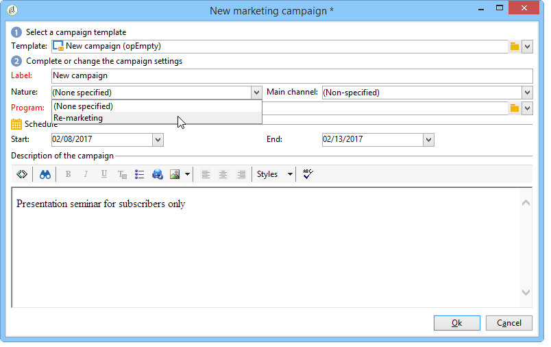

# 瞭解綱要結構 {#schema-structure}

結構描述的基本結構如下所述。

## 資料結構描述  {#data-schema}

對於`<srcschema>`，結構如下：

```sql
<srcSchema>
    <enumeration>
        ...          //definition of enumerations
    </enumeration>
   
    <element>         //definition of the root <element>    (mandatory)

        <compute-string/>  //definition of a compute-string
        <dbindex>
            ...        //definition of indexes
        </dbindex>
        <key>
            ...        //definition of keys
        </key>
        <sysFilter>
            ...           //definition of filters
        </sysFilter>
        <attribute>
            ...             //definition of fields
        </attribute>
    
            <element>           //definition of sub-<element> 
                  <attribute>           //(collection, links or XML)
                  ...                         //and additional fields
                  </attribute>
                ...
            </element>
      
    </element> 

        <methods>                 //definition of SOAP methods
            <method>
                ...
            </method>
            ...
    </methods>  
          
</srcSchema>
```

資料結構描述的XML檔案必須包含具有&#x200B;**名稱**&#x200B;和&#x200B;**名稱空間**&#x200B;屬性的&#x200B;**`<srcschema>`**&#x200B;根元素，才能填入結構描述名稱及其名稱空間。

```sql
<srcSchema name="schema_name" namespace="namespace">
...
</srcSchema>
```

讓我們使用以下XML內容來說明資料結構的結構：

```sql
<recipient email="John.doe@aol.com" created="2009/03/12" gender="1"> 
  <location city="London"/>
</recipient>
```

及其對應的資料結構：

```sql
<srcSchema name="recipient" namespace="cus">
  <element name="recipient">
    <attribute name="email"/>
    <attribute name="created"/>
    <attribute name="gender"/>
    <element name="location">
      <attribute name="city"/>
   </element>
  </element>
</srcSchema>
```

## 說明 {#description}

結構描述的進入點是其主要元素。 它很容易識別，因為其名稱與結構描述相同，且應是根元素的子項。 內容的說明以此元素開頭。

在我們的範例中，主要元素由以下行表示：

```
<element name="recipient">
```

主要元素後面的&#x200B;**`<attribute>`**&#x200B;和&#x200B;**`<element>`**&#x200B;元素是用來定義XML結構中資料專案的位置和名稱。

在我們的範例結構描述中，這些類別包括：

```sql
<attribute name="email"/>
<attribute name="created"/>
<attribute name="gender"/>
<element name="location">
  <attribute name="city"/>
</element>
```

下列規則適用：

* 每個&#x200B;**`<element>`**&#x200B;和&#x200B;**`<attribute>`**&#x200B;都必須透過&#x200B;**name**&#x200B;屬性以名稱識別。

  >[!IMPORTANT]
  >
  >元素的名稱應簡潔，最好是英文，並且僅包含允許在XML命名規則中的字元。

* 只有&#x200B;**`<element>`**&#x200B;個元素可以在XML結構中包含&#x200B;**`<attribute>`**&#x200B;個元素和&#x200B;**`<element>`**&#x200B;個元素。
* **`<attribute>`**&#x200B;專案在&#x200B;**`<element>`**&#x200B;內必須有唯一的名稱。
* 建議在多行資料字串中使用&#x200B;**`<elements>`**。

## 資料類型 {#data-types}

資料型別是透過&#x200B;**`<attribute>`**&#x200B;和&#x200B;**`<element>`**&#x200B;元素中的&#x200B;**type**&#x200B;屬性輸入的。

[`<attribute>`專案](../../configuration/using/schema/attribute.md)和[`<element>`專案](../../configuration/using/schema/element.md)的說明中有詳細清單。

若未填入此屬性，除非元素包含子元素，否則&#x200B;**字串**&#x200B;為預設資料型別。 如果是，則僅用於階層式建構元素（範例中為&#x200B;**`<location>`**&#x200B;元素）。

架構支援下列資料型別：

* **字串**：字元字串。 範例：名字、城鎮等。

  可透過&#x200B;**length**&#x200B;屬性指定大小（選用，預設值「255」）。

* **布林值**：布林值欄位。 可能值的範例：true/false、0/1、yes/no等。
* **位元組**，**短**，**長**：整數（1位元組、2位元組、4位元組）。 範例：年齡、帳號、點數等。
* **double**：雙精確度浮點數。 範例：價格、費率等。
* **日期**，**日期時間**：日期和日期+時間。 範例：出生日期、購買日期等。
* **datetimenotz**：沒有時區資料的日期+時間。
* **時間跨度**：持續時間。 範例：資歷。
* **備忘錄**：長文字欄位（多行）。 範例：說明、註解等。
* **uuid**：「uniqueidentifier」欄位支援GUID (僅在Microsoft SQL Server中支援)。

  >[!NOTE]
  >
  >若要在Microsoft SQL Server以外的RDBMS中包含&#x200B;**uuid**&#x200B;欄位，必須新增`the newuuid()`函式，並以其預設值完成。

以下是輸入型別的結構描述範例：

```sql
<srcSchema name="recipient" namespace="cus">
  <element name="recipient">
    <attribute name="email" type="string" length="80"/>
    <attribute name="created" type="datetime"/>
    <attribute name="gender" type="byte"/>
    <element name="location">
      <attribute name="city" type="string" length="50"/>
   </element>
  </element>
</srcSchema>
```

### 對應Adobe Campaign/DBMS資料型別 {#mapping-the-types-of-adobe-campaign-dbms-data}

下表列出Adobe Campaign針對不同資料庫管理系統所產生之資料型別的對應。

<table> 
 <tbody> 
  <tr> 
   <td> <strong>Adobe Campaign</strong><br /> </td> 
   <td> <strong>PosgreSQL</strong><br /> </td> 
   <td> <strong>Oracle</strong><br /> </td> 
  </tr> 
  <tr> 
   <td> 字串<br /> </td> 
   <td> VARCHAR(255)<br /> </td> 
   <td> VARCHAR2 （NVARCHAR2，如果是unicode）<br /> </td> 
  </tr> 
  <tr> 
   <td> 布林值<br /> </td> 
   <td> SMALLINT<br /> </td> 
   <td> 數字(3)<br /> </td> 
  </tr> 
  <tr> 
   <td> 位元組<br /> </td> 
   <td> SMALLINT<br /> </td> 
   <td> 數字(3)<br /> </td> 
  </tr> 
  <tr> 
   <td> 短整數<br /> </td> 
   <td> SMALLINT<br /> </td> 
   <td> 數字(5)<br /> </td> 
  </tr> 
  <tr> 
   <td> 雙精確度<br /> </td> 
   <td> 雙精確度<br /> </td> 
   <td> 浮點數<br /> </td> 
  </tr> 
  <tr> 
   <td> 長<br /> </td> 
   <td> 整數<br /> </td> 
   <td> 數字(10)<br /> </td> 
  </tr> 
  <tr> 
   <td> Int64<br /> </td> 
   <td> BIGINT<br /> </td> 
   <td> 數字(20)<br /> </td> 
  </tr> 
  <tr> 
   <td> 日期<br /> </td> 
   <td> 日期<br /> </td> 
   <td> 日期<br /> </td> 
  </tr> 
  <tr> 
   <td> 時間<br /> </td> 
   <td> 時間<br /> </td> 
   <td> 浮點數<br /> </td> 
  </tr> 
  <tr> 
   <td> 日期時間<br /> </td> 
   <td> 時間戳記<br /> </td> 
   <td> 日期<br /> </td> 
  </tr> 
  <tr> 
   <td> Datetimenotz<br /> </td> 
   <td> 時間戳記<br /> </td> 
   <td> 日期<br /> </td> 
  </tr> 
  <tr> 
   <td> 時間跨度<br /> </td> 
   <td> 雙精確度<br /> </td> 
   <td> 浮點數<br /> </td> 
  </tr> 
  <tr> 
   <td> 備忘錄<br /> </td> 
   <td> 文字<br /> </td> 
   <td> CLOB （Unicode則為NCLOB）<br /> </td> 
  </tr> 
  <tr> 
   <td> Blob<br /> </td> 
   <td> BLOB<br /> </td> 
   <td> BLOB<br /> </td> 
  </tr> 
 </tbody> 
</table>

## 屬性 {#properties}

資料結構描述的&#x200B;**`<elements>`**&#x200B;和&#x200B;**`<attributes>`**&#x200B;元素可以使用各種屬性來擴充。 您可以填入標籤來說明目前的元素。

### 標籤和說明 {#labels-and-descriptions}

* **label**&#x200B;屬性可讓您輸入簡短的說明。

  >[!NOTE]
  >
  >標籤與執行個體的目前語言相關聯。

  **範例**：

  ```sql
  <attribute name="email" type="string" length="80" label="Email"/>
  ```

  標籤會顯示在Adobe Campaign使用者端主控台輸入表單中：

  

* **desc**&#x200B;屬性可讓您輸入較長的說明。

  說明會顯示在Adobe Campaign使用者端主控台主視窗之狀態列的輸入表單中。

  >[!NOTE]
  >
  >說明與執行個體的目前語言相關聯。

  **範例**：

  ```sql
  <attribute name="email" type="string" length="80" label="Email" desc="Email of recipient"/>
  ```

### 預設值 {#default-values}

使用&#x200B;**default**&#x200B;屬性來定義在建立內容時傳回預設值的運算式。

值必須是符合XPath語言的運算式。 如需詳細資訊，請參閱[使用XPath參考](../../configuration/using/schema-structure.md#referencing-with-xpath)。

**範例**：

* 目前日期： **default=&quot;GetDate()&quot;**
* 計數器： **default=&quot;&#39;FRM&#39;+CounterValue(&#39;myCounter&#39;)&quot;**

  在此範例中，預設值是使用字串串串連來建構，並以可用計數器名稱呼叫&#x200B;**CounterValue**&#x200B;函式。 傳回的數目會在每次插入時遞增1。

  >[!NOTE]
  >
  >在Adobe Campaign使用者端主控台中，瀏覽至總管的&#x200B;**[!UICONTROL Administration > Counters]**&#x200B;資料夾以管理計數器。

若要將預設值連結至欄位，您可以使用`<default>`或`<sqldefault>`   欄位。

`<default>` ：可讓您在建立實體時，使用預設值預先填寫欄位。 此值不會是預設SQL值。

`<sqldefault>` ：可讓您在建立欄位時增加值。 此值會顯示為SQL結果。 在結構描述更新期間，只有新記錄會受此值影響。

### 分項清單 {#enumerations}

#### 開啟分項清單 {#free-enumeration}

**userEnum**&#x200B;屬性可讓您定義開啟的列舉，以儲存並顯示透過此欄位輸入的值。

語法如下：

`userEnum="name of enumeration"`

這些值會顯示在輸入表單的下拉式清單中：


>[!NOTE]
>
>在Adobe Campaign使用者端主控台中，瀏覽至檔案總管的&#x200B;**[!UICONTROL Administration > Enumerations]**&#x200B;資料夾以管理分項清單。

#### 設定分項清單 {#set-enumeration}

**enum**&#x200B;屬性可讓您定義預先知道可能值清單時使用的固定分項清單。

**enum**&#x200B;屬性參考主要專案外之結構描述中填入的列舉類別定義。

列舉可讓使用者從下拉式清單中選取值，而不是在常規輸入欄位中輸入值：


資料結構描述中的列舉宣告範例：

```sql
<enumeration name="gender" basetype="byte" default="0">    
  <value name="unknown" label="Not specified" value="0"/>    
  <value name="male" label="male" value="1"/>   
  <value name="female" label="female" value="2"/>   
</enumeration>
```

透過&#x200B;**`<enumeration>`**&#x200B;專案在主專案之外宣告分項清單。

列舉屬性如下：

* **baseType**：與值關聯的資料型別
* **標籤**：列舉的描述
* **名稱**：列舉的名稱
* **預設**：列舉的預設值

列舉值是在具有以下屬性的&#x200B;**`<value>`**&#x200B;元素中宣告：

* **name**：儲存在內部的值名稱
* **標籤**：圖形介面中顯示的標籤

#### Dbenum分項清單 {#dbenum-enumeration}

***dbenum**&#x200B;屬性可讓您定義其屬性類似於&#x200B;**enum**&#x200B;屬性的列舉。

不過，**name**&#x200B;屬性不會將值儲存在內部，而是儲存程式碼，讓您在不修改資料表結構描述的情況下擴充相關資料表。

例如，此分項清單用於指定行銷活動的性質。



### 範例 {#example}

以下是填入屬性的結構描述範例：

```sql
<srcSchema name="recipient" namespace="cus">
  <enumeration name="gender" basetype="byte">    
    <value name="unknown" label="Not specified" value="0"/>    
    <value name="male" label="male" value="1"/>   
    <value name="female" label="female" value="2"/>   
  </enumeration>

  <element name="recipient">
    <attribute name="email" type="string" length="80" label="Email" desc="Email of recipient"/>
    <attribute name="created" type="datetime" label="Date of creation" default="GetDate()"/>
    <attribute name="gender" type="byte" label="gender" enum="gender"/>
    <element name="location" label="Location">
      <attribute name="city" type="string" length="50" label="City" userEnum="city"/>
   </element>
  </element>
</srcSchema>
```

## 集合 {#collections}

集合是具有相同名稱和相同階層層級的元素清單。

值為「true」的&#x200B;**未繫結**&#x200B;屬性可讓您填入集合元素。

**範例**：結構描述中&#x200B;**`<group>`**&#x200B;集合專案的定義。

```sql
<element name="group" unbound="true" label="List of groups">
  <attribute name="label" type="string" label="Label"/>
</element>
```

透過XML內容的投影：

```sql
<group label="Group1"/>
<group label="Group2"/>
```

## 使用XPath參照 {#referencing-with-xpath}

XPath語言在Adobe Campaign中用於參照屬於資料結構的元素或屬性。

XPath是一種語法，可讓您在XML檔案的樹狀結構中尋找節點。

元素是以其名稱來指定，而屬性是以字元「@」開頭的名稱來指定。

**範例**：

* **@email**：選取電子郵件，
* **位置/@city**：選取&#x200B;**`<location>`**&#x200B;專案下的「city」屬性
* **../@email**：從目前專案的父專案選取電子郵件地址
* **群組`[1]/@label`**：選取第一個&#x200B;**`<group>`**&#x200B;集合專案的子項「label」屬性
* **群組`[@label='test1']`**：選取&#x200B;**`<group>`**&#x200B;專案的子系且包含「test1」值的「label」屬性

>[!NOTE]
>
>當路徑穿過子元素時，會新增額外的限制。 在此情況下，下列運算式必須放在方括弧之間：
>
>* **位置/@city**&#x200B;無效；請使用&#x200B;**`[location/@city]`**
>* **`[@email]`**&#x200B;和&#x200B;**@email**&#x200B;是同等的
>

您也可以定義複雜的運算式，例如下列算術運算：

* **@gender+1**：新增1至&#x200B;**性別**&#x200B;屬性的內容，
* **@email + &#39;(&#39;+@created+&#39;)&#39;**：藉由在括弧之間取得新增至建立日期的電子郵件地址值來建構字串（對於字串型別，請將常數放在引號中）。

已在運算式中新增高層級函式，以豐富此語言的潛力。

您可以透過Adobe Campaign使用者端主控台中的任何運算式編輯器，存取可用函式的清單：


**範例**：

* **GetDate()**：傳回目前日期
* **Year(@created)**：傳回「已建立」屬性中包含之日期的年份
* **GetEmailDomain(@email)**：傳回電子郵件地址網域

## 透過計算字串建立字串 {#building-a-string-via-the-compute-string}

**計算字串**&#x200B;是用於建構代表資料表中與結構描述相關之記錄的字串的XPath運算式。 **計算字串**&#x200B;主要用於圖形介面，以顯示選取記錄的標籤。

**計算字串**&#x200B;是透過資料結構描述主要元素下的&#x200B;**`<compute-string>`**&#x200B;元素所定義。 **expr**&#x200B;屬性包含計算顯示的XPath運算式。

**範例**：收件者資料表的運算字串。

```sql
<srcSchema name="recipient" namespace="nms">  
  <element name="recipient">
    <compute-string expr="@lastName + ' ' + @firstName +' (' + @email + ')' "/>
    ...
  </element>
</srcSchema>
```

收件者的計算字串結果： **Doe John (john.doe@aol.com)**

>[!NOTE]
>
>如果結構描述不包含計算字串，則計算字串預設會填入結構描述主索引鍵的值。


## 了解更多

瀏覽以下連結以瞭解更多資訊：

* [開始使用結構描述](about-schema-reference.md)
* [資料庫對應](database-mapping.md)
* [連結管理](database-links.md)
* [金鑰管理](database-keys.md)
* [Campaign 資料模型](about-data-model.md)