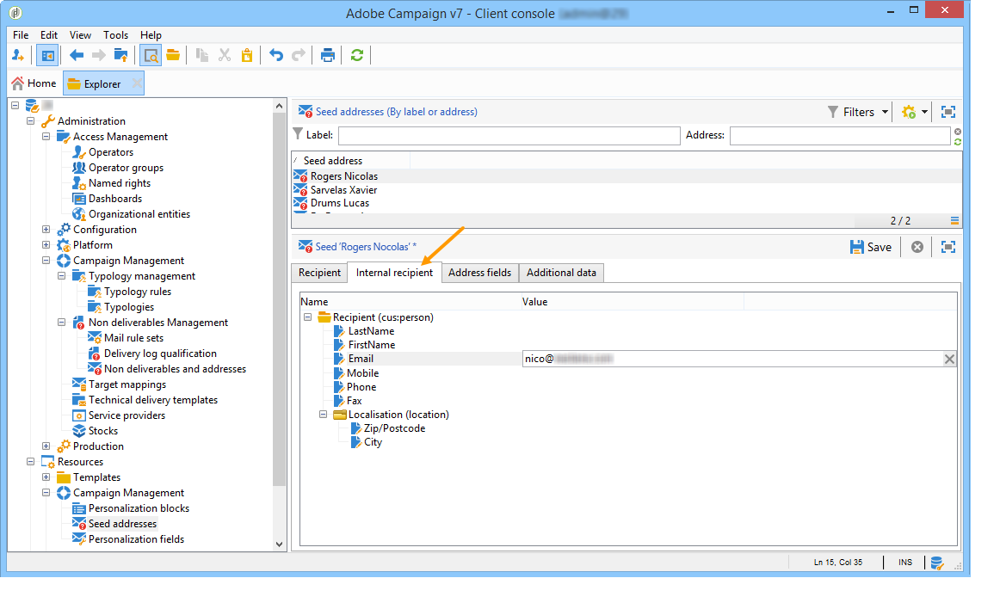

# 種子地址{#seed-addresses}


如果收件者表格是自訂表格，則需要其他設定。 此 **[!UICONTROL nms:seedMember]** 必須擴展架構。 種子地址中會新增一個標籤，以定義適當欄位，如下所示：



有關使用種子地址的詳細資訊，請參閱 [本節](../../delivery/using/about-seed-addresses.md).

## 實作 {#implementation}

此 **nms:seedMember** 結構和現成的連結表單可擴充供客戶設定，以參考所有必要欄位。 架構定義包含詳細說明其配置模式的注釋。

收件人表擴展架構的定義：

```
<srcSchema label="Person" name="person" namespace="cus">
  <element autopk="true" label="Person" name="person">
      <attribute label="LastName" name="lastname" type="string"/>
      <attribute label="FirstName" name="firstname" type="string"/>
    <element label="Address" name="address">
      <attribute label="Email" name="addrEnv" type="string"/>
    </element>
    <attribute label="Code Offer" name="codeOffer" type="string"/>
  </element>
</srcSchema>
```

應用以下步驟：

1. 建立的擴充功能 **nms:seedMember** 綱要。 有關詳細資訊，請參閱 [擴充結構](../../configuration/using/extending-a-schema.md).
1. 在這個新擴充功能中，於的根新增元素 **[!UICONTROL seedMember]** 搭配下列參數：

   ```
   name="custom_customNamespace_customSchema"
   ```

   此元素必須包含匯出促銷活動所需的欄位。 這些欄位的名稱應與外部架構中的對應欄位相同。 例如，如果結構為 **[!UICONTROL cus:person]** , **[!UICONTROL nms:seedMember]** 架構應擴充如下：

   ```
     <srcSchema extendedSchema="nms:seedMember" label="Seed addresses" labelSingular="Seed address" name="seedMember" namespace="cus">
     <element name="common">
       <element name="custom_cus_person">
         <attribute name="lastname" template="cus:person:person/@lastname"/>
         <attribute name="firstname" template="cus:person:person/@firstname"/>
         <attribute name="email" sqlname="myEmailField" template="cus:person:person/address/@addrEnv" xml="false"/>
       </element>
     </element>
     <element name="seedMember">
      <element aggregate="cus:seedMember:common"/>
     </element>
   </srcSchema>
   ```

   >[!NOTE]
   >
   >擴充 **nms:seedMember** 結構必須符合Adobe Campaign中促銷活動和傳送的結構。

   >[!IMPORTANT]
   >
   >
   >    
   >    
   >    * 在擴充功能期間，您必須指定 **SQL名稱(@sqlname)** （適用於「電子郵件」欄位）。 SQL名稱必須與為收件人架構保留的&#39;sEmail&#39;不同。
   >    * 必須使用擴展時建立的架構更新資料庫結構 **nms:seedMember**.
   >    * 在 **nms:seedMember** 擴充功能，包含電子郵件地址的欄位必須 **name=&quot;email&quot;** 作為屬性。 SQL名稱必須與已用於收件者架構的&#39;sEmail&#39;不同。 必須立即在 **`<element name="custom_cus_person" />`** 元素。


1. 修改 **[!UICONTROL seedMember]** 表單以在 **[!UICONTROL Seed addresses]** 窗口。 有關詳細資訊，請參閱 [表單結構](../../configuration/using/form-structure.md).

   ```
   <container colcount="2" label="Internal recipient" name="internal"
                xpath="custom_cus_person">
       <input colspan="2" editable="true" nolabel="true" type="treeEdit">
         <container label="Recipient (cus:person)">
           <input xpath="@last name"/>
           <input xpath="@first name"/>
           <input xpath="@email"/>
         </container>
       </input>
     </container>
   ```

如果未輸入種子地址的所有屬性，Adobe Campaign會自動替代設定檔：使用現有設定檔的資料，在個人化期間會自動輸入這些設定檔。
