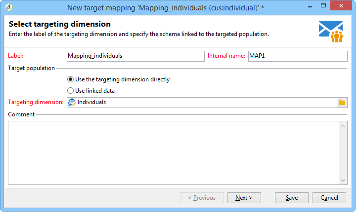

# 目標對應{#target-mapping}


在以下兩種情況下，需要建立目標對應：

* 如果您使用的收件者表格不是Adobe Campaign所提供的表格，
* 如果您設定的篩選維度與目標對應畫面上的標準目標維度不同。

目標對應建立助理會協助您建立使用自訂表格所需的所有結構描述。

## 建立和設定連結至自訂表格的綱要 {#creating-and-configuring-schemas-linked-to-the-custom-table}

建立目標對應之前，需要完成數個設定，Adobe Campaign才能使用新的收件者資料結構描述運作。

若要這麼做，請套用下列步驟：

1. 建立新的資料結構，整合您要使用的自訂表格欄位。

   如需進一步資訊，請參閱[結構描述參考(xtk：srcSchema)](../../configuration/using/about-schema-reference.md)。

   在我們的範例中，我們將建立客戶結構，這是一個非常簡單的表格，包含下列欄位：ID、名字、姓氏、電子郵件地址、行動電話號碼。 目的是能夠傳送電子郵件或簡訊警示給儲存在此表格中的個人。

   結構描述範例(cus：individual)

   ```
   <srcSchema name="individual" namespace="cus" label="Individuals">
     <element name="individual">
       <key name="id" internal="true">
         <keyfield xpath="@id"/>
       </key>
       <attribute name="id" type="long" length="32"/>
       <attribute name="lastName" type="string" length="100"/>
       <attribute name="firstName" type="string" length="100"/>
       <attribute name="email" type="string" length="100"/>
       <attribute name="mobile" type="string" length="100"/>
     </element>
   </srcSchema>
   ```

1. 使用=&quot;true&quot;屬性將您的結構描述宣告為外部檢視。 參考[檢視屬性](../../configuration/using/schema-characteristics.md#the-view-attribute)。

   ```
    <srcSchema desc="External recipient table" namespace="cus" view="true"....>
      ...
    </srcSchema>
   ```

1. 如果您需要新增直接郵件地址，請使用下列結構型別：

   ```
   <element advanced="true" name="postalAddress" template="nms:common:postalAddress">
        <attribute expr="SubString(JuxtWords(Smart([../infos/@firstname]), Upper([../infos/@name])), 1, 80)"
                   name="line1"/>
        <attribute expr="Upper([../address/@line2])" name="line2"/>
        <attribute expr="Upper([../address/@line])" name="line3"/>
        <attribute expr="Upper([../address/@line])" name="line4"/>
        <attribute expr="Upper([../address/@line])" name="line5"/>
        <attribute expr="Upper([../address/@line])" name="line6"/>
        <attribute _operation="delete" name="line7"/>
        <attribute _operation="delete" name="addrErrorCount"/>
        <attribute _operation="delete" name="addrQuality"/>
        <attribute _operation="delete" name="addrLastCheck"/>
        <element expr="@line1+'n'+@line2+'n'+@line3+'n'+@line4+'n'+@line5+'n'+@line6"
                 name="serialized"/>
        <attribute expr="AllNonNull2([../address/@line], [../infos/@name])" name="addrDefined"/>
      </element>
   ```

1. 按一下&#x200B;**[!UICONTROL Administration > Campaign management > Target mappings]**&#x200B;節點。
1. 按一下「**新增**」按鈕，開啟目標對應建立助理。
1. 輸入&#x200B;**標籤**&#x200B;欄位，並選取您剛在&#x200B;**目標維度**&#x200B;欄位中建立的結構描述。

   

1. 在&#x200B;**編輯地址表單**&#x200B;視窗中，選取符合各種傳遞地址的結構描述欄位。 在此，我們可以對應&#x200B;**@email**&#x200B;和&#x200B;**@mobile**&#x200B;欄位。

   

1. 在以下&#x200B;**儲存體**&#x200B;視窗中，輸入擴充功能結構描述&#x200B;**的**&#x200B;尾碼，以區分Adobe Campaign提供的全新結構描述與現成可用的結構描述。

   按一下&#x200B;**[!UICONTROL Define new additional fields]**&#x200B;以選取您要在傳遞中鎖定的維度。

   依預設，排除管理會儲存在與訊息相同的表格中。

   如果要設定連結至目標對應之追蹤的儲存體，請核取&#x200B;**產生追蹤的儲存體結構描述**&#x200B;方塊。

   

   >[!IMPORTANT]
   >
   >Adobe Campaign不支援多個收件者結構描述（也稱為目標定位結構描述），連結至相同的broadlog和/或trackinglog結構描述。 否則，這可能會導致之後資料協調出現異常。 如需詳細資訊，請參閱[建議與限制](../../configuration/using/about-custom-recipient-table.md)頁面。

1. 在&#x200B;**擴充功能**&#x200B;視窗中，選取您要產生的選用結構描述(可用結構描述清單取決於Adobe Campaign平台上安裝的模組)。

   

1. 按一下&#x200B;**儲存**&#x200B;按鈕以關閉助理。

   助理使用開始綱要來建立使新目標對應運作所需的所有其他綱要。

   

## 使用目標對應 {#using-target-mapping}

使用新結構作為傳送目標的方法有兩種：

* 根據對應建立一或多個傳遞範本
* 建立傳遞時，在目標選取期間直接選取對應，如下所示：


