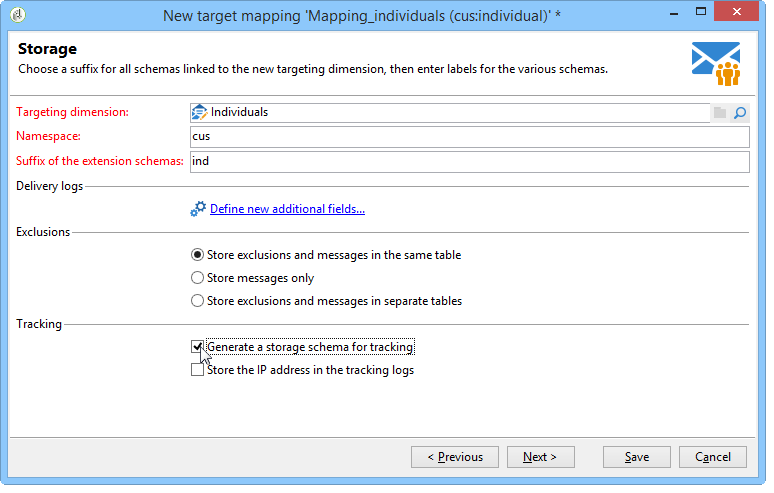

# 目標對應{#target-mapping}


建立目標對應有兩種必要：

* 如果您使用的收件者表格並非Adobe Campaign提供的表格，
* 如果您在目標對應畫面上設定與標準目標維度不同的篩選維度。

目標映射建立嚮導將幫助您建立使用自定義表所需的所有架構。

## 建立和設定連結至自訂表格的結構 {#creating-and-configuring-schemas-linked-to-the-custom-table}

建立目標對應之前，Adobe Campaign若要與新的收件者資料結構搭配運作，需進行數項設定。

若要這麼做，請套用下列步驟：

1. 建立新資料架構，整合您要使用的自訂表格欄位。

   如需詳細資訊，請參閱[結構參考(xtk:srcSchema)](../../configuration/using/about-schema-reference.md)。

   在我們的範例中，我們將建立客戶結構，一個包含下列欄位且非常簡單的表格：ID，名字，姓氏，電子郵件地址，行動電話號碼。 其目的是能夠向儲存在此表中的個人發送電子郵件或簡訊警報。

   範例結構(cus:individual)

   ```
   <srcSchema name="individual" namespace="cus" label="Individuals">
     <element name="individual">
       <key name="id" internal="true">
         <keyfield xpath="@id"/>
       </key>
       <attribute name="id" type="long" length="32"/>
       <attribute name="lastName" type="string" length="100"/>
       <attribute name="firstName" type="string" length="100"/>
       <attribute name="email" type="string" length="100"/>
       <attribute name="mobile" type="string" length="100"/>
     </element>
   </srcSchema>
   ```

1. 使用=&quot;true&quot;屬性將結構宣告為外部檢視。 請參閱[檢視屬性](../../configuration/using/schema-characteristics.md#the-view-attribute)。

   ```
    <srcSchema desc="External recipient table" namespace="cus" view="true"....>
      ...
    </srcSchema>
   ```

1. 如果需要添加直接郵件地址，請使用以下類型的結構：

   ```
   <element advanced="true" name="postalAddress" template="nms:common:postalAddress">
        <attribute expr="SubString(JuxtWords(Smart([../infos/@firstname]), Upper([../infos/@name])), 1, 80)"
                   name="line1"/>
        <attribute expr="Upper([../address/@line2])" name="line2"/>
        <attribute expr="Upper([../address/@line])" name="line3"/>
        <attribute expr="Upper([../address/@line])" name="line4"/>
        <attribute expr="Upper([../address/@line])" name="line5"/>
        <attribute expr="Upper([../address/@line])" name="line6"/>
        <attribute _operation="delete" name="line7"/>
        <attribute _operation="delete" name="addrErrorCount"/>
        <attribute _operation="delete" name="addrQuality"/>
        <attribute _operation="delete" name="addrLastCheck"/>
        <element expr="@line1+'n'+@line2+'n'+@line3+'n'+@line4+'n'+@line5+'n'+@line6"
                 name="serialized"/>
        <attribute expr="AllNonNull2([../address/@line], [../infos/@name])" name="addrDefined"/>
      </element>
   ```

1. 按一下&#x200B;**[!UICONTROL Administration > Campaign management > Target mappings]**&#x200B;節點。
1. 按一下&#x200B;**新建**&#x200B;按鈕以開啟目標映射建立嚮導。
1. 輸入&#x200B;**Label**&#x200B;欄位，然後選擇您剛在&#x200B;**Targeting dimension**&#x200B;欄位中建立的架構。

   

1. 在&#x200B;**編輯地址表單**&#x200B;窗口中，選擇與各種傳送地址匹配的架構欄位。 在此，我們可以映射&#x200B;**@email**&#x200B;和&#x200B;**@mobile**&#x200B;欄位。

   

1. 在以下&#x200B;**Storage**&#x200B;視窗中，輸入擴充架構&#x200B;**的尾碼欄位，以區分新架構與Adobe Campaign提供的現成架構。**

   按一下&#x200B;**[!UICONTROL Define new additional fields]**&#x200B;以選取您要在傳送中定位的維度。

   依預設，排除管理會儲存在與訊息相同的表格中。

   如果要為連結到目標映射的跟蹤配置儲存，請選中&#x200B;**生成用於跟蹤的儲存架構**&#x200B;框。

   

   >[!IMPORTANT]
   >
   >Adobe Campaign不支援連結至相同broadlog和/或trackinglog結構的多個收件者結構，也稱為目標結構。 否則，之後資料協調可能會導致異常。 如需詳細資訊，請參閱[建議和限制](../../configuration/using/about-custom-recipient-table.md)頁面。

1. 在&#x200B;**擴充功能**&#x200B;視窗中，選取您要產生的選用結構(可用結構的清單取決於Adobe Campaign平台上安裝的模組)。

   

1. 按一下&#x200B;**Save**&#x200B;按鈕以關閉嚮導。

   嚮導使用啟動架構建立新目標映射工作所需的所有其他架構。

   

## 使用目標對應 {#using-target-mapping}

使用新結構作為傳送目標有兩種方式：

* 根據對應建立一或多個傳遞範本
* 建立傳送時，在目標選取期間直接選取對應，如下所示：


**相關主題**

* [快速回應客戶存取其資料的請求](https://helpx.adobe.com/campaign/kb/simplifying-campaign-management-acc.html#Quicklyrespondtocustomerrequeststoaccesstheirdata)
