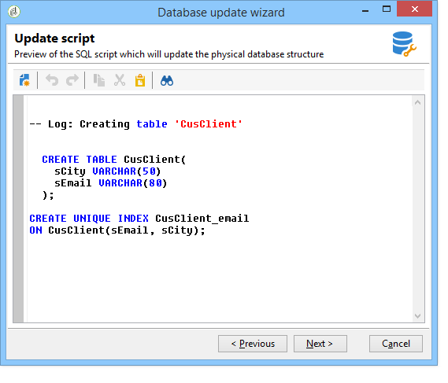

# 更新資料庫結構{#updating-the-database-structure}

要對方案應用修改，請啟動資料庫更新嚮導。 此精靈可透過 **[!UICONTROL Tools > Advanced > Update database structure]** 。 它檢查資料庫的物理結構是否與其邏輯說明匹配並執行SQL更新指令碼。

資料庫中的模組會自動填充和激活。

和 **[!UICONTROL Add stored procedures]** 選 **[!UICONTROL Import initialization data]** 項用於啟動初始SQL指令碼和建立資料庫時執行的資料包。

您可以從外部資料套件匯入一組資料。 要執行此操作，請選 **[!UICONTROL Import a package]** 擇並輸入包的XML檔案。

請按照以下步驟查看資料庫更新SQL指令碼：

>[!NOTE]
>
>這位於編輯欄位中，可加以修改以刪除或新增SQL程式碼。

接下來，啟動資料庫更新：

