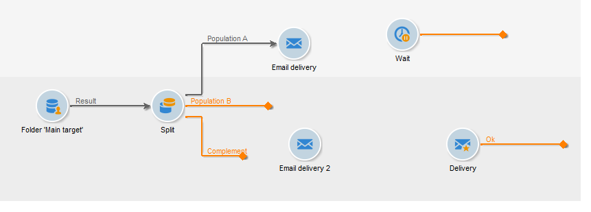

# 在工作流中配置交貨 {#step-4--configuring-the-deliveries-in-the-workflow}

一次 [群體建立](a-b-testing-uc-population-samples.md)，您可以配置交貨。 在此使用例中，前兩個交貨使您能夠將不同的內容發送到人口A和人口B。第三種是回退式交貨：將發送給不屬於A和B的接收者。其內容將由指令碼計算，並且與A或B相同，具體取決於開啟率最高的是哪個。 我們需要為第三次交貨配置等待期，以查明交貨A和B的結果。這就是為什麼第三個交貨 **[!UICONTROL Wait]** 的子菜單。

1. 轉到 **[!UICONTROL Split]** 活動，並將目標為填充A的轉換連結到工作流中已有的電子郵件遞送。

   

1. 按兩下交貨以將其開啟。
1. 使用下拉清單，選擇交貨A的模板。

   

1. 按一下 **[!UICONTROL Continue]** 查看交貨，然後保存。

   

1. 連結 **[!UICONTROL Split]** 目標為人口B的活動，轉到第二個電子郵件傳送。

   

1. 開啟交貨，在交貨B中選擇模板，然後保存交貨。

   

1. 將目的地為剩餘人口的過渡連結到 **[!UICONTROL Wait]** 的子菜單。

   

1. 開啟 **[!UICONTROL Wait]** 並配置5天的等待期。

   

1. 連結 **[!UICONTROL Wait]** 活動 **[!UICONTROL JavaScript code]** 的子菜單。

   

現在可以建立指令碼。 [了解更多資訊](a-b-testing-uc-script.md)。
