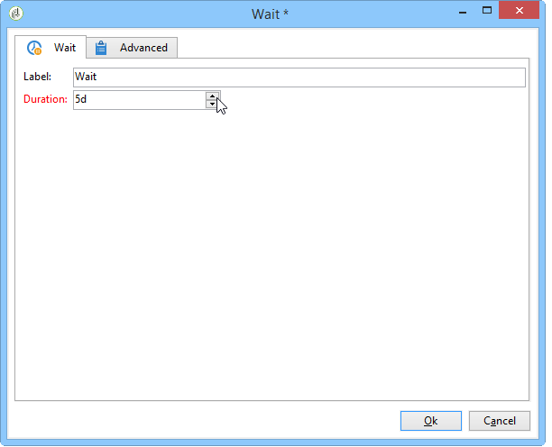

# AB測試：在工作流程中設定傳送 {#step-4--configuring-the-deliveries-in-the-workflow}

建立[母體](a-b-testing-uc-population-samples.md)後，您就可以設定傳送。 在此使用案例中，前兩個傳送可讓您傳送不同的內容給母體A和B。第三個傳遞是後援傳遞：會傳送給不屬於A或B的收件者。其內容將由指令碼計算，並將與A或B相同，具體取決於哪一個的開啟率最高。 我們需要設定第三次傳送的等待時間，以找出傳送A和B的結果。這就是第三個傳遞包含&#x200B;**[!UICONTROL Wait]**&#x200B;活動的原因。

1. 移至&#x200B;**[!UICONTROL Split]**&#x200B;活動，並將預定母體A的轉換連結至工作流程中已存在的其中一個電子郵件傳遞。

   

1. 連按兩下傳送以開啟。
1. 使用下拉式清單，選取傳送A的範本。

   

1. 按一下&#x200B;**[!UICONTROL Continue]**&#x200B;檢視傳遞，然後儲存。

   

1. 將預定母體B的&#x200B;**[!UICONTROL Split]**&#x200B;活動的轉變連結到第二個電子郵件傳遞。

   

1. 開啟傳遞，並在傳遞B中選取範本，然後儲存傳遞。

   

1. 將預定要送給剩餘母體的轉變連結至&#x200B;**[!UICONTROL Wait]**&#x200B;活動。

   

1. 開啟&#x200B;**[!UICONTROL Wait]**&#x200B;活動並設定5天的等候時間。

   

1. 將&#x200B;**[!UICONTROL Wait]**&#x200B;活動連結至&#x200B;**[!UICONTROL JavaScript code]**&#x200B;活動。

   

您現在可以建立指令碼。 [了解更多](a-b-testing-uc-script.md)。
