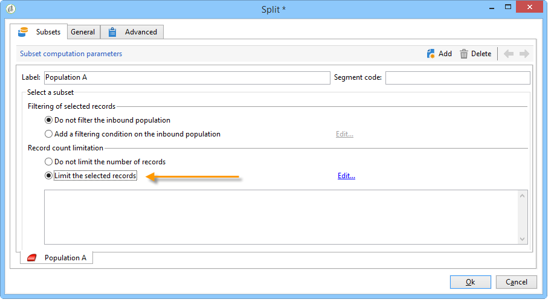
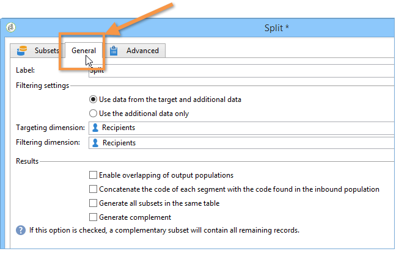

# AB測試：設定母體樣本 {#step-2--configuring-population-samples}

## 設定查詢活動 {#configuring-the-query-activity}

* 連按兩下&#x200B;**[!UICONTROL Query]**&#x200B;活動。

  

* 按一下&#x200B;**[!UICONTROL Edit query]**&#x200B;連結，並選取您要鎖定的收件者。

  

* 將&#x200B;**[!UICONTROL Query]**&#x200B;活動連結至&#x200B;**[!UICONTROL Split]**&#x200B;活動。

  

## 設定分割活動 {#configuring-the-split-activity}

此活動可讓您建立多個母體：接收傳送A的母體、接收傳送B的母體，以及剩餘母體。 使用隨機選取可讓您只鎖定每次傳送的部分母體。

1. 建立母體A：

   * 連按兩下&#x200B;**[!UICONTROL Split]**&#x200B;活動。

     

   * 在現有索引標籤中，將標籤變更為母體A。

     

   * 選取 **[!UICONTROL Limit the selected records]** 選項。

     

   * 按一下&#x200B;**[!UICONTROL Edit]**&#x200B;連結，選取&#x200B;**[!UICONTROL Activate random sampling]**，然後按一下&#x200B;**[!UICONTROL Next]**。

     

   * 將臨界值設為10%，然後按一下&#x200B;**[!UICONTROL Finish]**。

     

1. 建立母體B：

   * 按一下&#x200B;**[!UICONTROL Add]**&#x200B;為母體B建立新索引標籤。

     

   * 和之前一樣，將母體限製為10%。

     

1. 建立剩餘母體：

   * 移至 **[!UICONTROL General]** 索引標籤。

     

   * 選取 **[!UICONTROL Generate complement]**。

     

   * 變更標籤以指定此母體既不包含A也不包含B，然後按一下&#x200B;**[!UICONTROL OK]**&#x200B;以關閉活動。

     

您現在可以建立兩個傳遞範本。 [深入瞭解](a-b-testing-uc-delivery-templates.md))。
