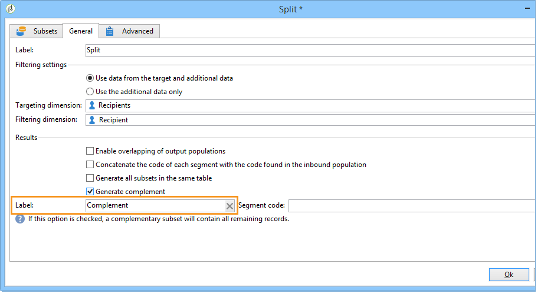

# 設定母體樣本 {#step-2--configuring-population-samples}

## 設定「查詢」活動 {#configuring-the-query-activity}

* 連按兩下&#x200B;**[!UICONTROL Query]**&#x200B;活動。

   

* 按一下&#x200B;**[!UICONTROL Edit query]**&#x200B;連結，然後選取您要鎖定的收件者。

   

* 將&#x200B;**[!UICONTROL Query]**&#x200B;活動連結至&#x200B;**[!UICONTROL Split]**&#x200B;活動。

   

## 設定分割活動 {#configuring-the-split-activity}

此活動可讓您建立數個母體：接收傳送A的傳送B的傳送B的傳送B，以及剩餘的母體。 使用隨機選取可讓您只鎖定每個傳送的一部分母體。

1. 建立母體A:

   * 連按兩下&#x200B;**[!UICONTROL Split]**&#x200B;活動。

      

   * 在現有索引標籤中，將標籤變更為母體A。

      

   * 選擇&#x200B;**[!UICONTROL Limit the selected records]**&#x200B;選項。

      

   * 按一下&#x200B;**[!UICONTROL Edit]**&#x200B;連結，選擇&#x200B;**[!UICONTROL Activate random sampling]**，然後按一下&#x200B;**[!UICONTROL Next]**。

      

   * 將臨界值設為10%，然後按一下&#x200B;**[!UICONTROL Finish]**。

      

1. 建立人口B:

   * 按一下&#x200B;**[!UICONTROL Add]**&#x200B;為母體B建立新索引標籤。

      

   * 將母體限制為先前的10%。

      

1. 建立剩餘母體：

   * 移至 **[!UICONTROL General]** 索引標籤。

      

   * 選取 **[!UICONTROL Generate complement]**。

      

   * 變更標籤以指定此母體不包含A或B，然後按一下&#x200B;**[!UICONTROL OK]**&#x200B;以關閉活動。

      

您現在可以建立兩個傳送範本。 [深入瞭解](a-b-testing-uc-delivery-templates.md)).
