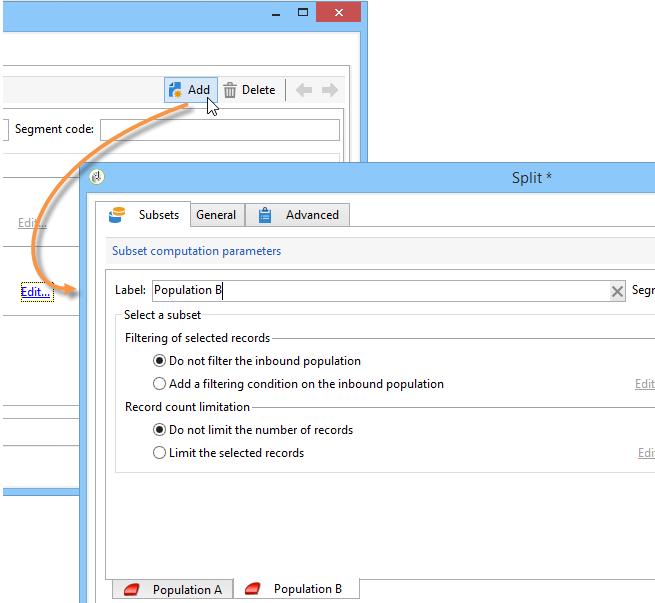

# 設定母體樣本 {#step-2--configuring-population-samples}

## 設定查詢活動 {#configuring-the-query-activity}

* 連按兩下 **[!UICONTROL Query]** 活動。

   

* 按一下 **[!UICONTROL Edit query]** 連結並選取您要鎖定的收件者。

   

* 連結 **[!UICONTROL Query]** 活動至 **[!UICONTROL Split]** 活動。

   

## 設定分割活動 {#configuring-the-split-activity}

此活動可讓您建立多個母體：接收傳送A的母體、接收傳送B的母體，以及剩餘母體。 使用隨機選取可讓您只鎖定每個傳送的部分母體。

1. 建立母體A：

   * 連按兩下 **[!UICONTROL Split]** 活動。

      

   * 在現有索引標籤中，將標籤變更為母體A。

      

   * 選取 **[!UICONTROL Limit the selected records]** 選項。

      

   * 按一下 **[!UICONTROL Edit]** 連結，選取 **[!UICONTROL Activate random sampling]**，然後按一下 **[!UICONTROL Next]**.

      

   * 將臨界值設定為10%，然後按一下 **[!UICONTROL Finish]**.

      

1. 建立母體B：

   * 按一下 **[!UICONTROL Add]** 為母體B建立新索引標籤。

      

   * 和之前一樣，將人口限制在10%。

      

1. 建立剩餘母體：

   * 移至 **[!UICONTROL General]** 索引標籤。

      

   * 選取 **[!UICONTROL Generate complement]**。

      

   * 變更標籤以指定此母體既不包含A也不包含B，然後按一下 **[!UICONTROL OK]** 以關閉活動。

      

您現在可以建立兩個傳遞範本。 [了解更多](a-b-testing-uc-delivery-templates.md)).
