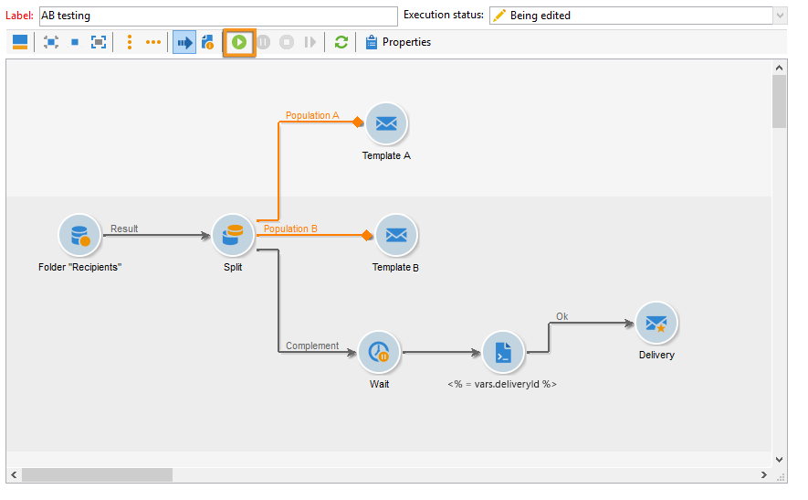

# AB測試：啟動工作流程 {#step-7--starting-the-workflow}

1. 按一下&#x200B;**[!UICONTROL Start]**&#x200B;工作流程。

   

1. 透過行銷活動控制面板，核准傳遞A和B的目標與內容。
1. 確認傳遞。
1. 請等待5天期間結束，以檢視在傳遞開啟結果後計算的內容。

   

   在此案例中，範本B被選中。

1. 決定第三次傳送的內容後，核准目標和內容。

您現在可以分析結果。 [了解更多資訊](a-b-testing-uc-analyzing.md)。
