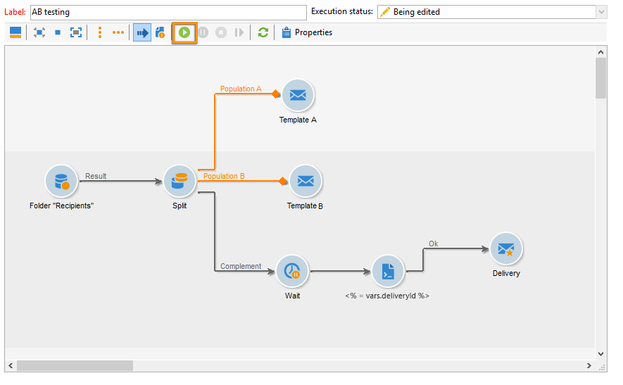
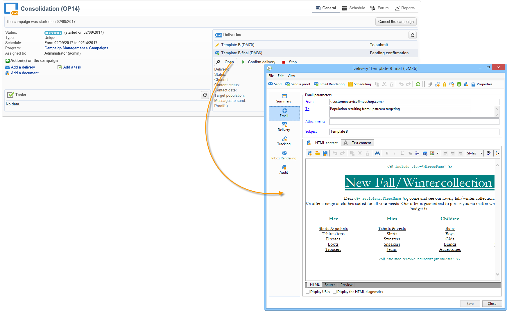

# 開始工作流程 {#step-7--starting-the-workflow}

1. 按一下 **[!UICONTROL Start]** 的子菜單。

   

1. 通過市場活動控制面板批准交貨A和B的目標和內容。
1. 確認交貨。
1. 等到5天時段結束，以確定在交貨開始結果後計算的內容。

   

   在這種情況下，選擇了模板B。

1. 一旦確定了第三次傳遞的內容，就批准目標和內容。

現在可以分析結果。 [了解更多資訊](a-b-testing-uc-analyzing.md)。
