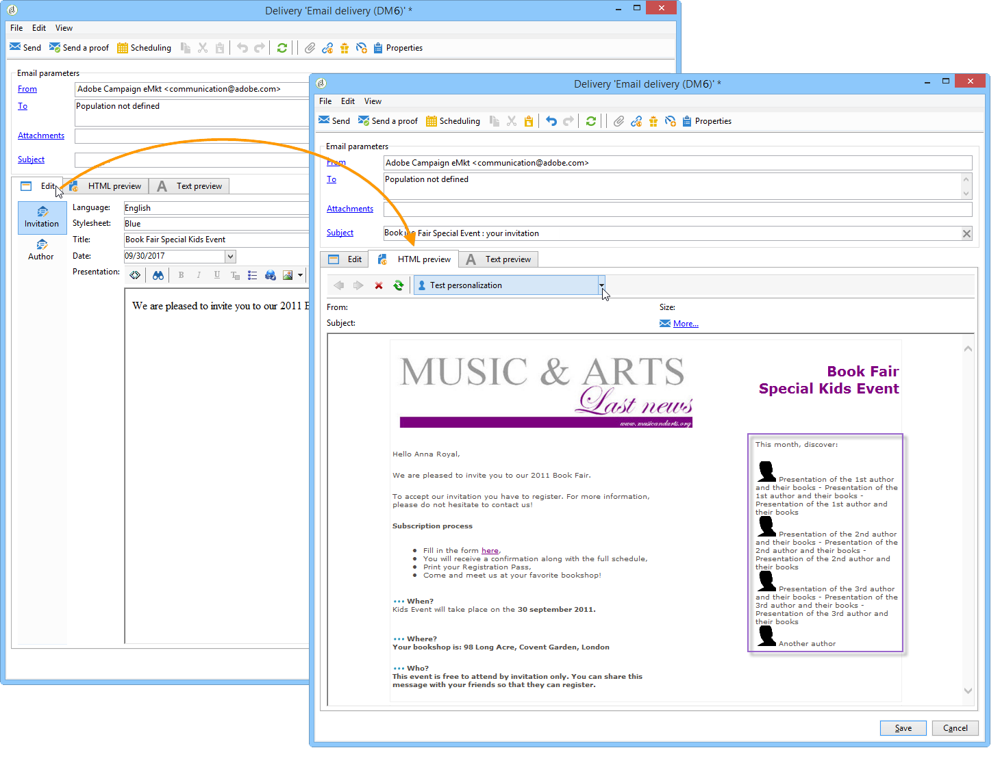

# 關於內容管理{#about-content-management}

Adobe Campaign內容管理員模組是特定Campaign Classic [內建套件](../../installation/using/installing-campaign-standard-packages.md) 您可以安裝此套件，以建立定期電子報或網站。 它可協助您建立、驗證和發佈訊息。

>[!NOTE]
>
>本節提供「內容管理」模組。 有關如何設計電子郵件傳遞內容的詳細資訊，請參閱 [本節](defining-the-email-content.md).

內容管理模組結合了工作群組、工作流程和內容彙總功能。 這可讓訊息自動格式化：電子郵件、郵件、簡訊、網頁等。

在傳送中使用內容管理員，可讓您為負責內容建立的操作者提供輸入或選擇欄位。 此內容的版面配置與顯示以及所做的任何變更都會使用樣式表自動管理。

>[!CAUTION]
>
>根據所使用的內容範本，在傳遞層級實施對樣式表所做的所有變更。

內容管理具備下列優點：

* 透過輸入介面進行結構化訊息編輯
* 分離資料內容及其呈現方式（以XML格式產生），
* 以多種格式（html、txt、XML等）產生檔案 以樣式表為基礎，以確保符合圖形字元規範，
* 外部內容流程的復原與自動彙總、
* 與工作流程共同作業，以進行資料驗證和檢查。

不過，這種內容建立模式確實涉及一些限制，特別包括：

* 關於最終檔案設計的限制自由，
* 需求分析必須嚴謹，以免遺失函式而影響一般使用者。
