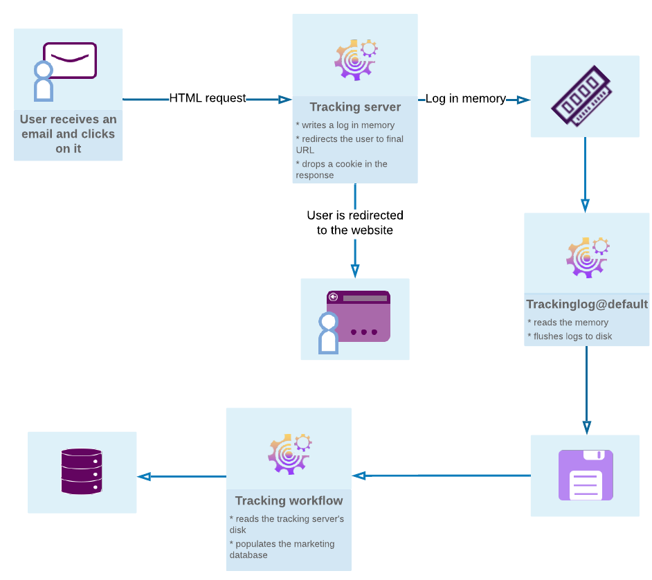

# 開始郵件跟蹤 {#get-started-tracking}

由於Adobe Campaign的跟蹤功能，您可以跟蹤發送的郵件並檢查收件人的行為：開啟、按一下連結、取消訂閱等。

此資訊在 **[!UICONTROL Tracking]** 的子菜單。 此頁籤顯示從清單中選擇的收件人跟蹤並按一下的所有URL連結。 這是在交貨螢幕中仍存在的交貨中跟蹤的所有URL的累積。 清單可以配置，通常包含：按一下的URL、按一下的日期和時間以及找到URL的文檔。 如需詳細資訊，請參閱[本章節](../../platform/using/editing-a-profile.md#tracking-tab)。

的 **交貨儀表板** 也是監控您的交貨以及發送消息時遇到的最終問題的關鍵。 有關詳細資訊，請參閱 [此部分](delivery-dashboard.md)。

下圖顯示了用戶和各種伺服器之間對話的各個階段。

## 配置跟蹤 {#configure-tracking}

**操作原則**

在使用跟蹤之前，您需要先為實例配置它。 [了解更多](../../installation/using/deploying-an-instance.md#operating-principle)

**跟蹤伺服器**

要配置跟蹤，必須聲明實例並向跟蹤伺服器註冊。 [了解更多](../../installation/using/deploying-an-instance.md#tracking-server)

**保存跟蹤**

配置跟蹤並填充URL後，必須註冊跟蹤伺服器。 [了解更多](../../installation/using/deploying-an-instance.md#saving-tracking)

## 訊息追蹤 {#message-tracking}

**跟蹤的連結**

您可以跟蹤消息的接收和消息內容中插入的連結的激活情況，以便更好地瞭解收件人的行為。 [了解更多](how-to-configure-tracked-links.md)

**URL跟蹤**

可以通過激活或停用跟蹤的URL來配置跟蹤選項。 [了解更多](personalizing-url-tracking.md)

**跟蹤連結個性化**

Campaign Classic跟蹤功能允許您在電子郵件中添加可個性化且支援跟蹤的連結。 [了解更多](tracking-personalized-links.md)

**跟蹤日誌**

「跟蹤」技術工作流在發送並激活傳送後檢索跟蹤資料。 此資料可在您交貨的「跟蹤」頁籤中找到。 [了解更多](accessing-the-tracking-logs.md)

**測試追蹤**

在通過跟蹤發送郵件之前，您可以在鏡像頁面、電子郵件日誌和連結上test跟蹤。 [了解更多](testing-tracking.md)

## Web應用程式跟蹤 {#web-application-tracking}

**追蹤 Web 應用程式**

您還可以使用跟蹤標籤跟蹤和測量Web應用程式頁面上的訪問。 此功能可用於所有Web應用程式類型，如表單和登錄頁。 [了解更多](../../web/using/tracking-a-web-application.md)

**網站應用程式追蹤選擇退出**

Web應用程式跟蹤選擇退出使您能夠停止跟蹤選擇退出行為跟蹤的最終用戶的Web行為。 您可以將橫幅廣告顯示到Web應用程式或登錄頁中，從而允許用戶選擇退出。 [了解更多](../../web/using/web-application-tracking-opt-out.md)

## 跟蹤報告 {#tracking-reports}

**跟蹤統計**

此報表提供有關開啟、按一下和交易記錄的統計資訊，並允許您跟蹤交貨的市場影響。 [了解更多](../../reporting/using/delivery-reports.md#tracking-statistics)

**URL 和點按流**

此報告顯示交貨後訪問的頁的清單。 [了解更多](../../reporting/using/delivery-reports.md#urls-and-click-streams)

**人員與收件者**

通過此示例，更好地瞭解Adobe Campaign的人員/人員和接收者之間的跟蹤差異。 [了解更多](../../reporting/using/person-people-recipients.md)

**追蹤指標**

此報告合併了用於在接收到傳送時跟蹤收件人行為的主要指標，如開啟、點擊率和按一下流。 [了解更多](../../reporting/using/delivery-reports.md#tracking-indicators)

**指示器計算**

不同的表根據交貨類型為您提供不同報表中使用的指示符清單及其計算公式。 [了解更多](../../reporting/using/indicator-calculation.md)

## 追蹤疑難排解 {#tracking-troubleshooting}

以下故障排除技巧將幫助您解決在Adobe Campaign Classic使用跟蹤時最常見的問題。 有關更高級的故障診斷，請參閱 [此部分](tracking-troubleshooting.md)。

* 檢查跟蹤日誌進程是否正在運行

   此進程從IIS/Web伺服器共用記憶體讀取並寫入重定向日誌。

   通過選擇實例中的「監視」頁籤，您可以從首頁訪問它。 您還可以對實例執行以下命令： `<user>@<instance>:~$ nlserver pdump`

   如果跟蹤日誌進程未出現在清單中，請在實例上使用以下命令啟動它： `<user>@<instance>:~$ nlserver start trackinglogd`

* 檢查「跟蹤」技術工作流最近是否正在運行。

   可以在資料夾「管理」>「生產」>「技術工作流」中找到「跟蹤」技術工作流。
