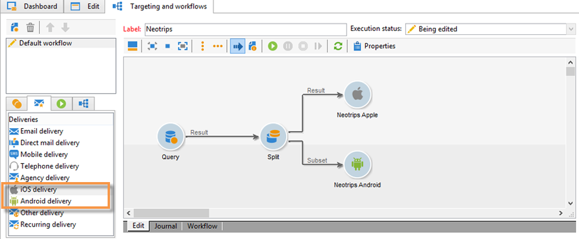

# 關於行動應用程式頻道{#about-mobile-app-channel}

>[!CAUTION]
>
>本檔案詳細說明整合行動應用程式與Adobe Campaign平台的程式。 它不提供如何建立行動應用程式或如何設定它以管理通知的資訊。 如果您想要進一步瞭解此資訊，請參閱官方的Apple([https://developer.apple.com/](https://developer.apple.com/))和Android([https://developer.android.com/index.html](https://developer.android.com/index.html))檔案。

以下章節提供行動應用程式頻道專屬的資訊。 如需如何建立傳送的全域資訊，請參[閱本節](../../delivery/using/steps-about-delivery-creation-steps.md)。

行動 **應用程式頻道** ，可讓您使用Adobe Campaign平台，透過應用程式將個人化通知傳送至iOS和Android終端機。 提供兩個傳送渠道：

* iOS頻道，可讓您傳送通知至Apple行動裝置。

   

* 一種Android頻道，可讓您傳送資料訊息至Android行動裝置。

   

與這兩個渠道相對應，促銷活動工作流程中有兩個傳送活動：

>[!NOTE]
>
>另外，還提供兩個事務性消息模板用於事務性消息傳遞。

您可以定義應用程式行為，以供使用者啟動通知以顯示符合應用程式內容的畫面。 例如：

* 通知客戶告知其包裹已離開倉庫。 啟動通知會開啟含有傳送相關資訊的頁面。
* 使用者已將項目新增至購物車，但未完成購買就離開應用程式。 系統會傳送通知，告知他們購物車已遭棄用。 當他們啟動通知時，項目會顯示在螢幕上。

>[!CAUTION]
>
>* 您必須確保傳送至行動應用程式的通知符合Apple（Apple推播通知服務）和Google（Google雲端訊息）所指定的必要條件。
>* 警告：在某些國家／地區，法律要求您告知使用者您收集到的資料類型行動應用程式及其處理目的。 你必須檢查法律。

(mobileAppOptOutMagt **[!UICONTROL NMAC opt-out management]** )工作流程會更新行動裝置上取消訂閱的通知。 有關此工作流的詳細資訊，請參閱「工作 [流」指南](../../workflow/using/mobile-app-channel.md)。

Adobe Campaign與二進位和HTTP/2 APNS都相容。 有關配置步驟的詳細資訊，請參閱「連接 [器](../../delivery/using/setting-up-mobile-app-channel.md#connectors) 」部分。
