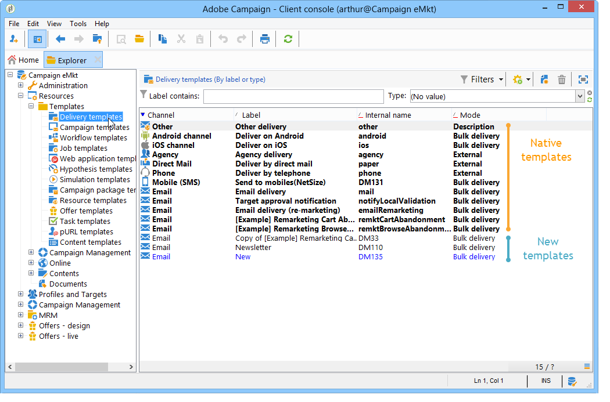

# 使用傳遞範本 {#about-templates}

傳遞設定可以儲存在傳遞範本中以便重複使用。 範本可能包含傳遞的完整或部分設定。

範本有兩種型別：

1. Adobe Campaign原生傳遞範本 — 不得從系統刪除原生範本。 其中包含每個傳送通道的最低設定。 但是，管理員可以限制某些功能，或為使用者提供預設值（追蹤啟動、寄件者電子郵件地址等）。 原生案例會以粗體顯示在範本清單中。 必須複製它們才能修改它們。

1. 預先定義的傳遞範本 — Adobe Campaign管理員可以建立新的傳遞範本。 操作者（擁有適當存取許可權者）或伺服器程式可自動重複使用這些存取許可權。 例如，您可以設定電子郵件傳遞範本，當使用者使用此範本建立傳遞時，他們只需輸入文字或HTML內容然後傳遞即可；管理員已定義其他選項。

在[Campaign v8檔案](https://experienceleague.adobe.com/en/docs/campaign/campaign-v8/send/create-templates){target="_blank"}中瞭解如何建立和使用傳遞範本。