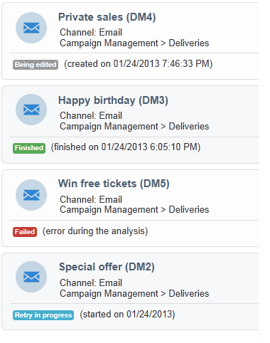
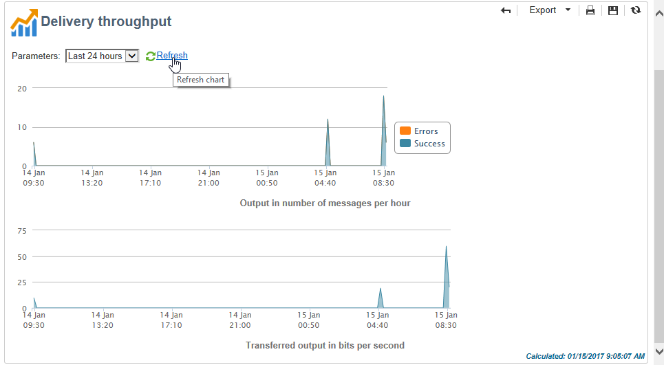

# 存取傳送資訊{#accessing-deliveries-information}

## 存取傳送清單 {#accessing-the-list-of-deliveries}

若要存取傳送清單，請前往宇宙， **[!UICONTROL Campaigns]** 然後按一下連 **[!UICONTROL Deliveries]** 結。

如果您使 [用瀏覽器視圖](../../platform/using/adobe-campaign-workspace.md#about-adobe-campaign-explorer)，則可以通過樹中的節點訪問 **[!UICONTROL Campaign management > Deliveries]** 所有交貨。

>[!NOTE]
>
>Adobe Campaign工作區會顯示在 [此區段](../../platform/using/adobe-campaign-workspace.md)。

此頁面可讓您存取傳送的整體檢視：它會顯示資料庫中的所有傳送。 您可以檢視其狀態、成功率和修改日期。

>[!NOTE]
>
>本節將介紹資訊 [過濾](../../platform/using/filtering-options.md)。

傳送精靈可讓您設定傳送、啟動核准程式及傳送。 精靈的內容取決於通訊管道（電子郵件、行動裝置、推播、直效郵件）和營運商權限。

若要控制清單中的傳送，請按一下傳送。 例如，它會在新視窗中開啟，您可以確認傳送或暫停傳送。

根據交貨週期的階段，可能的主要狀態為：

* 已取消
* 失敗
* 待定
* 已完成
* 已暫停
* 重試擱置中
* 進行中
* 可立即交付
* 正在準備
* 目標計算
* 正在編輯

每個狀態都有其自己的顏色和標籤。

按鈕旁的下拉式清單可 **[!UICONTROL Create]** 讓您根據傳送的狀態來篩選傳送。

## 存取傳送日曆 {#accessing-the-delivery-calendar}

若要存取傳送日曆，請前往宇宙， **[!UICONTROL Campaign]** 然後按一下連 **[!UICONTROL Campaign calendar]** 結。 此行事歷會顯示一段時間內的促銷活動劃分。 您可以依月、周或日對展示進行個人化。

按一下傳送的名稱，以顯示其相關的主要資訊。 您也可以按一下，視需要開啟促銷活動 **[!UICONTROL Open]**。

## 訪問傳送吞吐量資訊 {#accessing-deliveries-throughput-information}

頁面上的資訊 **[!UICONTROL Delivery throughput]** 與平台的所有傳送有關。 要測量消息的傳送速度，標準是每小時發送的消息數和消息的大小（以位／秒為單位）。 在以下範例中，第一個圖表以藍色顯示成功的傳送，以及以橙色顯示錯誤傳送的數量。

您可以選擇計算吞吐量的時隙。 若要這麼做，請從下拉式清單中選取值，然後按一下 **[!UICONTROL Refresh]**。

>[!NOTE]
>
>若是代管或混合安裝，如果您已升級至「增強MTA」, **[!UICONTROL Delivery throughput]** 該頁面將不再顯示您電子郵件收件者的總處理能力。 它將顯示從促銷活動到增強MTA的訊息中繼的吞吐量速度。
>
>如需Adobe Campaign增強型MTA的詳細資訊，請參閱本文 [件](https://helpx.adobe.com/campaign/kb/acc-campaign-enhanced-mta.html)。