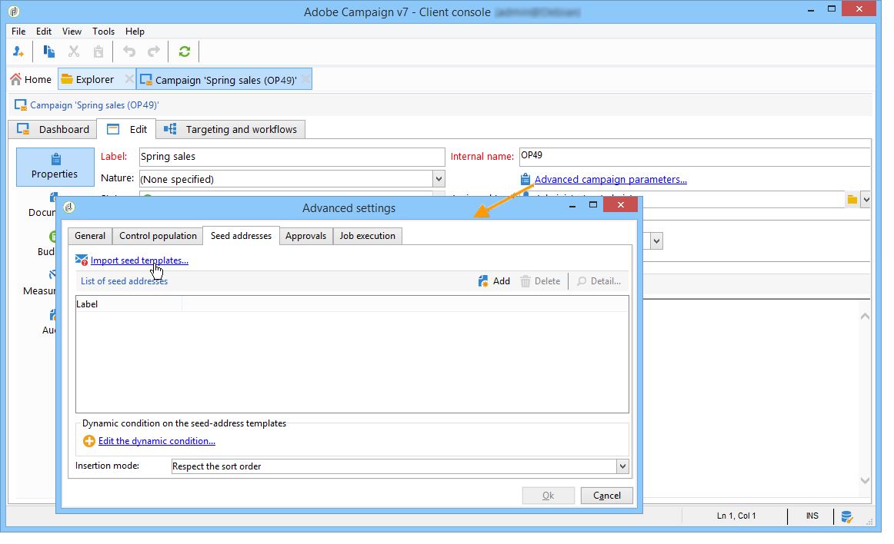

# 新增種子地址{#adding-seed-addresses}

## 傳遞中的種子地址 {#seed-addresses-in-a-delivery}

若要新增傳送的特定種子地址，請按一下 **[!UICONTROL To]** 連結，然後選取 **[!UICONTROL Seed addresses]** 標籤。

有三種可能的插入模式：

1. 輸入單一種子地址。

   若要這麼做，請按一下 **[!UICONTROL Add]** 按鈕並定義位址列位的內容。 對每個位址重複此步驟。

1. 匯入地址範本，並根據您的需求加以調整。

   若要這麼做，請按一下 **[!UICONTROL Import seed templates...]** 連結並選取包含地址範本的資料夾。 如需詳細資訊，請參閱[本章節](creating-seed-addresses.md#creating-seed-address-templates)。

   如有必要，在新增變數後，您可以連按兩下變數或按一下 **[!UICONTROL Detail...]** 按鈕以調整每個地址的內容。

1. 建立條件以動態選取要插入的控制位址。

   若要這麼做，請按一下 **[!UICONTROL Edit the dynamic condition...]** 連結，然後輸入種子地址選擇引數。 例如，您可以包含包含於特定檔案夾中的所有種子地址，或屬於您組織之特定部門的種子地址。

   本章節提供這方面的範例： [使用案例：依條件選取種子地址](use-case--selecting-seed-addresses-on-criteria.md).

>[!NOTE]
>
>當使用的收件者表格不是預設值時，會使用此選項 **nms：recipient** 表格內，而且您正使用Adobe Campaign隨附的收件匣轉譯功能 **[!UICONTROL Deliverability]** 模組。
>
>有關詳細資訊，請參閱 [使用外部收件者表格](using-an-external-recipient-table.md) 以及的相關檔案 [收件匣轉譯](inbox-rendering.md).

對於傳送，您也可以自訂將位址插入解壓縮檔案的方式。 預設情況下，會以輸出檔案的排序順序插入它們，但您可以選擇在檔案結尾或開頭插入，或隨機在主要目標的收件者之間插入。

## 行銷活動中的種子地址 {#seed-addresses-in-a-campaign}

若要新增種子地址至行銷活動的目標，請選取作業並按一下 **[!UICONTROL Edit]** 標籤。

按一下 **[!UICONTROL Advanced campaign settings...]** 連結，然後 **[!UICONTROL Seed addresses]** 標籤，如下所示：

從行銷活動插入的種子地址將新增到行銷活動中每個傳遞的目標。
