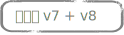

# 新增種子地址{#adding-seed-addresses}

## 傳送中的種子地址 {#seed-addresses-in-a-delivery}

若要新增傳送的特定種子地址，請按一下&#x200B;**[!UICONTROL To]**&#x200B;連結，然後選取&#x200B;**[!UICONTROL Seed addresses]**&#x200B;標籤。

有三種可能的插入模式：

1. 輸入單個種子地址。

   要執行此操作，請按一下&#x200B;**[!UICONTROL Add]**&#x200B;按鈕並定義地址欄位的內容。 對每個地址重複。

1. 匯入地址範本並加以調整以符合您的需求。

   要執行此操作，請按一下&#x200B;**[!UICONTROL Import seed templates...]**&#x200B;連結並選擇包含地址模板的資料夾。 如需詳細資訊，請參閱[本章節](creating-seed-addresses.md#creating-seed-address-templates)。

   如有必要，新增這些欄位後，您可以連按兩下，或按一下&#x200B;**[!UICONTROL Detail...]**&#x200B;按鈕以調整每個位址的內容。

1. 建立條件以動態選取要插入的控制地址。

   要執行此操作，請按一下&#x200B;**[!UICONTROL Edit the dynamic condition...]**&#x200B;連結，然後輸入種子地址選擇參數。 例如，您可以包含特定資料夾中包含的所有種子地址，或包含貴組織特定部門的種子地址。

   本節將提供此範例：[使用案例：按條件](use-case--selecting-seed-addresses-on-criteria.md)選擇種子地址。

>[!NOTE]
>
>使用的收件者表格不是預設的&#x200B;**nms:recipient**&#x200B;表格，且您使用Adobe Campaign **[!UICONTROL Deliverability]**&#x200B;模組隨附的收件匣轉譯功能時，即會使用此選項。
>
>有關詳細資訊，請參閱[使用外部收件者表](using-an-external-recipient-table.md)和[收件匣呈現](inbox-rendering.md)上的檔案。

對於傳送，您也可以自訂將位址插入解壓縮檔案的方式。 依預設，它們會以輸出檔案的排序順序插入，但您可以選取在檔案的結尾或開頭插入，或在主要目標的收件者之間隨機插入。

## 行銷活動中的種子地址 {#seed-addresses-in-a-campaign}

若要將種子地址添加到促銷活動的目標，請選擇操作，然後按一下&#x200B;**[!UICONTROL Edit]**&#x200B;頁簽。

按一下&#x200B;**[!UICONTROL Advanced campaign settings...]**&#x200B;連結，然後按一下&#x200B;**[!UICONTROL Seed addresses]**&#x200B;標籤，如下所示：

從促銷活動插入的種子地址將新增至促銷活動中每個傳送的目標。
