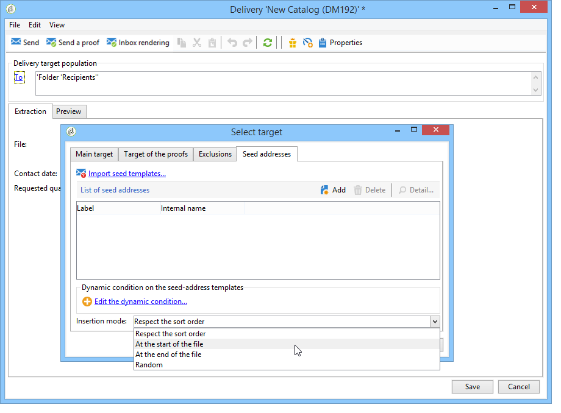

# 新增種子地址{#adding-seed-addresses}

## 傳遞中的種子地址 {#seed-addresses-in-a-delivery}

若要新增傳遞的特定種子地址，請按一下&#x200B;**[!UICONTROL To]**&#x200B;連結，然後選取&#x200B;**[!UICONTROL Seed addresses]**&#x200B;標籤。

有三種可能的插入模式：

1. 輸入單一種子地址。

   若要這麼做，請按一下&#x200B;**[!UICONTROL Add]**&#x200B;按鈕並定義位址列位的內容。 對每個位址重複此步驟。

1. 匯入位址範本，並根據您的需求加以調整。

   若要這麼做，請按一下&#x200B;**[!UICONTROL Import seed templates...]**&#x200B;連結，然後選取包含地址範本的資料夾。 如需詳細資訊，請參閱[本章節](creating-seed-addresses.md#creating-seed-address-templates)。

   如有必要，在新增地址之後，您可以連按兩下它們，或按一下&#x200B;**[!UICONTROL Detail...]**&#x200B;按鈕以調整每個地址的內容。

1. 建立條件以動態選取要插入的控制位址。

   若要這麼做，請按一下&#x200B;**[!UICONTROL Edit the dynamic condition...]**&#x200B;連結，然後輸入種子位址選取引數。 例如，您可以包含特定資料夾中包含的所有種子地址，或屬於您組織特定部門的種子地址。

   本區段提供這方面的範例： [使用案例：依據條件](use-case-selecting-seed-addresses-on-criteria.md)選取種子地址。

>[!NOTE]
>
>當使用的收件者資料表不是預設的&#x200B;**nms：recipient**&#x200B;資料表，而且您正在使用Adobe Campaign **[!UICONTROL Deliverability]**&#x200B;模組隨附的收件匣轉譯功能時，就會使用此選項。
>
>如需詳細資訊，請參閱[使用外部收件者資料表](using-an-external-recipient-table.md)以及有關[收件匣轉譯](inbox-rendering.md)的檔案。

對於傳送，您也可以自訂將位址插入解壓縮檔案的方式。 預設會依輸出檔案的排序順序插入，但您可以選擇在檔案結尾或開頭插入，或隨機插入主要目標的收件者之間。

## 行銷活動中的種子地址 {#seed-addresses-in-a-campaign}

若要新增種子地址至行銷活動的目標，請選取作業並按一下&#x200B;**[!UICONTROL Edit]**&#x200B;標籤。

按一下&#x200B;**[!UICONTROL Advanced campaign settings...]**&#x200B;連結，然後按一下&#x200B;**[!UICONTROL Seed addresses]**&#x200B;標籤，如下所示：

從行銷活動插入的種子地址將新增到行銷活動中的每個傳遞的目標。
