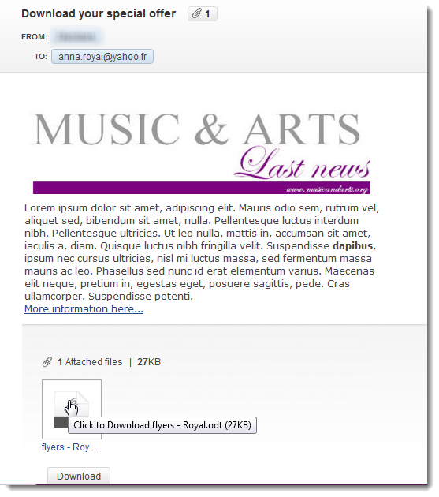

# 附加檔案{#attaching-files}

## 關於電子郵件附件{#about-email-attachments}

您可以附加一或多個檔案至電子郵件傳送。

>[!NOTE]
>
>為避免效能問題，建議每個電子郵件不要包含多個附件。 建議的閾值可從[Campaign Classic選項清單](../../installation/using/configuring-campaign-options.md#delivery)配置。

可能有兩種情況：

* 選取檔案，並依原樣附加至傳送。
* 為每個收件者個人化附件的內容。 在這種情況下，您需要建立&#x200B;**計算附件**:附件的名稱在每條消息的發送時計算，具體取決於收件人。 如果您有&#x200B;**可變數位列印**&#x200B;選項，您也可以在傳送時將內容個人化並轉換為PDF格式。

>[!NOTE]
>
>這種配置通常在傳送範本中執行。 有關詳細資訊，請參閱[關於模板](../../delivery/using/about-templates.md)。

## 附加本地檔案{#attaching-a-local-file}

若要將本機檔案附加至傳送，請遵循下列步驟。

>[!NOTE]
>
>您可以附加數個檔案至傳送。 附件可以是任何格式，包括壓縮格式。

1. 按一下&#x200B;**[!UICONTROL Attachments]**&#x200B;連結。
1. 按一下 **[!UICONTROL Add]** 按鈕。
1. 按一下&#x200B;**[!UICONTROL File...]**&#x200B;以選取要附加至傳送的檔案。

   

您也可以直接將檔案拖放至傳送精靈工具列的傳送&#x200B;**[!UICONTROL Attachments]**&#x200B;欄位，或使用傳送精靈工具列的&#x200B;**[!UICONTROL Attach]**&#x200B;圖示。

在選取檔案後，檔案會立即上傳至伺服器，以便在傳送時使用。 它列在&#x200B;**[!UICONTROL Attachments]**&#x200B;欄位中。

## 建立計算附件{#creating-a-calculated-attachment}

建立計算附件時，可以在分析或發送每條消息時計算附件的名稱，並且可以取決於收件人。 您也可以個人化並轉換為PDF。

若要建立個人化附件，請遵循下列步驟：

1. 按一下&#x200B;**[!UICONTROL Attachments]**&#x200B;連結。
1. 按一下&#x200B;**[!UICONTROL Add]**&#x200B;按鈕，然後選擇&#x200B;**[!UICONTROL Calculated attachment]**。
1. 從&#x200B;**[!UICONTROL Type]**&#x200B;下拉清單中選擇計算類型：

可以使用以下選項：

* **建立傳送範本時會指定檔案名稱**
* **在傳送每則訊息時，檔案內容會個人化並轉換為PDF**
* **檔案名稱是在傳送分析期間計算的（無法取決於收件者描述檔）**
* **檔案名稱是在傳送時計算給每個收件者（可視收件者而定）**

### 附加本地檔案{#attach-a-local-file}

如果附件是本地檔案，請選擇以下選項：**[!UICONTROL File name is specified when creating the delivery template]**。 檔案會在本機選取並上傳至伺服器。 請遵循以下步驟：

1. 在&#x200B;**[!UICONTROL Local file]**&#x200B;欄位中選取要上傳的檔案。
1. 視需要指定標籤。 在消息傳遞系統中查看時，標籤會替換檔案名。 如果未指定任何內容，則預設情況下會使用檔案名。

   

1. 如有必要，請選擇&#x200B;**[!UICONTROL Upload file on the server]** ，然後按一下&#x200B;**[!UICONTROL Update on server]**&#x200B;開始傳輸。

   

然後，該檔案便可在伺服器上使用，以便附加到從此模板建立的不同傳送。

### 附加個人化訊息{#attach-a-personalized-message}

選項&#x200B;**[!UICONTROL The file content is personalized and converted into PDF format at the time of delivery for each message]**&#x200B;可讓您選擇包含個人化欄位的檔案，例如預期收件者的姓氏和名字。

對於此類型的附件，應用以下配置步驟：

1. 選取要上傳的檔案。
1. 視需要指定標籤。
1. 選擇&#x200B;**[!UICONTROL Upload file on the server]** ，然後按一下&#x200B;**[!UICONTROL Update on server]**&#x200B;開始傳輸。
1. 您可以顯示預覽。 若要這麼做，請選取收件者。

   

1. 分析您的傳送內容，然後開始進行。

   每位收件者都會收到附加至傳送的個人化PDF。

   

>[!NOTE]
>
>為避免效能問題，如果您將即時從個人化URL下載的影像加入附件，預設每個影像大小不應超過100,000位元組。 此建議的閾值可從[Campaign Classic選項清單](../../installation/using/configuring-campaign-options.md#delivery)配置。

### 附加計算檔案{#attach-a-calculated-file}

您可以在準備交貨期間計算附件名稱。 要執行此操作，請選擇&#x200B;**[!UICONTROL The file name is calculated during delivery analysis (it cannot depend on the recipient)]**&#x200B;選項。

>[!NOTE]
>
>只有當傳送是由外部程式或工作流程傳送時，才會使用此選項。

1. 指定您要套用至附件的標籤。
1. 在定義窗口中指定檔案的訪問路徑及其確切名稱。

   >[!IMPORTANT]
   >
   >該檔案必須存在於伺服器上。

   

1. 分析並開始傳送。

   可在分析日誌中看到檔案名計算。

   

### 附加個人化檔案{#attach-a-personalized-file}

選擇附件時，可以選擇&#x200B;**[!UICONTROL The file name is calculated during delivery for each recipient (it can depend on the recipient)]**&#x200B;選項。 然後，您可以將收件者個人化資料與要傳送的檔案名稱對應。

>[!NOTE]
>
>只有當傳送是由外部程式或工作流程傳送時，才會使用此選項。

1. 指定您要套用至附件的標籤。
1. 在定義窗口中指定檔案的訪問路徑及其確切名稱。 如果檔案名稱是個人化的，您可以使用「個人化」欄位來取得相關值。

   

   >[!IMPORTANT]
   >
   >該檔案必須存在於伺服器上。

1. 分析並開始傳送。

   在以下示例中，根據使用合併欄位定義的附加檔案名稱來選擇附加檔案。

   

### 附件設定{#attachment-settings}

對於前兩個選項，您可以選擇適當的選項來選擇&#x200B;**[!UICONTROL Upload file on the server]**。 **[!UICONTROL Update the file on the server]**&#x200B;連結可讓您開始上傳。

有訊息會告訴您檔案已上傳至伺服器：

對於檔案更改，將顯示一條警告消息：

**[!UICONTROL Advanced]**&#x200B;標籤可讓您定義附加檔案的進階選項：

* 您可以定義篩選選項，以避免將附加的檔案傳送給所有收件者。 選項&#x200B;**[!UICONTROL Enable filtering of recipients who will receive the attachment]**&#x200B;會啟動輸入欄位，用於定義收件者選擇指令碼，此指令碼必須在JavaScript中輸入。
* 您可以編寫檔案名稱的指令碼，以個人化檔案。

   在視窗中輸入文字，然後使用下拉式清單中的個人化欄位。 在下列範例中，檔案名稱會個人化，以包含今天的日期和收件者的名稱。

   
