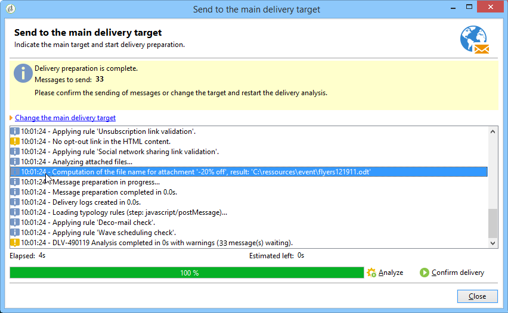

# 將檔案附加至電子郵件{#attaching-files}

## 關於電子郵件附件 {#about-email-attachments}

您可以將一或多個檔案附加至電子郵件傳送。

>[!NOTE]
>
>為避免出現效能問題，建議每封電子郵件不要包含多個附件。建議的臨界值可從下列位置設定： [Campaign Classic選項清單](../../installation/using/configuring-campaign-options.md#delivery).

有兩種可能的情況：

* 選取檔案並按原樣將其附加至傳送。
* 為每個收件者個人化附件內容。 在此情況下，您需要建立 **計算附件**：附件的名稱會在每封郵件的傳遞時根據收件者計算。 內容也可以個人化，並在傳送時轉換為PDF格式，前提是您 **可變數位列印** 選項。

>[!NOTE]
>
>這類設定通常會在傳遞範本中執行。 有關詳細資訊，請參閱 [關於範本](about-templates.md).

## 護欄 {#attachments-guardrails}

為避免效能問題，電子郵件中包含的影像不能超過100 MB。 此限制（預設設定）可由 `NmsDelivery_MaxDownloadedImageSize` 選項。 不過，Adobe強烈建議您在電子郵件傳送中避免大型影像。

Adobe也建議限制附加檔案的大小和數量。 依預設，您只能新增一個檔案作為電子郵件的附件。 此臨界值可從 `NmsDelivery_MaxRecommendedAttachments` 選項。

進一步瞭解 [Campaign Classic選項清單](../../installation/using/configuring-campaign-options.md#delivery).

## 附加本機檔案 {#attaching-a-local-file}

若要將本機檔案附加至傳遞，請遵循下列步驟。

>[!NOTE]
>
>您可以將多個檔案附加至傳遞。 附件可以是任何格式，包括壓縮格式。

1. 按一下&#x200B;**[!UICONTROL Attachments]**&#x200B;連結。
1. 按一下 **[!UICONTROL Add]** 按鈕。
1. 按一下 **[!UICONTROL File...]** 以選取要附加至傳遞的檔案。

   

您也可以直接將檔案拖放到傳送中 **[!UICONTROL Attachments]** 欄位，或使用 **[!UICONTROL Attach]** 圖示進行遞送。

選取檔案後，系統會立即將其上傳至伺服器，以便在傳送時可供使用。 此專案會列於 **[!UICONTROL Attachments]** 欄位。

## 建立計算附件 {#creating-a-calculated-attachment}

建立計算附件時，可在分析或傳遞每封郵件期間計算附件的名稱，並可視收件者而定。 您也可以將其個人化並轉換為PDF。

若要建立個人化附件，請遵循下列步驟：

1. 按一下&#x200B;**[!UICONTROL Attachments]**&#x200B;連結。
1. 按一下 **[!UICONTROL Add]** 按鈕，然後選取 **[!UICONTROL Calculated attachment]**.
1. 選取計算型別，從 **[!UICONTROL Type]** 下拉式清單：

可以使用以下選項：

* **建立傳遞範本時所指定的檔案名稱**
* **檔案的內容會進行個人化，並在每則訊息的傳送期間轉換為PDF**
* **檔案名稱會在傳遞分析期間計算（無法取決於收件者設定檔）**
* **檔案名稱會在每個收件者的傳遞時計算（可取決於收件者）**

### 附加本機檔案 {#attach-a-local-file}

如果附件是本機檔案，請選取選項： **[!UICONTROL File name is specified when creating the delivery template]**. 檔案會在本機選取並上傳至伺服器。 請遵循以下步驟：

1. 選取要上傳的檔案 **[!UICONTROL Local file]** 欄位。
1. 視需要指定標籤。 在訊息系統中檢視時，標籤會取代檔案名稱。 如果未指定任何專案，預設會使用檔案名稱。

   

1. 如有必要，請選取 **[!UICONTROL Upload file on the server]**，然後按一下 **[!UICONTROL Update on server]** 以開始傳輸。

   

然後，檔案便可在伺服器上取得，以附加至從此範本建立的不同傳送。

### 附加個人化訊息 {#attach-a-personalized-message}

選項 **[!UICONTROL The file content is personalized and converted into PDF format at the time of delivery for each message]** 可讓您選取包含個人化欄位的檔案，例如目標收件者的姓氏和名字。

對於此型別的附件，請套用下列設定步驟：

1. 選取要上傳的檔案。
1. 視需要指定標籤。
1. 選取 **[!UICONTROL Upload file on the server]**，然後按一下 **[!UICONTROL Update on server]** 以開始傳輸。
1. 您可以顯示預覽。 若要這麼做，請選取收件者。

   

1. 分析您的傳遞，然後開始進行。

   每個收件者都會收到附加至傳遞的個人化PDF。

   

### 附加計算檔案 {#attach-a-calculated-file}

您可以在傳遞準備期間計算附件名稱。 若要這麼做，請選取選項 **[!UICONTROL The file name is calculated during delivery analysis (it cannot depend on the recipient)]**.

>[!NOTE]
>
>僅當傳送是由外部程式或工作流程傳送時，才會使用此選項。

1. 指定您要套用至附件的標籤。
1. 在定義視窗中指定檔案的存取路徑及其確切名稱。

   >[!IMPORTANT]
   >
   >檔案必須存在於伺服器上。

   

1. 分析，然後開始傳遞。

   可以在分析記錄檔中看到檔案名稱計算。

   

### 附加個人化檔案 {#attach-a-personalized-file}

選取附件時，您可以選擇選項 **[!UICONTROL The file name is calculated during delivery for each recipient (it can depend on the recipient)]**. 然後，您可以使用要傳送的檔案名稱來對應收件者個人化資料。

>[!NOTE]
>
>僅當傳送是由外部程式或工作流程傳送時，才會使用此選項。

1. 指定您要套用至附件的標籤。
1. 在定義視窗中指定檔案的存取路徑及其確切名稱。 如果檔案名稱已個人化，您可以使用相關值的個人化欄位。

   

   >[!IMPORTANT]
   >
   >檔案必須存在於伺服器上。

1. 分析，然後開始傳遞。

   在以下範例中，附加檔案是根據使用合併欄位定義的名稱選擇的。

   

### 附件設定 {#attachment-settings}

對於前兩個選項，您可以選擇 **[!UICONTROL Upload file on the server]** 選取適當的選項。 此 **[!UICONTROL Update the file on the server]** 連結可讓您開始上傳。

系統會顯示一則訊息，告知您檔案已上傳至伺服器：

對於檔案變更，會顯示警告訊息：

此 **[!UICONTROL Advanced]** 索引標籤可讓您定義附加檔案上的進階選項：

* 您可以定義篩選選項，以避免將附加檔案傳送給所有收件者。 選項 **[!UICONTROL Enable filtering of recipients who will receive the attachment]** 啟用用來定義收件者選擇指令碼的輸入欄位，該指令碼必須以JavaScript輸入。
* 您可以編寫檔案名稱的指令碼，以便進行個人化。

  在視窗中輸入文字，並使用下拉式清單中可用的個人化欄位。 在下列範例中，檔案名稱經過個人化，包含今天的日期和收件者名稱。

  
