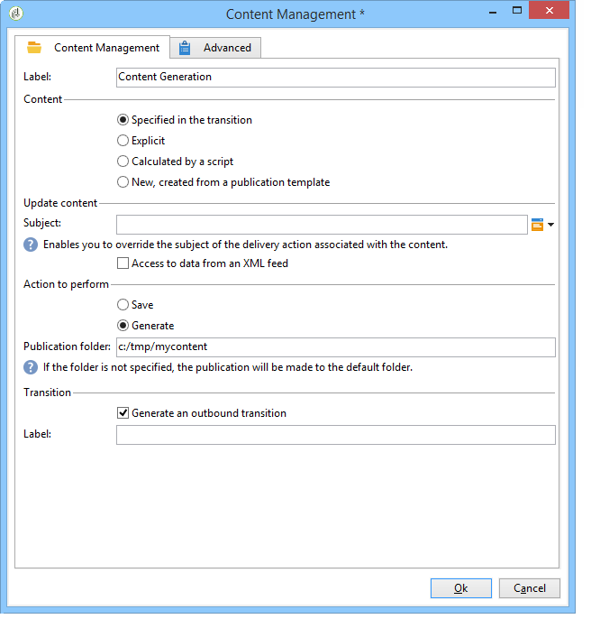

# 使用工作流程自動化{#automating-via-workflows}


## 內容管理活動 {#content-management-activity}

可透過Adobe Campaign使用者端介面設定的工作流程，自動建立、編輯和發佈內容。

此 **內容管理** 活動可透過 **[!UICONTROL Tools]** 工作流程圖工具列。

活動屬性可細分為四個步驟：

* **[!UICONTROL Content]** ：可讓您輸入現有內容或建立內容，
* **[!UICONTROL Update content]** ：可讓您修改內容的主體或透過XML資料流更新內容，
* **[!UICONTROL Action to execute]** ：可讓您儲存或產生內容，
* **[!UICONTROL Transition]** ：可讓您選擇是否要產生輸出轉變並為其命名。


### 內容 {#content}

* **由轉變指定**

   要使用的內容先前已建立。 處理程式將涉及由傳入事件傳播的內容例項。 可透過事件的「contentId」變數存取內容識別碼。

* **明確**

   可讓您選擇先前建立的內容。

* **由指令碼計算**

   根據JavaScript範本選取內容例項。 要評估的程式碼可讓您擷取內容識別碼。

* **新增，透過出版物範本建立**

   透過出版物範本建立新內容。 內容例項將會儲存在填入的「字串」資料夾中。

### 更新內容 {#update-the-content}

* **主題**

   可讓您在發佈時修改傳遞動作的主題。

* **從XML摘要存取資料**

   內容會從外部來源的XML摘要更新。 必須輸入URL才能進行資料下載。

   XSL樣式表可用來轉換傳入的XML資料。

### 要執行的動作 {#action-to-execute}

* **儲存**

   儲存建立或修改的內容。 儲存內容的識別碼會傳播到傳出事件的「contentId」變數中。

* **生成**

   為具有「檔案」型別發佈的每個轉換範本產生輸出檔案。 使用下列引數為每個產生的檔案啟動傳出轉變：儲存在「contentId」變數中的內容的識別碼，以及「filename」變數中的檔案名稱。

### 轉變 {#transition}

此 **產生輸出轉換** 選項可讓您將輸出轉變新增至 **[!UICONTROL Content management]** 活動以將新活動連結至工作流程執行。 核取此選項後，輸入轉變的標籤。

## 範例 {#examples}

### 自動化內容建立和傳遞 {#automating-content-creation-and-delivery}

下列範例會自動建立及傳送內容區塊。


內容是透過「內容管理」活動設定：


透過出版物模型和內容字串資料夾建立新的內容例項。

在我們的範例中，我們已將傳遞主題超載。 這將會列入考量，而不是在 **[!UICONTROL Delivery]** 範本。

內容會由來自輸入URL的XML摘要自動填入：

```
<?xml version='1.0' encoding='ISO-8859-1'?>
<book name="Content automation test" date="2008/06/08" language="eng" computeString="Content automation test">
  <section id="1" name="Introduction">
    <page>Introduction to input forms.</page>
  </section>
</book>
```

資料格式不符合在發佈範本中輸入的資料結構描述(**cus：book** 在我們的範例中)； **`<section>`** 元素必須取代為 **`<chapter>`** 元素。 我們需要套用「cus：book-workflow.xsl」樣式表以進行必要的變更。

使用的XSLT樣式表原始碼：

```
<?xml version="1.0" encoding="utf-8"?>
<xsl:stylesheet version="1.0" xmlns:xsl="http://www.w3.org/1999/XSL/Transform">
 <xsl:output indent="yes" method="xml"  encoding="ISO-8859-1"/>

 <xsl:template match="text()|@*"/>

  <xsl:template match="*">
    <xsl:variable name="element.name" select="name(.)"/>
    <xsl:element name="{$element.name}">
      <xsl:copy-of select="text()|@*"/>
      <xsl:apply-templates/>
    </xsl:element>
  </xsl:template>

  <xsl:template match="book">
  <book name="test">
     <xsl:apply-templates/>
    <book>
 </xsl:template>

  <xsl:template match="section">
    <chapter>
      <xsl:for-each select="@*">
        <xsl:copy-of select="."/>
      </xsl:for-each>
       <xsl:apply-templates/>
    </chapter>
  </xsl:template>
  
</xsl:stylesheet>
```

活動的最後一個動作是儲存內容例項並繼續下一個任務。

目標定位是透過 **查詢** 活動。

一個 **合併連結** 已新增活動，以確保只有在完成目標查詢和內容更新後，才會開始傳送。

傳遞動作的設定方式為 **傳遞** 活動：


系統會根據範本建立新的傳遞動作。

活動的傳遞範本可用來選取出版物範本的轉換範本。 內容產生將會考量所有沒有傳遞範本的HTML和文字範本，或是使用與活動相同的範本參照的範本。

要傳遞的目標是透過傳入事件輸入的。

傳遞內容會透過傳入事件填入。

完成活動的最後一步是準備然後啟動傳送。

### 建立內容以供稍後發佈 {#creating-content-and-publishing-it-later}

此範例會建立內容區塊，並在特定時間延遲後啟動檔案發佈。


第一個 **內容管理** 任務會建立內容例項。


>[!NOTE]
>
>此 **[!UICONTROL Publication]** 「轉換範本」視窗的標籤必須填入要產生的目標位置。

已新增等待活動，以暫停下一個轉變一週。


在此時段內手動輸入內容。

下一個任務會啟動內容產生。



要發佈的內容會透過傳入的轉變輸入。

最終動作是透過強制發佈目錄來產生此內容。

此 **JavaScript代碼** activity會擷取每個產生檔案的全名。


### 建立傳遞及其內容 {#creating-the-delivery-and-its-content}

此範例使用與第一個範例相同的概念，只有它在第一個步驟中建立傳遞動作。


第一個 **建立傳遞** 任務會建立傳遞動作。

「分支」活動可讓您同時啟動Target計算與內容例項的建立。

執行工作後，「與」連線方塊會啟動 **傳遞** 此任務可啟動先前建立的內容及目標定位傳遞。


要啟動的傳遞動作會透過轉變填入。

要傳遞的目標是透過傳入事件輸入的。

傳遞內容會透過傳入事件填入。

活動的最終動作是準備並啟動傳送。

### 從FTP匯入內容 {#importing-content-from-ftp}

如果您的傳送內容位於FTP或SFTP伺服器上的HTML檔案中，則可輕鬆將此內容載入到Adobe Campaign傳送中。 請參閱 [此範例](../../workflow/using/loading-delivery-content.md).

### 從Amazon Simple Storage Service (S3)聯結器匯入內容 {#importing-content-from-amazon-simple-storage-service--s3--connector}

如果您的傳送內容位於Amazon Simple Storage Service (S3)貯體，則可輕鬆將此內容載入Adobe Campaign傳送中。 請參閱 [此範例](../../workflow/using/loading-delivery-content.md).

## 半自動更新 {#semi-automatic-update}

可在「半自動」模式下更新內容資料。 會透過URL從XML摘要復原資料。

透過輸入表單手動執行資料復原的啟動。

目的是宣告 **editBtn** type **`<input>`** 欄位。 此控制項包含編輯區域和啟動處理的按鈕。

編輯區域可讓您填入用來建構要擷取之資料的XML摘要的URL的變數資料。

按鈕會執行 **GetAndTransform** SOAP方法填入至 **`<input>`** 標籤之間。

表單中的控制項宣告如下：

```
<input type="editbtn" xpath="<path>">
  <enter>
    <soapCall name="GetAndTransform" service="ncm:content">
      <param exprIn="<url>" type="string"/>
      <param exprIn="'xtk:xslt|<style sheet>'" type="string"/>
      <param type="DOMElement" xpathOut="<output path>"/>
    </soapCall>
  </enter>
</input>
```

此 **GetAndTransform** 方法必須宣告於 **`<enter>`** 的元素 **`<input>`** 標籤之間。 此標籤會以從動態建構的運算式復原XML資料的URL作為引數。 函式的第二個引數是選用引數，當傳入的XML資料與內容的格式不同時，會參考用於中間轉換的樣式表。

輸出會根據在最後一個引數中輸入的路徑來更新內容。

**範例**：為了說明此範例，我們從&quot;cus：book&quot;結構描述開始。

新增半自動更新編輯控制項輸入表單：


```
<input label="File name" type="editbtn" xpath="/tmp/@name">
  <enter>
    <soapCall name="GetAndTransform" service="ncm:content">
      <param exprIn="'https://myserver.adobe.com/incoming/' + [/tmp/@name] + '.xml'" type="string"/>
      <param exprIn="'xtk:xslt|cus:book-workflow.xsl'" type="string"/>
      <param type="DOMElement" xpathOut="."/>
    </soapCall>
  </enter>
</input>
```

編輯區域可讓您輸入要擷取的檔案名稱。 URL是根據此名稱建構，例如：https://myserver.adobe.com/incomin/data.xml

要擷取的資料格式與工作流程自動化範例1中的相同。 我們將使用在此範例中看到的「cus：book-workflow.xsl」樣式表。

工作執行的結果會從路徑「。」更新內容執行個體。
