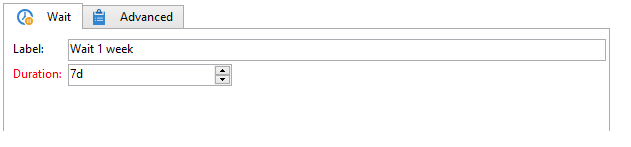
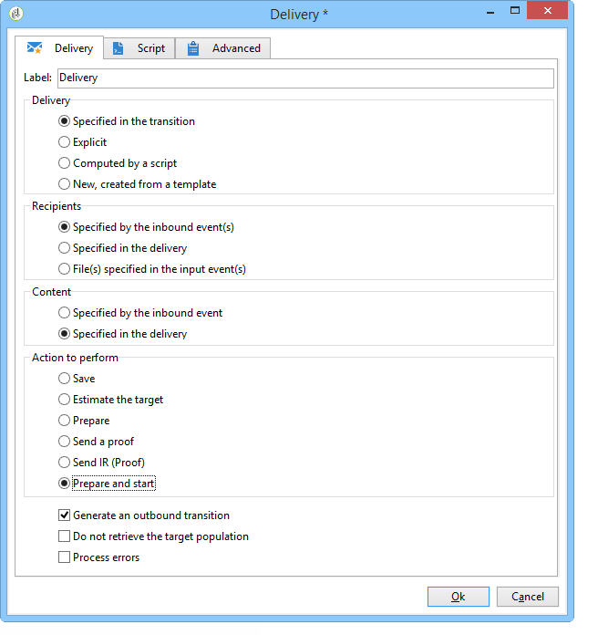

# 使用工作流程自動化{#automating-via-workflows}


## 內容管理活動 {#content-management-activity}

使用通過Adobe Campaign客戶端介面配置的工作流，可以自動建立、編輯和發佈內容。

的 **內容管理** 通過 **[!UICONTROL Tools]** 工具欄。

活動屬性分為四個步驟：

* **[!UICONTROL Content]** :允許您輸入現有內容或建立內容，
* **[!UICONTROL Update content]** :允許您修改內容的主題或通過XML資料流更新內容，
* **[!UICONTROL Action to execute]** :允許您保存或生成內容，
* **[!UICONTROL Transition]** :允許您選擇是否生成輸出轉換並為其指定名稱。


### 內容 {#content}

* **由轉換指定**

   要使用的內容是以前建立的。 進程將與傳入事件傳播的內容實例有關。 通過事件的&quot;contentId&quot;變數訪問內容標識符。

* **顯式**

   允許您選擇以前建立的內容。

* **由指令碼計算**

   基於JavaScript模板選擇內容實例。 要評估的代碼允許您檢索內容標識符。

* **新建，通過發佈模板建立**

   通過發佈模板建立新內容。 內容實例將保存在填充的「字串」資料夾中。

### 更新內容 {#update-the-content}

* **主旨**

   用於在發佈時修改傳遞操作的主題。

* **從XML源訪問資料**

   從外部源的XML源更新內容。 必須輸入URL才能進行資料下載。

   XSL樣式表可用於轉換傳入的XML資料。

### 要執行的操作 {#action-to-execute}

* **儲存**

   保存建立或修改的內容。 已保存內容的標識符在傳出事件的&quot;contentId&quot;變數中傳播。

* **生成**

   為每個轉換模板生成帶有「檔案」類型發佈的輸出檔案。 每個生成的檔案都會激活傳出轉換，並使用以下參數：保存在&quot;contentId&quot;變數中的內容的標識符和&quot;filename&quot;變數中的檔案名。

### 轉變 {#transition}

的 **生成輸出轉換** 選項，可將輸出轉換添加到 **[!UICONTROL Content management]** 活動，將新活動連結到工作流執行。 選中此選項後，輸入過渡的標籤。

## 範例 {#examples}

### 自動化內容建立和交付 {#automating-content-creation-and-delivery}

以下示例自動建立和傳遞內容塊。


通過「內容管理」活動配置內容：


通過發佈模型和內容字串資料夾建立新的內容實例。

在我們的例子中，我們超負荷了交貨對象。 將考慮它，而不是在 **[!UICONTROL Delivery]** 的下界。

內容由輸入的URL中的XML源自動填充：

```
<?xml version='1.0' encoding='ISO-8859-1'?>
<book name="Content automation test" date="2008/06/08" language="eng" computeString="Content automation test">
  <section id="1" name="Introduction">
    <page>Introduction to input forms.</page>
  </section>
</book>
```

資料格式與在發佈模板中輸入的資料架構不匹配(**cus：帳簿** );這樣 **`<section>`** 元素必須替換為 **`<chapter>`** 的子菜單。 我們需要應用「cus:book-workflow.xsl」樣式表進行必要的更改。

使用的XSLT樣式表的原始碼：

```
<?xml version="1.0" encoding="utf-8"?>
<xsl:stylesheet version="1.0" xmlns:xsl="http://www.w3.org/1999/XSL/Transform">
 <xsl:output indent="yes" method="xml"  encoding="ISO-8859-1"/>

 <xsl:template match="text()|@*"/>

  <xsl:template match="*">
    <xsl:variable name="element.name" select="name(.)"/>
    <xsl:element name="{$element.name}">
      <xsl:copy-of select="text()|@*"/>
      <xsl:apply-templates/>
    </xsl:element>
  </xsl:template>

  <xsl:template match="book">
  <book name="test">
     <xsl:apply-templates/>
    <book>
 </xsl:template>

  <xsl:template match="section">
    <chapter>
      <xsl:for-each select="@*">
        <xsl:copy-of select="."/>
      </xsl:for-each>
       <xsl:apply-templates/>
    </chapter>
  </xsl:template>
  
</xsl:stylesheet>
```

活動的最終操作是保存內容實例並繼續執行下一個任務。

通過 **查詢** 的子菜單。

安 **與連接** 已添加活動，以確保僅在目標查詢和內容更新完成後才啟動傳遞。

通過 **交貨** 活動：


基於模板建立新的傳遞操作。

活動的傳遞模板用於選擇發佈模板的轉換模板。 內容生成將考慮所有沒有傳遞模板的HTML和文本模板，或那些與活動使用相同模板引用的模板。

要傳送的目標通過傳入事件輸入。

通過傳入事件填充傳遞內容。

完成活動的最後一步是準備並啟動交付。

### 建立內容以供以後發佈 {#creating-content-and-publishing-it-later}

此示例建立內容塊並在特定時間延遲後啟動檔案發佈。


第一個 **內容管理** 任務建立內容實例。


>[!NOTE]
>
>的 **[!UICONTROL Publication]** 必須使用要生成的目標的位置填充轉換模板窗口的頁籤。

將添加等待活動，以暫停下一個轉換一週。



在此時間段內手動輸入內容。

下一任務將啟動內容生成。


要發佈的內容通過傳入的轉換輸入。

最後的操作是通過強制發佈目錄來生成此內容。

的 **JavaScript代碼** 活動將檢索每個生成的檔案的全名。


### 建立交付及其內容 {#creating-the-delivery-and-its-content}

此示例使用與第一個示例相同的概念，僅在第一步中建立交貨操作。


第一個 **建立交貨** task建立交貨操作。

分叉活動允許您並行啟動目標計算和內容實例的建立。

執行任務後，「與」(AND)-join框將激活 **交貨** 任務，以啟動以前建立的內容和目標交付。



要啟動的傳遞操作通過轉換填充。

要傳送的目標通過傳入事件輸入。

通過傳入事件填充傳遞內容。

該活動的最後行動是準備和啟動交付。

### 從FTP導入內容 {#importing-content-from-ftp}

如果您的傳遞內容位於FTP或SFTP伺服器上的HTML檔案中，則可以輕鬆將此內容載入到Adobe Campaign的傳遞中。 請參閱 [此示例](../../workflow/using/loading-delivery-content.md)。

### 從Amazon簡單儲存服務(S3)連接器導入內容 {#importing-content-from-amazon-simple-storage-service--s3--connector}

如果您的交付內容位於Amazon簡單儲存服務(S3)儲存桶上，則您可以輕鬆地將此內容載入到Adobe Campaign交付中。 請參閱 [此示例](../../workflow/using/loading-delivery-content.md)。

## 半自動更新 {#semi-automatic-update}

內容資料可以在「半自動」模式下更新。 通過URL從XML源恢復資料。

資料恢復的激活通過輸入形式手動執行。

其目的是宣佈 **編輯Btn** 類型 **`<input>`** 的子菜單。 該控制項包括編輯區域和啟動處理的按鈕。

編輯區域允許您填充用於構建要檢索的資料的XML源的URL的變數資料。

按鈕執行 **GetAndTransform** 在 **`<input>`** 標籤。

窗體中的控制項聲明如下：

```
<input type="editbtn" xpath="<path>">
  <enter>
    <soapCall name="GetAndTransform" service="ncm:content">
      <param exprIn="<url>" type="string"/>
      <param exprIn="'xtk:xslt|<style sheet>'" type="string"/>
      <param type="DOMElement" xpathOut="<output path>"/>
    </soapCall>
  </enter>
</input>
```

的 **GetAndTransform** 必須在 **`<enter>`** 元素 **`<input>`** 標籤。 此標籤將從動態構建的表達式中恢復XML資料的URL作為參數。 函式的第二個參數是可選的，並在傳入的XML資料與內容的格式不同時引用用於中間轉換的樣式表。

輸出將根據在最後一個參數中輸入的路徑更新內容。

**示例**:為了說明此示例，我們從&quot;cus:book&quot;架構開始。

添加了半自動更新編輯控制項輸入表單：


```
<input label="File name" type="editbtn" xpath="/tmp/@name">
  <enter>
    <soapCall name="GetAndTransform" service="ncm:content">
      <param exprIn="'https://myserver.adobe.com/incoming/' + [/tmp/@name] + '.xml'" type="string"/>
      <param exprIn="'xtk:xslt|cus:book-workflow.xsl'" type="string"/>
      <param type="DOMElement" xpathOut="."/>
    </soapCall>
  </enter>
</input>
```

編輯區域允許您輸入要檢索的檔案的名稱。 URL是基於此名稱構建的，例如：https://myserver.adobe.com/incomin/data.xml

要檢索的資料的格式與工作流自動化示例1中的格式相同。 我們將使用此示例中所示的「cus:book-workflow.xsl」樣式表。

作業執行結果從路徑「。」更新內容實例。
