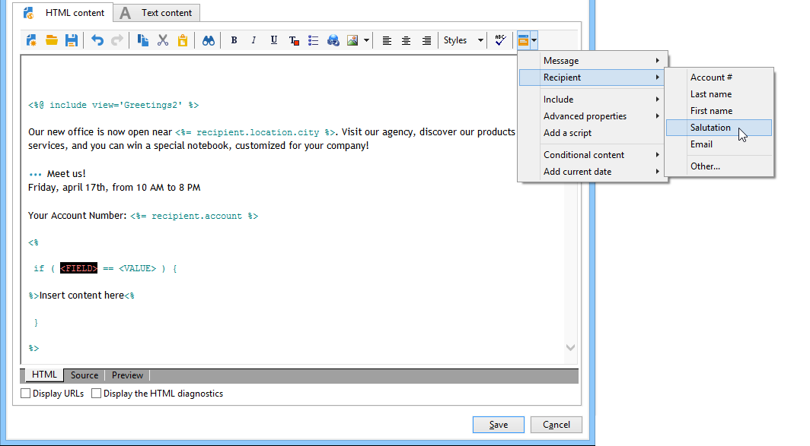
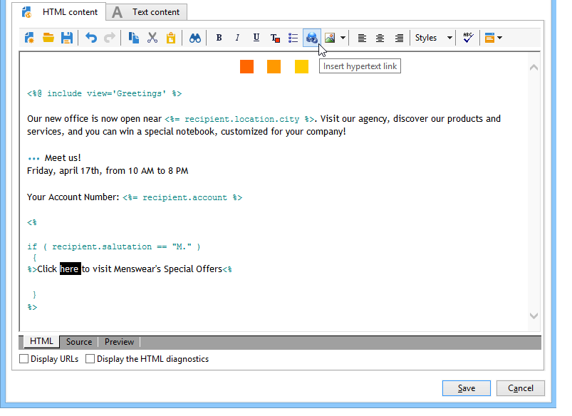

# 條件式內容{#conditional-content}


例如，您可以透過設定條件式內容欄位，根據收件者的設定檔建立動態個人化。 當滿足特定條件時，將替代文字塊和/或影像。

 [在影片中探索此功能](#conditionnal-content-video)


## 在電子郵件中使用條件 {#using-conditions-in-an-email}

在以下範例中，您將學習如何建立訊息，並根據收件者的性別和興趣，以動態方式個人化。

* 顯示「Mr」 或「Ms」 根據資料源中&#x200B;**[!UICONTROL Gender]**&#x200B;欄位（M或F）的值，
* 根據所指明或檢測到的興趣個性化組合新聞稿或促銷優惠：

   * 興趣1 — >區塊1
   * 興趣2 — >區塊2
   * 興趣3 — >區塊3
   * 興趣4 — >區塊4

要根據欄位的值建立條件式內容，請應用以下步驟：

1. 按一下個人化圖示並選取&#x200B;**[!UICONTROL Conditional content > If]**。

   

   個人化元素會插入訊息內文。 您現在必須進行設定。

1. 接下來，填入&#x200B;**if**&#x200B;運算式的參數。

   操作步驟：

   * 選取運算式的第一個元素&#x200B;**`<field>`**（依預設，在插入&#x200B;**if**&#x200B;運算式期間會反白顯示此元素），然後按一下個人化圖示以將其取代為測試欄位。

      

   * 將&#x200B;**`<value>`**&#x200B;替換為將滿足條件的欄位的值。 此值必須用引號表示。
   * 指定在滿足條件時要插入的內容。 這可能包含文字、影像、表單、超文字連結等。

      

1. 按一下&#x200B;**[!UICONTROL Preview]**&#x200B;標籤，以根據傳送收件者檢視訊息內容：

   * 選取條件為true的收件者：

      

   * 選取條件不為true的收件者：

      

您可以新增其他案例，並根據一或多個欄位的值定義不同內容。 要執行此操作，請使用&#x200B;**[!UICONTROL Conditional content > Else]**&#x200B;和&#x200B;**[!UICONTROL Conditional content > Else if]**。 這些運算式的設定方式與&#x200B;**if**&#x200B;運算式相同。


>[!CAUTION]
>
>若要遵循JavaScript語法，在新增&#x200B;**Else**&#x200B;和&#x200B;**Else if**&#x200B;條件後，必須刪除&#x200B;**%> &lt;%**&#x200B;字元。

按一下&#x200B;**[!UICONTROL Preview]**&#x200B;並選取收件者以檢視條件式內容。


## 建立多語言電子郵件 {#creating-multilingual-email}

在以下範例中，您將學習如何建立多語言電子郵件。 內容會根據收件者的偏好語言，以一種或另一種語言顯示。

1. 建立電子郵件並選取目標母體。 在此範例中，顯示一個或另一個版本的條件將以收件者設定檔的&#x200B;**Language**&#x200B;值為基礎。 在此範例中，這些值設為&#x200B;**EN**、**FR**、**ES**。
1. 在電子郵件HTML內容中，按一下&#x200B;**[!UICONTROL Source]**&#x200B;標籤並貼上下列程式碼：

   ```
   <% if (language == "EN" ) { %>
   <DIV id=en-version>Hello <%= recipient.firstName %>,</DIV>
   <DIV>Discover your new offers!</DIV>
   <DIV><a href="https://www.adobe.com/products/en">www.adobe.com/products/en</A></FONT></DIV><%
    } %>
   <% if (language == "FR" ) { %>
   <DIV id=fr-version>Bonjour <%= recipient.firstName %>,</DIV>
   <DIV>Découvrez nos nouvelles offres !</DIV>
   <DIV><a href="https://www.adobe.com/products/fr">www.adobe.com/products/fr</A></DIV><%
    } %>
    <% if (language == "ES" ) { %>
   <DIV id=es-version><FONT face=Arial>
   <DIV>Olà <%= recipient.firstName %>,</DIV>
   <DIV>Descubra nuestros nuevas ofertas !</DIV>
   <DIV><a href="https://www.adobe.com/products/es">www.adobe.com/products/es</A></DIV>
   <% } %>
   ```

1. 選取使用不同偏好語言的收件者，以在&#x200B;**[!UICONTROL Preview]**&#x200B;標籤中測試電子郵件內容。

   >[!NOTE]
   >
   >由於電子郵件內容中未定義任何替代版本，因此請務必在傳送電子郵件前篩選目標母體。

## 教學課程影片 {#conditionnal-content-video}

此影片以多語言電子報為範例，示範如何新增條件式內容至傳遞。

>[!VIDEO](https://video.tv.adobe.com/v/24926?quality=12)

其他Campaign Classic操作說明影片可在[此處](https://experienceleague.adobe.com/docs/campaign-classic-learn/tutorials/overview.html?lang=zh-Hant)取得。
