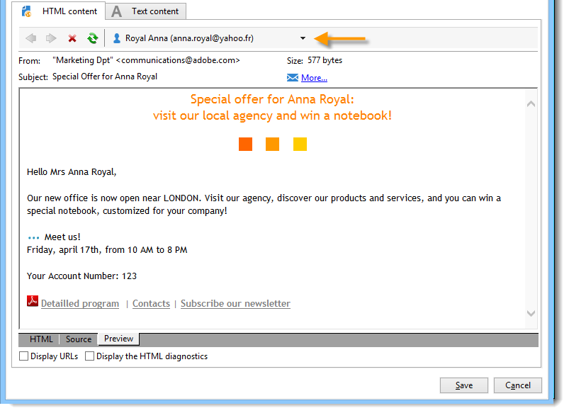

# 條件式內容{#conditional-content}


通過配置條件內容欄位，您可以建立基於收件人配置檔案的動態個性化設定。 當滿足特定條件時替代文字塊和/或影像。

 [在影片中探索此功能](#conditionnal-content-video)


## 在電子郵件中使用條件 {#using-conditions-in-an-email}

在下面的示例中，您將學習如何建立消息，根據收件人的性別和興趣動態個性化。

* 顯示「Mr」 或&quot;女士&quot; 根據 **[!UICONTROL Gender]** 欄位（M或F）,
* 根據所指示或檢測到的興趣個性化地匯編新聞稿或促銷優惠：

   * 利息1 — >第1塊
   * 利息2 — >塊2
   * 利息3 — >第3塊
   * 利息4 — >第4塊

要根據欄位的值建立條件內容，請應用以下步驟：

1. 按一下個性化表徵圖並選擇 **[!UICONTROL Conditional content > If]**。

   

   個性化元素被插入消息主體中。 您現在必須配置它們。

1. 接下來，填寫 **如果** 表達式。

   操作步驟：

   * 選擇表達式的第一個元素， **`<field>`**,(預設情況下，在插入 **如果** 表達式)，然後按一下個性化表徵圖，將其替換為test欄位。

      

   * 替換 **`<value>`** 的值。 此值必須用引號括起來。
   * 指定滿足條件時要插入的內容。 它可以由文本、影像、表單、超文本連結等組成。

      

1. 按一下 **[!UICONTROL Preview]** 頁籤，根據傳遞收件人查看郵件內容：

   * 選擇條件為true的收件人：

      

   * 選擇條件不為真的收件人：

      

您可以添加其它案例，並根據一個或多個欄位的值定義不同的內容。 要執行此操作，請使用 **[!UICONTROL Conditional content > Else]** 和 **[!UICONTROL Conditional content > Else if]**。 這些表達式的配置方式與 **如果** 表達式。


>[!CAUTION]
>
>要尊重JavaScript語法， **%> &lt;%** 添加後必須刪除字元 **埃爾塞** 和 **否則** 的下界。

按一下 **[!UICONTROL Preview]** 並選擇收件人以查看條件內容。


## 建立多語言電子郵件 {#creating-multilingual-email}

在下面的示例中，您將學習如何建立多語言電子郵件。 內容將以一種語言或另一種語言顯示，具體取決於收件人的首選語言。

1. 建立電子郵件並選擇目標填充。 在本示例中，顯示一個版本或另一個版本的條件將基於 **語言** 收件人配置檔案的值。 在本例中，這些值設定為 **EN**。 **FR**。 **ES**。
1. 在電子郵件HTML內容中，按一下 **[!UICONTROL Source]** 頁籤並貼上以下代碼：

   ```
   <% if (language == "EN" ) { %>
   <DIV id=en-version>Hello <%= recipient.firstName %>,</DIV>
   <DIV>Discover your new offers!</DIV>
   <DIV><a href="https://www.adobe.com/products/en">www.adobe.com/products/en</A></FONT></DIV><%
    } %>
   <% if (language == "FR" ) { %>
   <DIV id=fr-version>Bonjour <%= recipient.firstName %>,</DIV>
   <DIV>Découvrez nos nouvelles offres !</DIV>
   <DIV><a href="https://www.adobe.com/products/fr">www.adobe.com/products/fr</A></DIV><%
    } %>
    <% if (language == "ES" ) { %>
   <DIV id=es-version><FONT face=Arial>
   <DIV>Olà <%= recipient.firstName %>,</DIV>
   <DIV>Descubra nuestros nuevas ofertas !</DIV>
   <DIV><a href="https://www.adobe.com/products/es">www.adobe.com/products/es</A></DIV>
   <% } %>
   ```

1. Test **[!UICONTROL Preview]** 頁籤。

   >[!NOTE]
   >
   >由於電子郵件內容中未定義任何替代版本，因此請確保在發送電子郵件之前過濾目標填充。

## 教程視頻 {#conditionnal-content-video}

此影片以多語言電子報為範例，示範如何新增條件式內容至傳遞。

>[!VIDEO](https://video.tv.adobe.com/v/24926?quality=12)

可提供其他Campaign Classic操作視頻 [這裡](https://experienceleague.adobe.com/docs/campaign-classic-learn/tutorials/overview.html?lang=zh-Hant)。
