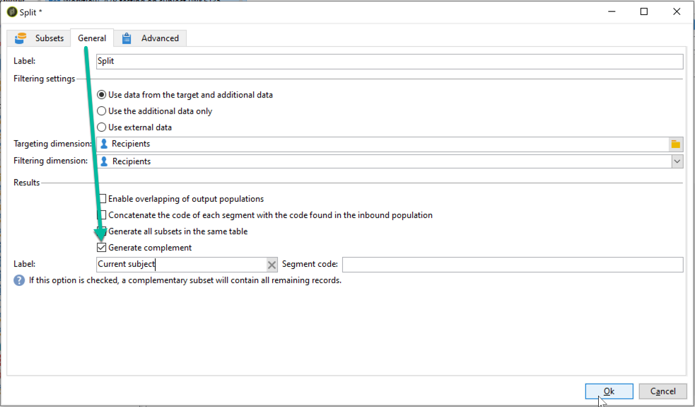

# 配置A/B測試{#configuring-a-b-testing}

本節詳細說明如何建立執行A/B測試的工作流程。

1. 建立新工作流程，然後設定[Query](../../workflow/using/query.md)活動以定位所需的人口。

1. 新增[Split](../../workflow/using/split.md)活動，將目標人口劃分為多個子集。

1. 開啟活動，然後根據您的需求設定每個子集。 有關如何配置&#x200B;**[!UICONTROL Split]**&#x200B;活動的詳細資訊，請參閱此部分。

   在此範例中，我們想要測試電子報的2個新主題，將每個主題呈現給10%的目標人口。

   

1. 新增轉場，以傳送包含目前主題的電子報給其餘人口。 若要這麼做，請從&#x200B;**[!UICONTROL General]**&#x200B;標籤啟動&#x200B;**[!UICONTROL Generate complement]**&#x200B;選項。

   

1. 針對每個子集，新增要測試的傳送版本。

   

您現在可以開始工作流程。 傳送完交貨後，您將可以追蹤傳送記錄檔中三個子集的行為，以便查看哪個主題最成功。

工作流程也可讓您自動識別執行成效較佳的傳送變體，然後將其傳送至剩餘人口，以自動化您的流程。 有關詳細資訊，請參閱此專用[使用案例](../../delivery/using/a-b-testing-use-case.md)。
