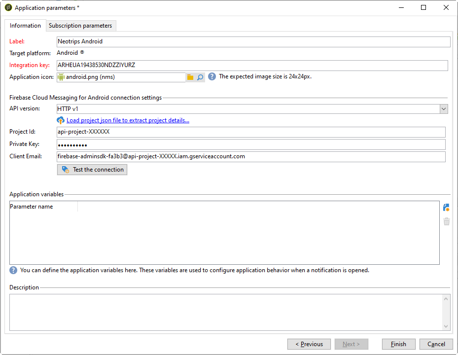

# 針對 Android 的設定步驟

一旦安裝了軟體包，您就可以在Adobe Campaign Classic定義Android應用設定。

>[!NOTE]
>
>要瞭解如何為iOS配置應用程式以及如何為iOS建立交付，請參閱此 [節](configuring-the-mobile-application.md)。

關鍵步驟是：

1. [配置Android外部帳戶](#configuring-external-account-android)
1. [配置Android服務](#configuring-android-service)
1. [在市場活動中建立移動應用](#creating-android-app)
1. [使用其他資料擴展應用架構](#extend-subscription-schema)

然後你就能 [建立Android富通知](create-notifications-android.md)。

## 配置Android外部帳戶 {#configuring-external-account-android}

對於Android，有兩個介面可用：

* V1連接器，允許每個MTA子級連接一個。
* V2連接器允許與FCM伺服器同時連接，以提高吞吐量。

要選擇要使用的連接器，請執行以下步驟：

1. 轉到 **[!UICONTROL Administration > Platform > External accounts]**。
1. 選擇 **[!UICONTROL Android routing]** 外部帳戶。
1. 在 **[!UICONTROL Connector]** 的 **[!UICONTROL JavaScript used in the connector]** 欄位：

   對於Android V2:https://localhost:8080/nms/jsp/androidPushConnectorV2.js

   >[!NOTE]
   >
   > 您也可以按https://localhost:8080/nms/jsp/androidPushConnector.js配置它，但我們建議您使用連接器版本2。

   

1. 對於Android V2,Adobe伺服器配置檔案(serverConf.xml)中提供了一個附加參數：

   * **maxGCMConnectPerChild**:每個子伺服器啟動的對FCM的並行HTTP請求的最大限制（預設為8）。

## 配置Android服務 {#configuring-android-service}

 [瞭解如何在視頻中配置Android服務](https://experienceleague.adobe.com/docs/campaign-classic-learn/getting-started-with-push-notifications-for-android/configuring-an-android-service-in-campaign.html#configuring-an-android-service-and-creating-an-android-mobile-application-in-campaign)

1. 轉到 **[!UICONTROL Profiles and Targets > Services and subscriptions]** 按一下 **[!UICONTROL New]**。

   

1. 定義 **[!UICONTROL Label]** 和 **[!UICONTROL Internal name]**。
1. 轉到 **[!UICONTROL Type]** 選擇 **[!UICONTROL Mobile application]**。

   >[!NOTE]
   >
   >預設 **[!UICONTROL Subscriber applications (nms:appSubscriptionRcp)]** 目標映射連結到收件人表。 如果要使用其他目標映射，則需要建立新的目標映射，並在 **[!UICONTROL Target mapping]** 服務欄位。 有關建立目標映射的詳細資訊，請參閱 [此部分](../../configuration/using/about-custom-recipient-table.md)。

   

1. 然後按一下 **[!UICONTROL Add]** 按鈕。

   

1. 建立Android應用程式。 如需詳細資訊，請參閱[本章節](configuring-the-mobile-application-android.md#creating-android-app)。

## 建立Android移動應用程式 {#creating-android-app}

建立服務後，您現在需要建立Android應用程式：

1. 在新建立的服務中，按一下 **[!UICONTROL Add]** 按鈕。

   

1. 選擇 **[!UICONTROL Create an Android application]** 輸入 **[!UICONTROL Label]**。

   

1. 確保相同 **[!UICONTROL Integration key]** 在Adobe Campaign和應用程式碼中通過SDK定義。 如需詳細資訊，請參閱[本章節](integrating-campaign-sdk-into-the-mobile-application.md)。

   >[!NOTE]
   >
   > 的 **[!UICONTROL Integration key]** 完全可自定義，但需要與SDK中指定的值完全相同。

1. 選擇 **[!UICONTROL API version]**:HTTP v1或HTTP（舊版）。 這些配置在 [此部分](#select-api-version)

1. 填寫 **[!UICONTROL Firebase Cloud Messaging the Android connection settings]** 的子菜單。

1. 按一下 **[!UICONTROL Finish]**，之後 **[!UICONTROL Save]**。您的Android應用程式現已準備好用於Campaign Classic。

預設情況下，Adobe Campaign在 **[!UICONTROL User identifier]** (@userKey)欄位 **[!UICONTROL Subscriber applications (nms:appSubscriptionRcp)]** 的子菜單。 此鍵使您能夠將訂閱連結到收件人。 要收集其他資料（如複雜的協調密鑰），需要應用以下配置：

### 選擇API版本{#select-api-version}

建立服務和新移動應用程式後，您需要根據所選API版本配置移動應用程式。

* **HTTP v1** 配置的詳細資訊 [此部分](configuring-the-mobile-application-android.md#android-service-httpv1)。
* **HTTP（舊版）** 配置的詳細資訊 [此部分](configuring-the-mobile-application-android.md#android-service-http)。

#### 配置HTTP v1 API{#android-service-httpv1}

要配置HTTP v1 API版本，請執行以下步驟：

1. 在 **[!UICONTROL Mobile application creation wizard]** 窗口，選擇 **[!UICONTROL HTTPV1]** 的 **[!UICONTROL API version]** 下拉。

1. 按一下 **[!UICONTROL Load project json file to extract project details...]** 直接載入JSON密鑰檔案。 有關如何提取JSON檔案的詳細資訊，請參閱 [此頁](https://firebase.google.com/docs/admin/setup#initialize-sdk)。

   您還可以人工輸入以下詳細資訊：
   * **[!UICONTROL Project Id]**
   * **[!UICONTROL Private Key]**
   * **[!UICONTROL Client Email]**

   

1. 按一下 **[!UICONTROL Test the connection]** 檢查您的配置是否正確，以及營銷伺服器是否有權訪問FCM。

   >[!CAUTION]
   >
   >對於中間採購部署， **[!UICONTROL Test connection]** 按鈕將不檢查MID伺服器是否具有訪問FCM伺服器的權限。

   

1. 作為一個選項，您可以使用一些 **[!UICONTROL Application variables]** 如果需要。 這些是完全可定製的，並且是發送到移動設備的消息負載的一部分。

1. 按一下 **[!UICONTROL Finish]**，之後 **[!UICONTROL Save]**。您的Android應用程式現已準備好用於Campaign Classic。

以下是FCM負載名稱，以進一步個性化推送通知：

| 訊息類型 | 可配置消息元素（FCM負載名稱） | 可配置選項（FCM負載名稱） |
|:-:|:-:|:-:|
| 資料消息 | N/A | validate_only |
| 通知消息 | title, body, android_channelid，表徵圖， sound，標籤，color, click_action，影像，ticker,sticky，可見性，notification_priority, notification_count   | validate_only |

 
 

#### 配置HTTP（舊）API{#android-service-http}

要配置HTTP（舊版）API版本，請執行以下步驟：

1. 在 **[!UICONTROL Mobile application creation wizard]** 窗口，選擇 **[!UICONTROL HTTP (legacy)]** 的 **[!UICONTROL API version]** 下拉。

1. 輸入 **[!UICONTROL Project key]** 由移動應用程式開發商提供。

1. 作為一個選項，您可以使用一些 **[!UICONTROL Application variables]** 如果需要。 這些是完全可定製的，並且是發送到移動設備的消息負載的一部分。

   在以下示例中，我們添加 **標題**。 **影像URL** 和 **表徵圖URL** 建立富推送通知，然後向應用程式提供要在通知中顯示的影像、標題和表徵圖。

   

1. 按一下 **[!UICONTROL Finish]**，之後 **[!UICONTROL Save]**。您的Android應用程式現已準備好用於Campaign Classic。

以下是FCM負載名稱，以進一步個性化推送通知：

| 訊息類型 | 可配置消息元素（FCM負載名稱） | 可配置選項（FCM負載名稱） |
|:-:|:-:|:-:|
| 資料消息 | N/A | dryRun |
| 通知消息 | title，標題， body, android_channel_id，表徵圖， sound，聲音，標籤， color, click_action   | dryRun |

 

## 擴展appsubscriptionRcp架構 {#extend-subscription-schema}

 [瞭解如何在視頻中擴展appsubscriptionRcp架構](https://experienceleague.adobe.com/docs/campaign-classic-learn/getting-started-with-push-notifications-for-android/extending-the-app-subscription-schema.html#extending-the-app-subscription-schema-to-personalize-push-notifications)

你需要擴展 **appsubscriptionRcp** 定義新的附加欄位，以將應用程式中的參數儲存在市場活動資料庫中。 例如，這些欄位將用於個性化。 操作步驟：

1. 建立 **[!UICONTROL Subscriber applications (nms:appsubscriptionRcp)]** 模式並定義新欄位。 瞭解有關中架構擴展的詳細資訊 [此頁](../../configuration/using/about-schema-edition.md)

1. 在 **[!UICONTROL Subscription parameters]** 頁籤。

   >[!CAUTION]
   >
   >確保中的配置名稱 **[!UICONTROL Subscription parameters]** 頁籤與移動應用程式碼中的頁籤相同。 請參閱[本節](integrating-campaign-sdk-into-the-mobile-application.md)。
