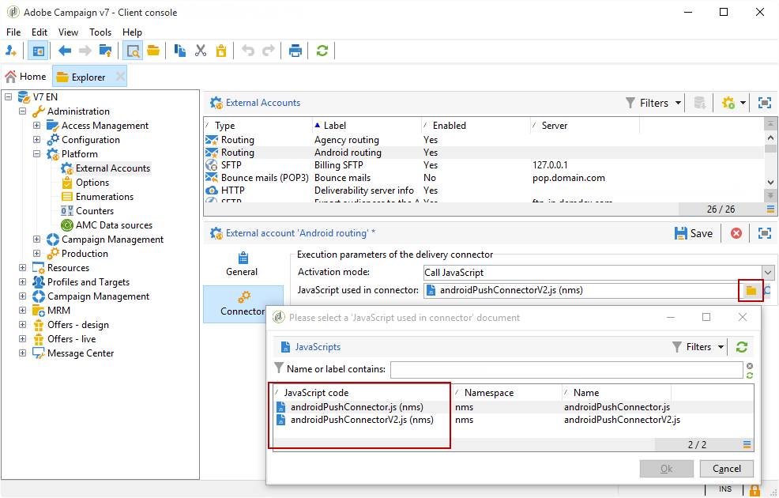
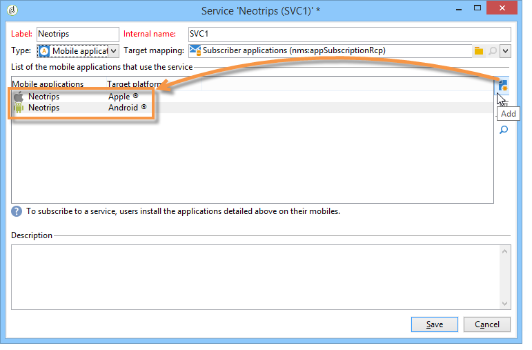
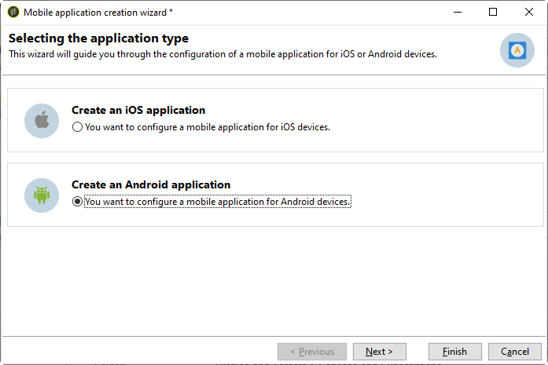
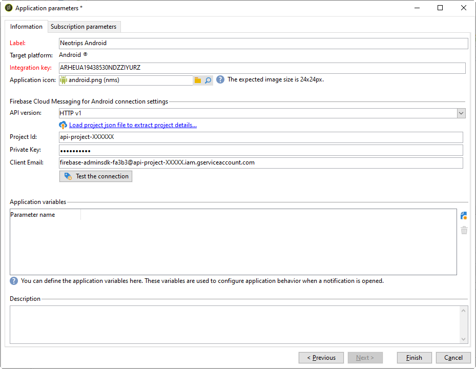
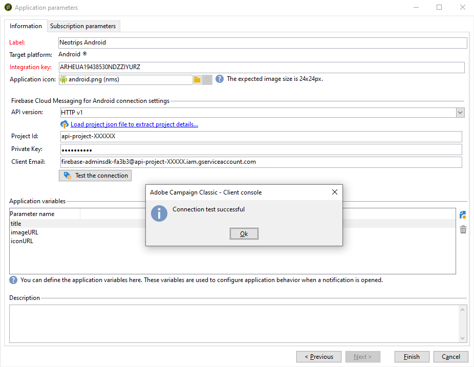

# 針對 Android 的設定步驟

安裝套件後，您可以在Adobe Campaign Classic中定義Android應用程式設定。

主要步驟為：

1. [設定Android外部帳戶](#configuring-external-account-android)
1. [設定Android服務](#configuring-android-service)
1. [在Campaign中建立行動應用程式](#creating-android-app)
1. [使用其他資料擴充應用程式綱要](#extend-subscription-schema)

然後，您就可以[建立Android豐富型通知](create-notifications-android.md)。

>[!IMPORTANT]
>
>Android Firebase Cloud Messaging (FCM) 服務的一些重要變更將於 2024 年發行，並可能影響 Adobe Campaign 實施。 Android 推播訊息訂閱服務設定可能需要更新，才能支援此變更。 您已經可以檢查並採取動作。 閱讀此[Adobe Campaign v8技術檔案](https://experienceleague.adobe.com/docs/campaign/technotes-ac/tn-new/push-technote.html?lang=zh-Hant){target="_blank"}以深入瞭解。

## 設定Android外部帳戶 {#configuring-external-account-android}

Android提供兩種聯結器：

* V1聯結器可讓每個MTA子系使用一個連線。
* V2聯結器可讓您同時連線至FCM伺服器，以改善輸送量。

若要選擇您要使用的聯結器，請依照下列步驟進行：

1. 移至&#x200B;**[!UICONTROL Administration > Platform > External accounts]**。
1. 選取&#x200B;**[!UICONTROL Android routing]**&#x200B;外部帳戶。
1. 在&#x200B;**[!UICONTROL Connector]**&#x200B;索引標籤中，填入&#x200B;**[!UICONTROL JavaScript used in the connector]**&#x200B;欄位：

   適用於Android V2： https://localhost:8080/nms/jsp/androidPushConnectorV2.js

   >[!NOTE]
   >
   > 您也可以依照https://localhost:8080/nms/jsp/androidPushConnector.js進行設定，但建議您使用聯結器版本2。

   

1. 對於Android V2，Adobe伺服器設定檔案(serverConf.xml)中還提供另一個引數：

   * **maxGCMConnectPerChild**：每個子伺服器向FCM起始的並行HTTP要求上限（預設為8）。

## 設定Android服務 {#configuring-android-service}

 [瞭解如何在影片中設定Android服務](https://experienceleague.adobe.com/docs/campaign-classic-learn/getting-started-with-push-notifications-for-android/configuring-an-android-service-in-campaign.html?lang=zh-Hant#configuring-an-android-service-and-creating-an-android-mobile-application-in-campaign){target="_blank"}。

1. 前往&#x200B;**[!UICONTROL Profiles and Targets > Services and subscriptions]**&#x200B;節點並按一下&#x200B;**[!UICONTROL New]**。

   

1. 定義&#x200B;**[!UICONTROL Label]**&#x200B;和&#x200B;**[!UICONTROL Internal name]**。
1. 移至&#x200B;**[!UICONTROL Type]**&#x200B;欄位並選取&#x200B;**[!UICONTROL Mobile application]**。

   >[!NOTE]
   >
   >預設&#x200B;**[!UICONTROL Subscriber applications (nms:appSubscriptionRcp)]**&#x200B;目標對應已連結至收件者資料表。 如果您想使用不同的目標對應，則需要建立新的目標對應，並在服務的&#x200B;**[!UICONTROL Target mapping]**&#x200B;欄位中輸入它。 如需建立目標對應的詳細資訊，請參閱[本區段](../../configuration/using/about-custom-recipient-table.md)。

   

1. 然後按一下&#x200B;**[!UICONTROL Add]**&#x200B;按鈕以選取應用程式型別。

   

1. 建立您的Android應用程式。 如需詳細資訊，請參閱[本章節](configuring-the-mobile-application-android.md#creating-android-app)。

## 建立Android行動應用程式 {#creating-android-app}

建立服務後，您現在需要建立Android應用程式：

1. 從您新建立的服務中，按一下&#x200B;**[!UICONTROL Add]**&#x200B;按鈕以選取應用程式型別。

   

1. 選取&#x200B;**[!UICONTROL Create an Android application]**&#x200B;並輸入&#x200B;**[!UICONTROL Label]**。

   

1. 確定透過SDK在Adobe Campaign和應用程式程式碼中定義了相同的&#x200B;**[!UICONTROL Integration key]**。<!--For more on this, refer to [this section](integrating-campaign-sdk-into-the-mobile-application.md).-->

   >[!NOTE]
   >
   > **[!UICONTROL Integration key]**&#x200B;可使用字串值完全自訂，但必須與SDK中指定的完全相同。

1. 選取&#x200B;**[!UICONTROL API version]**： HTTP v1或HTTP （舊版）。 這些設定在[本節](#select-api-version)中有詳細說明

1. 填寫&#x200B;**[!UICONTROL Firebase Cloud Messaging the Android connection settings]**&#x200B;欄位。

1. 按一下 **[!UICONTROL Finish]**，之後 **[!UICONTROL Save]**。 您的Android應用程式現在已準備好在Campaign Classic中使用。

依預設，Adobe Campaign會在&#x200B;**[!UICONTROL Subscriber applications (nms:appSubscriptionRcp)]**&#x200B;資料表的&#x200B;**[!UICONTROL User identifier]** (@userKey)欄位中儲存金鑰。 此金鑰可讓您將訂閱連結至收件者。 若要收集其他資料（例如複雜的調解金鑰），您必須套用下列設定：

### 設定API版本{#select-api-version}

>[!IMPORTANT]
>
>Android Firebase Cloud Messaging (FCM) 服務的一些重要變更將於 2024 年發行，並可能影響 Adobe Campaign 實施。 Google持續改善服務，其中舊版FCM API將於&#x200B;**2024年6月20日**&#x200B;終止服務。 閱讀此[Adobe Campaign v8技術檔案](https://experienceleague.adobe.com/docs/campaign/technotes-ac/tn-new/push-technote.html?lang=zh-Hant){target="_blank"}以深入瞭解。

建立服務和新的行動應用程式後，您需要設定行動應用程式。 不應選取&#x200B;**HTTP （舊版）** API，因為它已被Google取代。

若要設定HTTP v1 API版本，請遵循下列步驟：

1. 在&#x200B;**[!UICONTROL Mobile application creation wizard]**&#x200B;視窗的&#x200B;**[!UICONTROL API version]**&#x200B;下拉式清單中選取&#x200B;**[!UICONTROL HTTPV1]**。

1. 按一下&#x200B;**[!UICONTROL Load project json file to extract project details...]**&#x200B;直接載入您的JSON金鑰檔案。 如需有關如何解壓縮JSON檔案的詳細資訊，請參閱[此頁面](https://firebase.google.com/docs/admin/setup#initialize-sdk)。

   您也可以手動輸入下列明細：
   * **[!UICONTROL Project Id]**
   * **[!UICONTROL Private Key]**
   * **[!UICONTROL Client Email]**

   

1. 按一下&#x200B;**[!UICONTROL Test the connection]**&#x200B;以檢查您的設定是否正確，以及行銷伺服器是否具有存取FCM的許可權。

   >[!CAUTION]
   >
   >對於中間來源部署，**[!UICONTROL Test connection]**&#x200B;按鈕將不會檢查MID伺服器是否具有FCM伺服器的存取權。

   

1. 您可以視需要以約&#x200B;**[!UICONTROL Application variables]**&#x200B;擴充推送訊息內容，作為選項。 這些都是可完全自訂的專案，而且是傳送至行動裝置的訊息裝載的一部分。

1. 按一下 **[!UICONTROL Finish]**，之後 **[!UICONTROL Save]**。 您的Android應用程式現在已準備好在Campaign Classic中使用。

以下是FCM裝載名稱，可進一步個人化您的推播通知：

| 訊息類型 | 可設定的訊息元素（FCM裝載名稱） | 可設定的選項（FCM裝載名稱） |
|:-:|:-:|:-:|
| 資料訊息 | N/A | validate_only |
| 通知訊息 | title，內文， android_channel_id，圖示，聲音，標籤，顏色，點按動作，影像，提示，粘性，可見度，通知優先順序，通知計數  | validate_only |

## 擴充appsubscriptionRcp結構描述 {#extend-subscription-schema}

 [瞭解如何在視訊中擴充appsubscriptionRcp結構描述](https://experienceleague.adobe.com/docs/campaign-classic-learn/getting-started-with-push-notifications-for-android/extending-the-app-subscription-schema.html?lang=zh-Hant#extending-the-app-subscription-schema-to-personalize-push-notifications)

您必須擴充&#x200B;**appsubscriptionRcp**，以定義新的額外欄位，將應用程式中的引數儲存至Campaign資料庫。 例如，這些欄位用於個人化。 操作步驟：

1. 建立&#x200B;**[!UICONTROL Subscriber applications (nms:appsubscriptionRcp)]**&#x200B;結構描述的延伸並定義新欄位。 在[此頁面](../../configuration/using/about-schema-edition.md)中進一步瞭解結構描述延伸

1. 在&#x200B;**[!UICONTROL Subscription parameters]**&#x200B;索引標籤中定義對應。

   >[!CAUTION]
   >
   >確定&#x200B;**[!UICONTROL Subscription parameters]**&#x200B;標籤中的設定名稱與行動應用程式程式碼中的設定名稱相同。<!--Refer to [this section](integrating-campaign-sdk-into-the-mobile-application.md).-->
