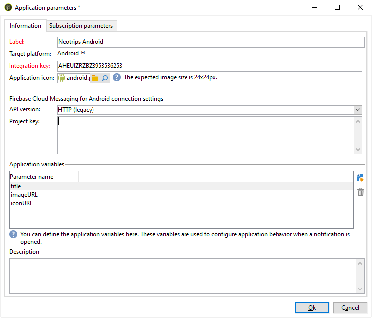
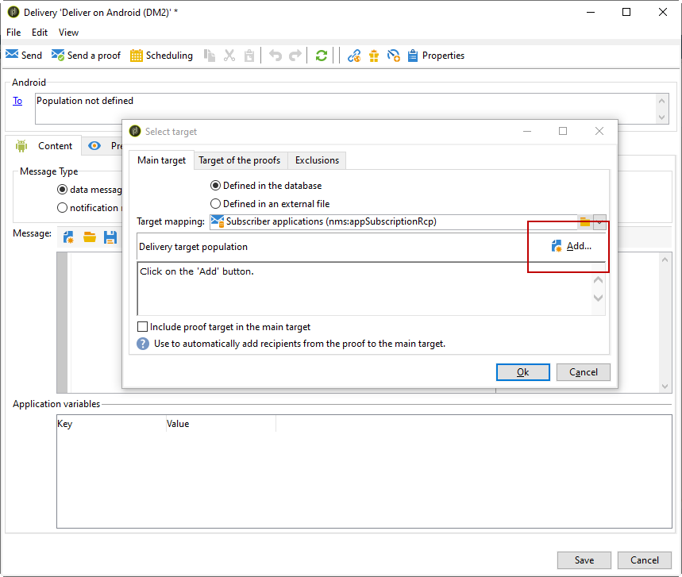

# 針對 Android 的設定步驟

安裝套件後，您就可以在Adobe Campaign Classic中定義Android應用程式設定。

>[!NOTE]
>
>若要了解如何為iOS設定您的應用程式，以及如何為iOS建立傳送，請參閱此[區段](../../delivery/using/configuring-the-mobile-application.md)。

關鍵步驟為：

1. [設定Android外部帳戶](#configuring-external-account-android)
1. [設定Android服務](#configuring-android-service)
1. [在Campaign中建立行動應用程式](#creating-android-app)
1. [使用其他資料擴充應用程式結構](#extend-subscription-schema)

然後，您將能夠[建立Android豐富通知](#creating-android-delivery)。

## 配置Android外部帳戶{#configuring-external-account-android}

Android提供兩個連接器：

* V1連接器，允許每個MTA子項有一個連接。
* 允許與FCM伺服器同時連線以改善吞吐量的V2連接器。

要選擇要使用的連接器，請執行以下步驟：

1. 前往&#x200B;**[!UICONTROL Administration > Platform > External accounts]**。
1. 選擇&#x200B;**[!UICONTROL Android routing]**&#x200B;外部帳戶。
1. 在&#x200B;**[!UICONTROL Connector]**&#x200B;標籤中，填入&#x200B;**[!UICONTROL JavaScript used in the connector]**&#x200B;欄位：

   若為Android V2:https://localhost:8080/nms/jsp/androidPushConnectorV2.js

   >[!NOTE]
   >
   > 您也可以依照下列https://localhost:8080/nms/jsp/androidPushConnector.js進行設定，但建議您使用第2版連接器。

   

1. 若為Android V2,Adobe伺服器設定檔案(serverConf.xml)中另有一個參數可供使用：

   * **maxGCMConnectPerChild**:每個子伺服器啟動的對FCM的並行HTTP請求的最大限制（預設為8）。

## 配置Android服務{#configuring-android-service}

 [了解如何在影片中設定Android服務](https://experienceleague.adobe.com/docs/campaign-classic-learn/getting-started-with-push-notifications-for-android/configuring-an-android-service-in-campaign.html?lang=en#configuring-an-android-service-and-creating-an-android-mobile-application-in-campaign)

1. 轉至&#x200B;**[!UICONTROL Profiles and Targets > Services and subscriptions]**&#x200B;節點，然後按一下&#x200B;**[!UICONTROL New]**。

   

1. 定義&#x200B;**[!UICONTROL Label]**&#x200B;和&#x200B;**[!UICONTROL Internal name]**。
1. 轉到&#x200B;**[!UICONTROL Type]**&#x200B;欄位並選擇&#x200B;**[!UICONTROL Mobile application]**。

   >[!NOTE]
   >
   >預設的&#x200B;**[!UICONTROL Subscriber applications (nms:appSubscriptionRcp)]**&#x200B;目標映射連結到收件者表。 如果要使用不同的目標映射，需要建立新的目標映射，並在服務的&#x200B;**[!UICONTROL Target mapping]**&#x200B;欄位中輸入。 有關建立目標映射的詳細資訊，請參閱[配置指南](../../configuration/using/about-custom-recipient-table.md)。

   

1. 然後按一下&#x200B;**[!UICONTROL Add]**&#x200B;按鈕以選取應用程式類型。

   

1. 建立Android應用程式。 如需詳細資訊，請參閱本[區段](../../delivery/using/configuring-the-mobile-application-android.md#creating-android-app)。

## 建立Android行動應用程式{#creating-android-app}

建立服務後，您現在需要建立Android應用程式：

1. 在新建立的服務中，按一下&#x200B;**[!UICONTROL Add]**&#x200B;按鈕以選擇應用程式類型。

   

1. 選擇&#x200B;**[!UICONTROL Create an Android application]**&#x200B;並輸入&#x200B;**[!UICONTROL Label]**。

   

1. 請確定在Adobe Campaign和透過SDK的應用程式程式碼中定義相同的&#x200B;**[!UICONTROL Integration key]**。 有關詳細資訊，請參閱：[將Campaign SDK整合至行動應用程式](../../delivery/using/integrating-campaign-sdk-into-the-mobile-application.md)。

   >[!NOTE]
   >
   > **[!UICONTROL Integration key]**&#x200B;可以完全自訂字串值，但必須與SDK中指定的值完全相同。

1. 選擇&#x200B;**[!UICONTROL API version]**:HTTP v1或HTTP（舊版）。 這些配置在[本節](#select-api-version)中有詳細說明

1. 填寫&#x200B;**[!UICONTROL Firebase Cloud Messaging the Android connection settings]**&#x200B;欄位。

1. 按一下 **[!UICONTROL Finish]**，之後 **[!UICONTROL Save]**。您的Android應用程式現在已準備好用於Campaign Classic。

依預設，Adobe Campaign會在&#x200B;**[!UICONTROL Subscriber applications (nms:appSubscriptionRcp)]**&#x200B;表格的&#x200B;**[!UICONTROL User identifier]**(@userKey)欄位中儲存金鑰。 此金鑰可讓您將訂閱連結至收件者。 若要收集其他資料（例如複雜的調解金鑰），您必須套用下列設定：

### 選擇API版本{#select-api-version}

建立服務和新的行動應用程式後，您需要根據所選的API版本來設定行動應用程式。

* **HTTP v1** 設定在本小節中 [詳細說明](../../delivery/using/configuring-the-mobile-application-android.md#android-service-httpv1)。
* **HTTP（舊版）** 設定在本節中有 [詳細說明](../../delivery/using/configuring-the-mobile-application-android.md#android-service-http)。

#### 配置HTTP v1 API{#android-service-httpv1}

若要設定HTTP v1 API版本，請遵循下列步驟：

1. 在&#x200B;**[!UICONTROL Mobile application creation wizard]**&#x200B;視窗中，選取&#x200B;**[!UICONTROL API version]**&#x200B;下拉式清單中的&#x200B;**[!UICONTROL HTTPV1]** 。

1. 按一下&#x200B;**[!UICONTROL Load project json file to extract projet details...]**&#x200B;以直接載入您的JSON索引鍵檔案。 如需如何擷取JSON檔案的詳細資訊，請參閱此[page](https://firebase.google.com/docs/admin/setup#initialize-sdk)。

   您也可以手動輸入下列詳細資訊：
   * **[!UICONTROL Project Id]**
   * **[!UICONTROL Private Key]**
   * **[!UICONTROL Client Email]**

   

1. 按一下&#x200B;**[!UICONTROL Test the connection]**&#x200B;以檢查您的設定是否正確，以及行銷伺服器是否可存取FCM。

   >[!CAUTION]
   >
   >若為中間來源部署，**[!UICONTROL Test connection]**&#x200B;按鈕將不會檢查MID伺服器是否可存取FCM伺服器。

   

1. 視需要，您可以讓推送訊息內容更豐富，並包含一些&#x200B;**[!UICONTROL Application variables]**。 這些功能可完全自訂，且是傳送至行動裝置之訊息裝載的一部分。

1. 按一下 **[!UICONTROL Finish]**，之後 **[!UICONTROL Save]**。您的Android應用程式現在已準備好用於Campaign Classic。

以下是FCM裝載名稱，以進一步個人化您的推播通知：

| 訊息類型 | 可設定的訊息元素（FCM裝載名稱） | 可設定選項（FCM裝載名稱） |
|:-:|:-:|:-:|
| 資料訊息 | N/A | validate_only |
| 通知訊息 | title, body, android_channel id, icon, sound, tag, color, click_action, image, ticker, ticking, visibility, notification_priority, notification_count   | validate_only |

 
 

#### 配置HTTP（舊版）API{#android-service-http}

若要設定HTTP（舊版）API版本，請遵循下列步驟：

1. 在&#x200B;**[!UICONTROL Mobile application creation wizard]**&#x200B;視窗中，選取&#x200B;**[!UICONTROL API version]**&#x200B;下拉式清單中的&#x200B;**[!UICONTROL HTTP (legacy)]** 。

1. 輸入由行動應用程式開發人員提供的&#x200B;**[!UICONTROL Project key]**。

1. 視需要，您可以讓推送訊息內容更豐富，並包含一些&#x200B;**[!UICONTROL Application variables]**。 這些功能可完全自訂，且是傳送至行動裝置之訊息裝載的一部分。

   在下列範例中，我們新增&#x200B;**title**、**imageURL**&#x200B;和&#x200B;**iconURL**&#x200B;以建立豐富推送通知，然後提供應用程式以在通知中顯示的影像、標題和圖示。

   

1. 按一下 **[!UICONTROL Finish]**，之後 **[!UICONTROL Save]**。您的Android應用程式現在已準備好用於Campaign Classic。

以下是FCM裝載名稱，以進一步個人化您的推播通知：

| 訊息類型 | 可設定的訊息元素（FCM裝載名稱） | 可設定選項（FCM裝載名稱） |
|:-:|:-:|:-:|
| 資料訊息 | 不適用 | dryRun |
| 通知訊息 | 標題， body, android_channel_id，圖示， sound, tag, color, click_action   | dryRun |

 

## 擴展appsubscriptionRcp架構{#extend-subscription-schema}

 [了解如何在影片中擴充appsubscriptionRcp架構](https://experienceleague.adobe.com/docs/campaign-classic-learn/getting-started-with-push-notifications-for-android/extending-the-app-subscription-schema.html?lang=en#extending-the-app-subscription-schema-to-personalize-push-notifications)

您需要擴充&#x200B;**appsubscriptionRcp**&#x200B;以定義新的其他欄位，以將應用程式的參數儲存在Campaign資料庫中。 例如，這些欄位將用於個人化。 操作步驟：

1. 建立&#x200B;**[!UICONTROL Subscriber applications (nms:appsubscriptionRcp)]**&#x200B;架構的擴充功能並定義新欄位。 進一步了解[本頁面](../../configuration/using/about-schema-edition.md)中的綱要擴展

1. 在&#x200B;**[!UICONTROL Subscription parameters]**&#x200B;索引標籤中定義對應。

   >[!CAUTION]
   >
   >確認&#x200B;**[!UICONTROL Subscription parameters]**&#x200B;標籤中的設定名稱與行動應用程式程式碼中的名稱相同。 請參閱[將Campaign SDK整合至行動應用程式](../../delivery/using/integrating-campaign-sdk-into-the-mobile-application.md)區段。

## 建立Android豐富通知{#creating-android-delivery}

使用Firebase雲端訊息，您可以在兩種訊息類型之間進行選擇：

* **[!UICONTROL Data message]**，由用戶端應用程式處理。
    訊息會直接傳送至行動應用程式，行動應用程式會產生並顯示Android通知給裝置。資料訊息僅包含您的自訂應用程式變數。

* **[!UICONTROL Notification message]**，由FCM SDK自動處理。
     FCM會代表用戶端應用程式在您的使用者裝置上自動顯示訊息。通知訊息包含一組預先定義的參數和選項，但仍可透過自訂應用程式變數進一步個人化。

如需Firebase雲端訊息類型的詳細資訊，請參閱[FCM檔案](https://firebase.google.com/docs/cloud-messaging/concept-options#notifications_and_data_messages)。

### 建立資料消息{#creating-data-message}

1. 前往&#x200B;**[!UICONTROL Campaign management]** > **[!UICONTROL Deliveries]**。

1. 按一下 **[!UICONTROL New]**。

   

1. 在&#x200B;**[!UICONTROL Delivery template]**&#x200B;下拉式清單中選取&#x200B;**[!UICONTROL Deliver on Android (android)]**。 將&#x200B;**[!UICONTROL Label]**&#x200B;新增至您的傳送。

1. 按一下&#x200B;**[!UICONTROL To]**&#x200B;以定義要定位的母體。 預設會套用&#x200B;**[!UICONTROL Subscriber application]**&#x200B;目標對應。 按一下&#x200B;**[!UICONTROL Add]**&#x200B;以選擇您的服務。

   

1. 在&#x200B;**[!UICONTROL Target type]**&#x200B;窗口中，選擇&#x200B;**[!UICONTROL Subscribers of an Android mobile application]**&#x200B;並按一下&#x200B;**[!UICONTROL Next]**。

1. 在&#x200B;**[!UICONTROL Service]**&#x200B;下拉式清單中，依序選取您先前建立的服務和應用程式，然後按一下&#x200B;**[!UICONTROL Finish]**。
系統會根據設定步驟期間新增的內容自動新增**[!UICONTROL Application variables]**。

   

1. 選擇&#x200B;**[!UICONTROL data message]**&#x200B;作為&#x200B;**[!UICONTROL Message Type]**。

1. 編輯豐富通知。

   

1. 如有需要，您可以在先前設定的&#x200B;**[!UICONTROL Application variables]**&#x200B;中新增資訊。 **[!UICONTROL Application variables]** 需要在Android服務中設定，且是傳送至行動裝置之訊息裝載的一部分。

1. 按一下&#x200B;**[!UICONTROL Save]**&#x200B;並傳送您的傳遞。

在訂閱者的行動Android裝置上收到影像和網頁時，應顯示在推播通知中。

### 建立通知消息{#creating-notification-message}

>[!NOTE]
>
>通知訊息的其他選項僅可搭配HTTP v1 API設定使用。 如需詳細資訊，請參閱本[區段](../../delivery/using/configuring-the-mobile-application-android.md#android-service-httpv1)。

 [了解如何在影片中建立Android推播通知](https://experienceleague.adobe.com/docs/campaign-classic-learn/getting-started-with-push-notifications-for-android/configuring-and-sending-push-notifications.html?lang=en#additional-resources)

1. 前往&#x200B;**[!UICONTROL Campaign management]** > **[!UICONTROL Deliveries]**。

1. 按一下 **[!UICONTROL New]**。

   

1. 在&#x200B;**[!UICONTROL Delivery template]**&#x200B;下拉式清單中選取&#x200B;**[!UICONTROL Deliver on Android (android)]**。 將&#x200B;**[!UICONTROL Label]**&#x200B;新增至您的傳送。

1. 按一下&#x200B;**[!UICONTROL To]**&#x200B;以定義要定位的母體。 預設會套用&#x200B;**[!UICONTROL Subscriber application]**&#x200B;目標對應。 按一下&#x200B;**[!UICONTROL Add]**&#x200B;以選擇您的服務。

   

1. 在&#x200B;**[!UICONTROL Target type]**&#x200B;窗口中，選擇&#x200B;**[!UICONTROL Subscribers of an Android mobile application]**&#x200B;並按一下&#x200B;**[!UICONTROL Next]**。

1. 在&#x200B;**[!UICONTROL Service]**&#x200B;下拉式清單中，依序選取您先前建立的服務和應用程式，然後按一下&#x200B;**[!UICONTROL Finish]**。

   

1. 選擇&#x200B;**[!UICONTROL notification message]**&#x200B;作為&#x200B;**[!UICONTROL Message Type]**。

1. 新增標題並編輯訊息。 使用&#x200B;**[!UICONTROL Notification options]**&#x200B;個人化您的推播通知：

   * **[!UICONTROL Channel ID]**:設定通知的通道ID。收到具有此通道ID的任何通知之前，應用程式必須先使用此通道ID建立通道。
   * **[!UICONTROL Sound]**:設定在裝置收到通知時播放音效。
   * **[!UICONTROL Color]**:設定通知的圖示顏色。
   * **[!UICONTROL Icon]**:設定通知的圖示，以在您的設定檔裝置上顯示。
   * **[!UICONTROL Tag]**:設定用來取代通知抽屜中現有通知的識別碼。
   * **[!UICONTROL Click action]**:設定與使用者點按您的通知相關聯的動作。

   有關&#x200B;**[!UICONTROL Notification options]**&#x200B;以及如何填寫這些欄位的詳細資訊，請參閱[FCM檔案](https://firebase.google.com/docs/reference/fcm/rest/v1/projects.messages#androidnotification)。

   

1. 如果您的應用程式已使用HTTP v1 API通訊協定進行設定，您可以使用下列&#x200B;**[!UICONTROL HTTPV1 additional options]**&#x200B;進一步個人化您的推播通知：

   * **[!UICONTROL Ticker]**:設定通知的代號文字。僅適用於設為Android 5.0 Lollipop的裝置。
   * **[!UICONTROL Image]**:設定要在通知中顯示的影像URL。
   * **[!UICONTROL Notification Count]**:設定要直接顯示在應用程式圖示上的新未讀資訊數。
   * **[!UICONTROL Sticky]**:設為true或false。若設為false，則當使用者按一下通知時，系統會自動將其關閉。 若設為true，即使使用者點按通知，仍會顯示通知。
   * **[!UICONTROL Notification Priority]**:將通知的優先順序設定為預設、最小、低或高。如需詳細資訊，請參閱[FCM檔案](https://firebase.google.com/docs/reference/fcm/rest/v1/projects.messages#NotificationPriority)。
   * **[!UICONTROL Visibility]**:將通知的可見度層級設為公開、私人或機密。如需詳細資訊，請參閱[FCM檔案](https://firebase.google.com/docs/reference/fcm/rest/v1/projects.messages#visibility)。

   有關&#x200B;**[!UICONTROL HTTP v1 additional options]**&#x200B;以及如何填寫這些欄位的詳細資訊，請參閱[FCM檔案](https://firebase.google.com/docs/reference/fcm/rest/v1/projects.messages#androidnotification)。

   

1. 如有需要，您可以在先前設定的&#x200B;**[!UICONTROL Application variables]**&#x200B;中新增資訊。 **[!UICONTROL Application variables]** 需要在Android服務中設定，且是傳送至行動裝置之訊息裝載的一部分。

1. 按一下&#x200B;**[!UICONTROL Save]**&#x200B;並傳送您的傳遞。

在訂閱者的行動Android裝置上收到影像和網頁時，應顯示在推播通知中。
