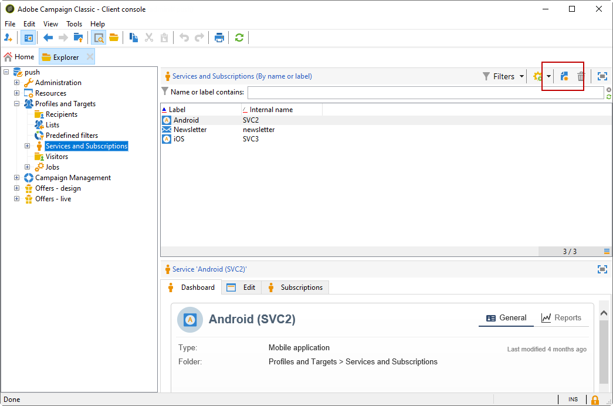

# 針對 Android 的設定步驟

安裝套件後，您可以在Adobe Campaign Classic中定義Android應用程式設定。

>[!NOTE]
>
>若要瞭解如何針對iOS設定您的應用程式，以及如何為iOS建立傳送，請參閱此 [區段](configuring-the-mobile-application.md).

主要步驟為：

1. [設定Android外部帳戶](#configuring-external-account-android)
1. [設定Android服務](#configuring-android-service)
1. [在Campaign中建立行動應用程式](#creating-android-app)
1. [使用其他資料擴充應用程式方案](#extend-subscription-schema)

然後，您將能夠 [建立Android豐富型通知](create-notifications-android.md).

## 設定Android外部帳戶 {#configuring-external-account-android}

Android提供兩種聯結器：

* 允許每個MTA子項一個連線的V1聯結器。
* V2聯結器允許同時連線至FCM伺服器以改善輸送量。

若要選擇您要使用的聯結器，請遵循下列步驟：

1. 前往 **[!UICONTROL Administration > Platform > External accounts]**.
1. 選取 **[!UICONTROL Android routing]** 外部帳戶。
1. 在 **[!UICONTROL Connector]** 標籤，填入 **[!UICONTROL JavaScript used in the connector]** 欄位：

   若為Android V2： https://localhost:8080/nms/jsp/androidPushConnectorV2.js

   >[!NOTE]
   >
   > 您也可以依照https://localhost:8080/nms/jsp/androidPushConnector.js進行設定，但建議您使用聯結器第2版。

   

1. 對於Android V2，Adobe伺服器設定檔案(serverConf.xml)中還提供另一個引數：

   * **maxGCMConnectPerChild**：由每個子伺服器向FCM起始的平行HTTP請求數上限（預設為8個）。

## 設定Android服務 {#configuring-android-service}

 [在影片中瞭解如何設定Android服務](https://experienceleague.adobe.com/docs/campaign-classic-learn/getting-started-with-push-notifications-for-android/configuring-an-android-service-in-campaign.html#configuring-an-android-service-and-creating-an-android-mobile-application-in-campaign)

1. 前往 **[!UICONTROL Profiles and Targets > Services and subscriptions]** 節點並按一下 **[!UICONTROL New]**.

   

1. 定義 **[!UICONTROL Label]** 和 **[!UICONTROL Internal name]**.
1. 前往 **[!UICONTROL Type]** 欄位並選取 **[!UICONTROL Mobile application]**.

   >[!NOTE]
   >
   >預設 **[!UICONTROL Subscriber applications (nms:appSubscriptionRcp)]** 目標對應會連結至收件者表格。 如果您想使用不同的目標對應，您需要建立新的目標對應，並在 **[!UICONTROL Target mapping]** 服務的欄位。 如需建立目標對應的詳細資訊，請參閱 [本節](../../configuration/using/about-custom-recipient-table.md).

   

1. 然後按一下 **[!UICONTROL Add]** 按鈕以選取應用程式型別。

   

1. 建立您的Android應用程式。 如需詳細資訊，請參閱[本章節](configuring-the-mobile-application-android.md#creating-android-app)。

## 建立Android行動應用程式 {#creating-android-app}

建立服務後，您現在需要建立Android應用程式：

1. 從您新建立的服務中，按一下 **[!UICONTROL Add]** 按鈕以選取應用程式型別。

   

1. 選取 **[!UICONTROL Create an Android application]** 並輸入 **[!UICONTROL Label]**.

   

1. 請確定相同 **[!UICONTROL Integration key]** 是透過SDK在Adobe Campaign和應用程式程式碼中定義的。 如需詳細資訊，請參閱[本章節](integrating-campaign-sdk-into-the-mobile-application.md)。

   >[!NOTE]
   >
   > 此 **[!UICONTROL Integration key]** 可完全自訂字串值，但必須與SDK中指定的值完全相同。

1. 選取 **[!UICONTROL API version]**：HTTP v1或HTTP （舊版）。 這些設定的詳細資訊，請參閱 [本節](#select-api-version)

1. 填入 **[!UICONTROL Firebase Cloud Messaging the Android connection settings]** 欄位。

1. 按一下 **[!UICONTROL Finish]**，之後 **[!UICONTROL Save]**。您的Android應用程式現在已準備好用於Campaign Classic。

依預設，Adobe Campaign會將金鑰儲存在 **[!UICONTROL User identifier]** (@userKey)欄位 **[!UICONTROL Subscriber applications (nms:appSubscriptionRcp)]** 表格。 此金鑰可讓您將訂閱連結至收件者。 若要收集其他資料（例如複雜的調解金鑰），您需要套用以下設定：

### 選取API版本{#select-api-version}

建立服務和新的行動應用程式後，您需要根據選擇的API版本設定行動應用程式。

* **HTTP v1** 有關設定的詳情，請參閱 [本節](configuring-the-mobile-application-android.md#android-service-httpv1).
* **HTTP （舊版）** 有關設定的詳情，請參閱 [本節](configuring-the-mobile-application-android.md#android-service-http).

#### 設定HTTP v1 API{#android-service-httpv1}

若要設定HTTP v1 API版本，請遵循下列步驟：

1. 在您的 **[!UICONTROL Mobile application creation wizard]** 視窗，選取 **[!UICONTROL HTTPV1]** 在 **[!UICONTROL API version]** 下拉式清單。

1. 按一下 **[!UICONTROL Load project json file to extract project details...]** 直接載入您的JSON金鑰檔案。 有關如何解壓縮JSON檔案的詳細資訊，請參閱 [此頁面](https://firebase.google.com/docs/admin/setup#initialize-sdk).

   您也可以手動輸入下列詳細資訊：
   * **[!UICONTROL Project Id]**
   * **[!UICONTROL Private Key]**
   * **[!UICONTROL Client Email]**

   

1. 按一下 **[!UICONTROL Test the connection]** 檢查您的設定是否正確，以及行銷伺服器是否擁有FCM的存取權。

   >[!CAUTION]
   >
   >對於中間來源部署， **[!UICONTROL Test connection]** 按鈕不會檢查MID伺服器是否可存取FCM伺服器。

   

1. 或者，您也可以選擇擴充推送訊息的內容 **[!UICONTROL Application variables]** 視需要而定。 這些都是可完全自訂的專案，而且是傳送至行動裝置的訊息裝載的一部分。

1. 按一下 **[!UICONTROL Finish]**，之後 **[!UICONTROL Save]**。您的Android應用程式現在已準備好用於Campaign Classic。

以下是FCM裝載名稱，可進一步個人化您的推播通知：

| 訊息類型 | 可設定的訊息元素（FCM裝載名稱） | 可設定的選項（FCM裝載名稱） |
|:-:|:-:|:-:|
| 資料訊息 | N/A | validate_only |
| 通知訊息 | title，內文， android_channel_id，圖示，聲音，標籤，顏色，點按動作，影像，提示，粘性，可見度， notification_priority， notification_count   | validate_only |

 
 

#### 設定HTTP （舊版） API{#android-service-http}

若要設定HTTP （舊版） API版本，請遵循下列步驟：

1. 在您的 **[!UICONTROL Mobile application creation wizard]** 視窗，選取 **[!UICONTROL HTTP (legacy)]** 在 **[!UICONTROL API version]** 下拉式清單。

1. 輸入 **[!UICONTROL Project key]** 由行動應用程式開發人員所提供。

1. 或者，您也可以選擇擴充推送訊息的內容 **[!UICONTROL Application variables]** 視需要而定。 這些都是可完全自訂的專案，而且是傳送至行動裝置的訊息裝載的一部分。

   在以下範例中，我們新增 **標題**， **imageURL** 和 **iconURL** 以建立豐富推送通知，然後為應用程式提供要在通知內顯示的影像、標題和圖示。

   

1. 按一下 **[!UICONTROL Finish]**，之後 **[!UICONTROL Save]**。您的Android應用程式現在已準備好用於Campaign Classic。

以下是FCM裝載名稱，可進一步個人化您的推播通知：

| 訊息類型 | 可設定的訊息元素（FCM裝載名稱） | 可設定的選項（FCM裝載名稱） |
|:-:|:-:|:-:|
| 資料訊息 | N/A | dryRun |
| 通知訊息 | title， body， android_channel_id， icon，圖示， sound，聲音，標籤， color，顏色， click_action   | dryRun |

 

## 擴充appsubscriptionRcp結構描述 {#extend-subscription-schema}

 [瞭解如何在影片中擴充appsubscriptionRcp結構描述](https://experienceleague.adobe.com/docs/campaign-classic-learn/getting-started-with-push-notifications-for-android/extending-the-app-subscription-schema.html#extending-the-app-subscription-schema-to-personalize-push-notifications)

您需要擴充 **appsubscriptionRcp** 以定義新的其他欄位，將應用程式中的引數儲存在Campaign資料庫中。 例如，這些欄位將用於個人化。 操作步驟：

1. 建立「 」的 **[!UICONTROL Subscriber applications (nms:appsubscriptionRcp)]** 和定義新欄位。 進一步瞭解中的結構描述擴充功能 [此頁面](../../configuration/using/about-schema-edition.md)

1. 在中定義對應 **[!UICONTROL Subscription parameters]** 標籤。

   >[!CAUTION]
   >
   >請確定 **[!UICONTROL Subscription parameters]** 索引標籤與行動應用程式程式碼中的相同。 請參閱[本節](integrating-campaign-sdk-into-the-mobile-application.md)。
