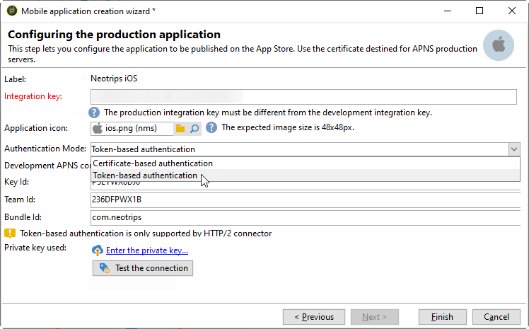

# 針對 iOS 的設定步驟 {#configuring-the-mobile-application-in-adobe-campaign-ios}


安裝套件後，您就可以在Adobe Campaign Classic中定義iOS應用程式設定。

>[!NOTE]
>
>若要了解如何為Android設定您的應用程式，以及如何為Android建立傳送，請參閱此[區段](configuring-the-mobile-application-android.md)。

關鍵步驟為：

1. [設定iOS外部帳戶](#configuring-external-account-ios)
1. [設定iOS服務](#configuring-ios-service)
1. [將iOS行動應用程式整合至Campaign](#creating-ios-app)

然後，您就能為iOS裝置](create-notifications-ios.md)建立推播通知。[


## 設定iOS外部帳戶 {#configuring-external-account-ios}

若為iOS,iOS HTTP/2連接器會傳送通知至HTTP/2 APN。

要配置此連接器，請執行以下步驟：

1. 前往&#x200B;**[!UICONTROL Administration > Platform > External accounts]**。
1. 選擇&#x200B;**[!UICONTROL iOS routing]**&#x200B;外部帳戶。
1. 在&#x200B;**[!UICONTROL Connector]**&#x200B;標籤中，使用下列URL填入&#x200B;**[!UICONTROL Access URL of the connector]**&#x200B;欄位：```http://localhost:8080/nms/jsp/iosHTTP2.jsp```

   

1. 按一下&#x200B;**[!UICONTROL Save]**。

您的iOS連接器現在已設定完畢。 您可以開始建立服務。

## 設定iOS服務 {#configuring-ios-service}

>[!CAUTION]
>
>應用程式必須先設定為「推送」動作，才能與Adobe Campaign SDK進行任何整合。
>
>如果情況並非如此，請參閱[此頁](https://developer.apple.com/documentation/usernotifications)。

1. 轉至&#x200B;**[!UICONTROL Profiles and Targets > Services and subscriptions]**&#x200B;節點，然後按一下&#x200B;**[!UICONTROL New]**。

   

1. 定義&#x200B;**[!UICONTROL Label]**&#x200B;和&#x200B;**[!UICONTROL Internal name]**。
1. 轉到&#x200B;**[!UICONTROL Type]**&#x200B;欄位並選擇&#x200B;**[!UICONTROL Mobile application]**。

   >[!NOTE]
   >
   >預設的&#x200B;**[!UICONTROL Subscriber applications (nms:appSubscriptionRcp)]**&#x200B;目標映射連結到收件者表。 如果要使用不同的目標映射，需要建立新的目標映射，並在服務的&#x200B;**[!UICONTROL Target mapping]**&#x200B;欄位中輸入。 有關建立目標映射的詳細資訊，請參閱[配置指南](../../configuration/using/about-custom-recipient-table.md)。

   

1. 然後按一下&#x200B;**[!UICONTROL Add]**&#x200B;按鈕以選取應用程式類型。

   

1. 建立iOS開發和生產應用程式。 如需詳細資訊，請參閱本[區段](configuring-the-mobile-application.md#creating-ios-app)。

## 建立iOS行動應用程式 {#creating-ios-app}

建立服務後，在Campaign中建立iOS應用程式。 請遵循以下步驟：

1. 在新建立的服務中，按一下&#x200B;**[!UICONTROL Add]**&#x200B;按鈕以選擇應用程式類型。

   

1. 出現以下窗口。 選擇&#x200B;**[!UICONTROL Create an iOS application]**，然後輸入&#x200B;**[!UICONTROL Label]**&#x200B;開始。

   

1. 視需要，您可以讓推送訊息內容更豐富，並包含一些&#x200B;**[!UICONTROL Application variables]**。 這些功能可完全自訂，且是傳送至行動裝置之訊息裝載的一部分。
在下列範例中，我們新增**mediaURl**&#x200B;和&#x200B;**mediaExt**&#x200B;以建立豐富推送通知，然後提供應用程式以在通知內顯示影像。

   

1. **[!UICONTROL Subscription parameters]**&#x200B;索引標籤可讓您以&#x200B;**[!UICONTROL Subscriber applications (nms:appsubscriptionRcp)]**&#x200B;架構的副檔名定義對應。

   >[!NOTE]
   >
   >請確定您的開發版本（沙箱）和應用程式的生產版本不使用相同的憑證。

1. **[!UICONTROL Sounds]**&#x200B;索引標籤可讓您指定要播放的音效。 按一下&#x200B;**[!UICONTROL Add]**&#x200B;並填寫&#x200B;**[!UICONTROL Internal name]**&#x200B;欄位，該欄位必須包含應用程式中嵌入的檔案的名稱或系統聲音的名稱。

1. 按一下&#x200B;**[!UICONTROL Next]**&#x200B;以開始配置開發應用程式。

1. 請確定在Adobe Campaign和透過SDK的應用程式程式碼中定義相同的&#x200B;**[!UICONTROL Integration key]**。 有關詳細資訊，請參閱：[將Campaign SDK整合至行動應用程式](integrating-campaign-sdk-into-the-mobile-application.md)。 此整合金鑰是每個應用程式專屬的，可讓您將行動應用程式連結至Adobe Campaign平台。

   >[!NOTE]
   >
   > **[!UICONTROL Integration key]**&#x200B;可以完全自訂字串值，但必須與SDK中指定的值完全相同。

1. 從&#x200B;**[!UICONTROL Application icon]**&#x200B;欄位中選取其中一個現成可用的圖示，以個人化您服務中的行動應用程式。

1. 選取 **[!UICONTROL Authentication mode]**。請注意，您稍後一律可以在行動應用程式的&#x200B;**[!UICONTROL Certificate]**&#x200B;標籤中變更驗證模式。
   * **[!UICONTROL Certificate-based authentication]**:按一 **[!UICONTROL Enter the certificate...]**  下，然後選取您的p12金鑰，並輸入行動應用程式開發人員提供的密碼。
   * **[!UICONTROL Token-based authentication]**:填入連線設定， **[!UICONTROL Key ID]**&#x200B;然 **[!UICONTROL Team ID]** 後 **[!UICONTROL Bundle ID]** 按一下以選取p8憑證 **[!UICONTROL Enter the private key]**。有關&#x200B;**[!UICONTROL Token-based authentication]**&#x200B;的詳細資訊，請參閱[Apple文檔](https://developer.apple.com/documentation/usernotifications/setting_up_a_remote_notification_server/establishing_a_token-based_connection_to_apns)。

   >[!NOTE]
   >
   > Adobe建議對iOS配置使用&#x200B;**[!UICONTROL Token-based authentication]**，因為此驗證模式更安全，且不綁定到證書過期。

   

1. 您可以按一下&#x200B;**[!UICONTROL Test the connection]**&#x200B;以確定成功。

1. 按一下&#x200B;**[!UICONTROL Next]**&#x200B;以開始配置生產應用程式，並執行上述所述的相同步驟。

   

1. 按一下&#x200B;**[!UICONTROL Finish]**。

您的iOS應用程式現在已可用於Campaign Classic。
