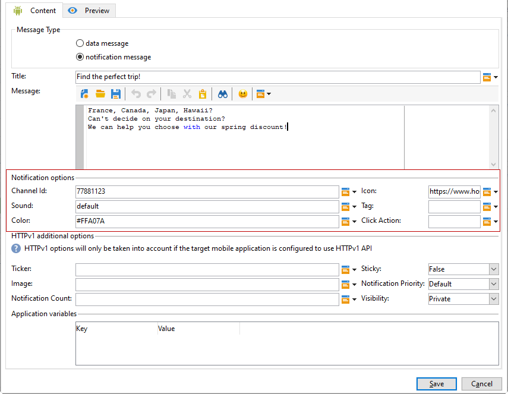

# 為Android建立通知{#create-notificaations-android}

使用Adobe Campaign在Android設備上發送推送通知。 有關交付建立的全球概念，請參閱 [此部分](steps-about-delivery-creation-steps.md)。

首先建立新交貨。

使用Firebase雲消息傳遞，您可以在兩種類型的消息中進行選擇：

* **[!UICONTROL Data message]**，由客戶端應用處理。
    消息被直接發送到移動應用程式，該移動應用程式將生成並顯示安卓通知給設備。 資料消息僅包含自定義應用程式變數。

* **[!UICONTROL Notification message]**，由FCM SDK自動處理。
     FCM會代表客戶端應用程式在用戶設備上自動顯示消息。 通知消息包含一組預定義的參數和選項，但仍然可以使用自定義應用程式變數進一步個性化。

有關Firebase雲消息類型的詳細資訊，請參閱 [FCM文檔](https://firebase.google.com/docs/cloud-messaging/concept-options#notifications_and_data_messages)。

## 建立資料消息 {#creating-data-message}

1. 轉到 **[!UICONTROL Campaign management]** > **[!UICONTROL Deliveries]**。

1. 按一下&#x200B;**[!UICONTROL New]**。

   

1. 選擇 **[!UICONTROL Deliver on Android (android)]** 的 **[!UICONTROL Delivery template]** 下拉。 添加 **[!UICONTROL Label]** 送到你的快遞。

1. 按一下 **[!UICONTROL To]** 來定義目標的人口。 預設情況下， **[!UICONTROL Subscriber application]** 應用了目標映射。 按一下 **[!UICONTROL Add]** 來修改標籤元素的屬性。

   

1. 在 **[!UICONTROL Target type]** 窗口，選擇 **[!UICONTROL Subscribers of an Android mobile application]** 按一下 **[!UICONTROL Next]**。

1. 在 **[!UICONTROL Service]** 下拉，選擇先前建立的服務，然後選擇應用程式，然後按一下 **[!UICONTROL Finish]**。
的 **[!UICONTROL Application variables]** 根據在配置步驟中添加的內容自動添加。

   

1. 選擇 **[!UICONTROL data message]** 如 **[!UICONTROL Message Type]**。

1. 編輯您的富通知。

   

1. 您可以在以前配置的資訊中添加資訊 **[!UICONTROL Application variables]** 如果需要。 **[!UICONTROL Application variables]** 需要在Android服務中配置，並且是發送到移動設備的消息負載的一部分。

1. 按一下 **[!UICONTROL Save]** 然後把你的快遞寄出去。

當用戶的移動Android設備上接收到影像和網頁時，應該在推送通知中顯示。

## 建立通知消息 {#creating-notification-message}

>[!NOTE]
>
>通知消息的其他選項僅在HTTP v1 API配置中可用。 如需詳細資訊，請參閱本[區段](configuring-the-mobile-application-android.md#android-service-httpv1)。

 [瞭解如何在視頻中建立Android推送通知](https://experienceleague.adobe.com/docs/campaign-classic-learn/getting-started-with-push-notifications-for-android/configuring-and-sending-push-notifications.html?lang=en#additional-resources)

1. 轉到 **[!UICONTROL Campaign management]** > **[!UICONTROL Deliveries]**。

1. 按一下&#x200B;**[!UICONTROL New]**。

   

1. 選擇 **[!UICONTROL Deliver on Android (android)]** 的 **[!UICONTROL Delivery template]** 下拉。 添加 **[!UICONTROL Label]** 送到你的快遞。

1. 按一下 **[!UICONTROL To]** 來定義目標的人口。 預設情況下， **[!UICONTROL Subscriber application]** 應用了目標映射。 按一下 **[!UICONTROL Add]** 來修改標籤元素的屬性。

   

1. 在 **[!UICONTROL Target type]** 窗口，選擇 **[!UICONTROL Subscribers of an Android mobile application]** 按一下 **[!UICONTROL Next]**。

1. 在 **[!UICONTROL Service]** 下拉，選擇先前建立的服務，然後選擇應用程式，然後按一下 **[!UICONTROL Finish]**。

   

1. 選擇 **[!UICONTROL notification message]** 如 **[!UICONTROL Message Type]**。

1. 添加標題並編輯您的郵件。 使用 **[!UICONTROL Notification options]**:

   * **[!UICONTROL Channel ID]**:設定通知的通道ID。 在收到任何具有此頻道ID的通知之前，應用必須建立具有此頻道ID的頻道。
   * **[!UICONTROL Sound]**:將聲音設定為在設備收到通知時播放。
   * **[!UICONTROL Color]**:設定通知的表徵圖顏色。
   * **[!UICONTROL Icon]**:將通知的表徵圖設定為在配置檔案的設備上顯示。
   * **[!UICONTROL Tag]**:設定用於替換通知抽屜中現有通知的標識符。
   * **[!UICONTROL Click action]**:設定與用戶關聯的操作，按一下您的通知。

   有關 **[!UICONTROL Notification options]** 以及如何填寫這些欄位，請參閱 [FCM文檔](https://firebase.google.com/docs/reference/fcm/rest/v1/projects.messages#androidnotification)。

   

1. 如果您的應用程式配置了HTTP v1 API協定，則可以通過以下方式進一步個性化推送通知 **[!UICONTROL HTTPV1 additional options]**:

   * **[!UICONTROL Ticker]**:設定通知的票證文本。 僅適用於設定為Android 5.0棒棒糖的設備。
   * **[!UICONTROL Image]**:設定要在通知中顯示的影像URL。
   * **[!UICONTROL Notification Count]**:設定要直接顯示在應用程式表徵圖上的新未讀資訊的數量。
   * **[!UICONTROL Sticky]**:設定為true或false。 如果設定為false，則當用戶按一下通知時，該通知將自動被取消。 如果設定為true，則即使用戶按一下通知也仍會顯示該通知。
   * **[!UICONTROL Notification Priority]**:將通知的優先順序設定為預設、最小、低或高。 有關此內容的詳細資訊，請參閱 [FCM文檔](https://firebase.google.com/docs/reference/fcm/rest/v1/projects.messages#NotificationPriority)。
   * **[!UICONTROL Visibility]**:將通知的可見性級別設定為「公共」、「私有」或「機密」。 有關此內容的詳細資訊，請參閱 [FCM文檔](https://firebase.google.com/docs/reference/fcm/rest/v1/projects.messages#visibility)。

   有關 **[!UICONTROL HTTP v1 additional options]** 以及如何填寫這些欄位，請參閱 [FCM文檔](https://firebase.google.com/docs/reference/fcm/rest/v1/projects.messages#androidnotification)。

   

1. 您可以在以前配置的資訊中添加資訊 **[!UICONTROL Application variables]** 如果需要。 **[!UICONTROL Application variables]** 需要在Android服務中配置，並且是發送到移動設備的消息負載的一部分。

1. 按一下 **[!UICONTROL Save]** 然後把你的快遞寄出去。

當用戶的移動Android設備上接收到影像和網頁時，應該在推送通知中顯示。
