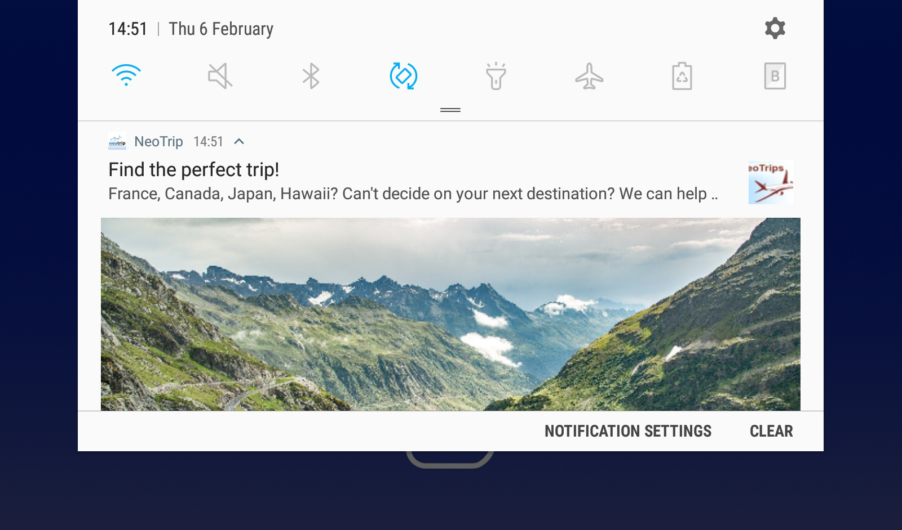

# 建立Android通知{#create-notificaations-android}

使用Adobe Campaign在Android裝置上傳送推播通知。 傳遞建立的全域概念，在 [本節](steps-about-delivery-creation-steps.md).

首先，建立新的傳送。

使用Firebase雲端訊息，您可以在兩種訊息類型之間進行選擇：

* **[!UICONTROL Data message]**，由用戶端應用程式處理。
    訊息會直接傳送至行動應用程式，行動應用程式會產生並顯示Android通知給裝置。 資料訊息僅包含您的自訂應用程式變數。

* **[!UICONTROL Notification message]**，由FCM SDK自動處理。
     FCM會代表用戶端應用程式在您的使用者裝置上自動顯示訊息。 通知訊息包含一組預先定義的參數和選項，但仍可透過自訂應用程式變數進一步個人化。

如需Firebase雲端訊息類型的詳細資訊，請參閱 [FCM檔案](https://firebase.google.com/docs/cloud-messaging/concept-options#notifications_and_data_messages).

## 建立資料訊息 {#creating-data-message}

1. 前往 **[!UICONTROL Campaign management]** > **[!UICONTROL Deliveries]**.

1. 按一下&#x200B;**[!UICONTROL New]**。

   

1. 選擇 **[!UICONTROL Deliver on Android (android)]** 在 **[!UICONTROL Delivery template]** 下拉式清單。 新增 **[!UICONTROL Label]** 傳送給您。

1. 按一下 **[!UICONTROL To]** 定義要定位的母體。 依預設， **[!UICONTROL Subscriber application]** 已套用目標對應。 按一下 **[!UICONTROL Add]** 來選取服務。

   

1. 在 **[!UICONTROL Target type]** 窗口，選擇 **[!UICONTROL Subscribers of an Android mobile application]** 按一下 **[!UICONTROL Next]**.

1. 在 **[!UICONTROL Service]** 下拉式清單，依序選取您先前建立的服務和應用程式，然後按一下 **[!UICONTROL Finish]**.
此 **[!UICONTROL Application variables]** 會根據設定步驟中新增的內容自動新增。

   

1. 選擇 **[!UICONTROL data message]** as **[!UICONTROL Message Type]**.

1. 編輯豐富通知。

   

1. 您可以在先前設定的中新增資訊 **[!UICONTROL Application variables]** 如有需要。 **[!UICONTROL Application variables]** 需要在Android服務中設定，且是傳送至行動裝置之訊息裝載的一部分。

1. 按一下 **[!UICONTROL Save]** 並傳送您的傳遞。

在訂閱者的行動Android裝置上收到影像和網頁時，應顯示在推播通知中。

## 建立通知訊息 {#creating-notification-message}

>[!NOTE]
>
>通知訊息的其他選項僅可搭配HTTP v1 API設定使用。 如需詳細資訊，請參閱本[區段](configuring-the-mobile-application-android.md#android-service-httpv1)。

 [了解如何在影片中建立Android推播通知](https://experienceleague.adobe.com/docs/campaign-classic-learn/getting-started-with-push-notifications-for-android/configuring-and-sending-push-notifications.html?lang=en#additional-resources)

1. 前往 **[!UICONTROL Campaign management]** > **[!UICONTROL Deliveries]**.

1. 按一下&#x200B;**[!UICONTROL New]**。

   

1. 選擇 **[!UICONTROL Deliver on Android (android)]** 在 **[!UICONTROL Delivery template]** 下拉式清單。 新增 **[!UICONTROL Label]** 傳送給您。

1. 按一下 **[!UICONTROL To]** 定義要定位的母體。 依預設， **[!UICONTROL Subscriber application]** 已套用目標對應。 按一下 **[!UICONTROL Add]** 來選取服務。

   

1. 在 **[!UICONTROL Target type]** 窗口，選擇 **[!UICONTROL Subscribers of an Android mobile application]** 按一下 **[!UICONTROL Next]**.

1. 在 **[!UICONTROL Service]** 下拉式清單，依序選取您先前建立的服務和應用程式，然後按一下 **[!UICONTROL Finish]**.

   

1. 選擇 **[!UICONTROL notification message]** as **[!UICONTROL Message Type]**.

1. 新增標題並編輯訊息。 使用將推播通知個人化 **[!UICONTROL Notification options]**:

   * **[!UICONTROL Channel ID]**:設定通知的通道ID。 收到具有此通道ID的任何通知之前，應用程式必須先使用此通道ID建立通道。
   * **[!UICONTROL Sound]**:設定在裝置收到通知時播放音效。
   * **[!UICONTROL Color]**:設定通知的圖示顏色。
   * **[!UICONTROL Icon]**:設定通知的圖示，以在您的設定檔裝置上顯示。
   * **[!UICONTROL Tag]**:設定用來取代通知抽屜中現有通知的識別碼。
   * **[!UICONTROL Click action]**:設定與使用者點按您的通知相關聯的動作。

   如需 **[!UICONTROL Notification options]** 以及如何填寫這些欄位，請參閱 [FCM檔案](https://firebase.google.com/docs/reference/fcm/rest/v1/projects.messages#androidnotification).

   

1. 如果您的應用程式已使用HTTP v1 API通訊協定設定，您可以使用下列項目進一步個人化您的推播通知 **[!UICONTROL HTTPV1 additional options]**:

   * **[!UICONTROL Ticker]**:設定通知的代號文字。 僅適用於設為Android 5.0 Lollipop的裝置。
   * **[!UICONTROL Image]**:設定要在通知中顯示的影像URL。
   * **[!UICONTROL Notification Count]**:設定要直接顯示在應用程式圖示上的新未讀資訊數。
   * **[!UICONTROL Sticky]**:設為true或false。 若設為false，則當使用者按一下通知時，系統會自動將其關閉。 若設為true，即使使用者點按通知，仍會顯示通知。
   * **[!UICONTROL Notification Priority]**:將通知的優先順序設定為預設、最小、低或高。 有關詳細資訊，請參閱 [FCM檔案](https://firebase.google.com/docs/reference/fcm/rest/v1/projects.messages#NotificationPriority).
   * **[!UICONTROL Visibility]**:將通知的可見度層級設為公開、私人或機密。 有關詳細資訊，請參閱 [FCM檔案](https://firebase.google.com/docs/reference/fcm/rest/v1/projects.messages#visibility).

   如需 **[!UICONTROL HTTP v1 additional options]** 以及如何填寫這些欄位，請參閱 [FCM檔案](https://firebase.google.com/docs/reference/fcm/rest/v1/projects.messages#androidnotification).

   

1. 您可以在先前設定的中新增資訊 **[!UICONTROL Application variables]** 如有需要。 **[!UICONTROL Application variables]** 需要在Android服務中設定，且是傳送至行動裝置之訊息裝載的一部分。

1. 按一下 **[!UICONTROL Save]** 並傳送您的傳遞。

在訂閱者的行動Android裝置上收到影像和網頁時，應顯示在推播通知中。
