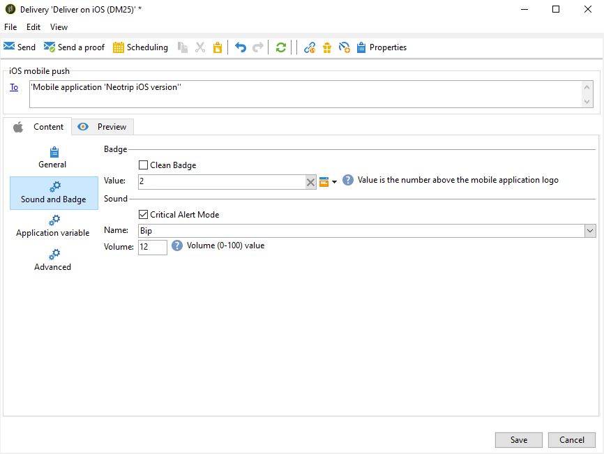

# 建立iOS通知{#create-notifications-ios}

本節詳細說明特定於iOS通知傳送的元素。 有關傳遞建立的全域概念，請參見 [本節](steps-about-delivery-creation-steps.md).

從建立新傳遞開始。

若要為iOS裝置建立推播通知，請遵循下列步驟：

1. 選取 **[!UICONTROL Deliver on iOS]** 傳遞範本。

   

1. 若要定義通知的目標，請按一下 **[!UICONTROL To]** 連結，然後按一下 **[!UICONTROL Add]**.

   

   >[!NOTE]
   >
   >選擇傳送的目標母體時的詳細程式會顯示在中 [本節](steps-defining-the-target-population.md).
   >
   >有關個人化欄位使用的詳細資訊，請參閱 [本節](about-personalization.md).
   >
   >有關包含種子清單的詳細資訊，請參閱 [關於種子地址](about-seed-addresses.md).

1. 選取 **[!UICONTROL Subscribers of an iOS mobile application (iPhone, iPad)]**，選取與您的行動應用程式相關的服務（在此案例中為Neotrips），然後選取應用程式的iOS版本。

   

1. 選擇您的 **[!UICONTROL Notification type]** 介於 **[!UICONTROL General notification (Alert, Sound, Badge)]** 或 **[!UICONTROL Silent notification]**.

   

   >[!NOTE]
   >
   >此 **靜音推播** 模式允許將「無訊息」通知傳送至行動應用程式。 使用者不會發現有通知傳到。而是直接傳輸到應用程式。

1. 在 **[!UICONTROL Title]** 欄位，輸入您要顯示在通知中心可用通知清單中的標題標籤。

   此欄位可讓您定義 **標題** iOS通知裝載的引數。

1. 您可以新增 **[!UICONTROL Subtitle]**，iOS通知承載之子標題引數的值。 請參閱 [本節](configuring-the-mobile-application.md).

1. 請在以下位置輸入訊息的內容： **[!UICONTROL Message content]** 區段。 個人化欄位的使用方式顯示在中 [關於個人化](about-personalization.md) 區段。

   

1. 按一下 **[!UICONTROL Insert emoticon]** 圖示以將表情符號插入推播通知。 若要自訂表情符號清單，請參閱 [本節](customizing-emoticon-list.md)

1. 從 **[!UICONTROL Sound and Badge]** 標籤，您可以編輯下列選項：

   * **[!UICONTROL Clean Badge]**：啟用此選項以重新整理徽章值。

   * **[!UICONTROL Value]**：設定用於直接在應用程式圖示上顯示的新未讀取資訊數目。

   * **[!UICONTROL Critical alert mode]**：啟用此選項可在使用者手機設為焦點模式或iPhone靜音時，將聲音新增至您的通知。

   * **[!UICONTROL Name]**：選取在收到通知時行動終端機要播放的音效。

   * **[!UICONTROL Volume]**：音量從0到100。

   >[!NOTE]
   >
   >聲音必須包含在應用程式中，並在建立服務時定義。 請參閱[本節](configuring-the-mobile-application.md#configuring-external-account-ios)。

   

1. 從 **[!UICONTROL Application variables]** 標籤，您的 **[!UICONTROL Application variables]** 都會自動新增。 它們可讓您定義通知行為，例如，您可以設定當使用者啟動通知時顯示的特定應用程式畫面。

   如需詳細資訊，請參閱[本章節](configuring-the-mobile-application.md)。

1. 從 **[!UICONTROL Advanced]** 標籤，您可以編輯下列一般選項：

   * **[!UICONTROL Mutable content]**：啟用此選項可允許行動應用程式下載媒體內容。

   * **[!UICONTROL Thread-id]**：用來將相關通知分組的識別碼。

   * **[!UICONTROL Category]**：會顯示動作按鈕的類別ID名稱。 這些通知可讓使用者以更快的方式回應通知，執行不同的工作，而不需在應用程式中開啟或導覽。

   

1. 對於時效性通知，您可以指定下列選項：

   * **[!UICONTROL Target content ID]**：用來在通知開啟時鎖定要轉送的應用程式視窗的識別碼。

   * **[!UICONTROL Launch image]**：要顯示的啟動影像檔案名稱。 如果使用者選擇啟動您的應用程式，則會顯示選取的影像，而非您應用程式的啟動畫面。

   * **[!UICONTROL Interruption level]**：

      * **[!UICONTROL Active]**：預設情況下，系統會立即顯示通知、在熒幕上點亮，並可播放音效。 通知不會突破焦點模式。

      * **[!UICONTROL Passive]**：系統會將通知新增至通知清單，而不會點亮熒幕或播放音效。 通知不會突破焦點模式。

      * **[!UICONTROL Time sensitive]**：系統會立即顯示通知、點亮熒幕、播放聲音並突破焦點模式。 此層級不需要Apple的特殊許可權。

      * **[!UICONTROL Critical]**：系統會立即顯示通知、點亮熒幕，並繞過靜音切換或聚焦模式。 請注意，此層級需要Apple的特殊許可權。

   * **[!UICONTROL Relevance score]**：將關聯性分數從0設定為100。 系統會使用此選項來排序通知摘要中的通知。

   

1. 設定通知後，按一下 **[!UICONTROL Preview]** 標籤以預覽通知。

   

   >[!NOTE]
   >
   >Adobe Campaign中未定義通知樣式（橫幅或警報）。 這取決於使用者在其iOS設定中選取的設定。 不過，Adobe Campaign可讓您預覽每種型別的通知樣式。 按一下右下方的箭頭，從一種樣式切換為另一種樣式。
   >
   >預覽使用iOS 10外觀。

若要傳送證明並傳送最終傳遞，請使用與電子郵件傳遞相同的程式。 [了解更多](steps-validating-the-delivery.md)

傳送訊息後，您可以監視和追蹤您的傳遞。 如需詳細資訊，請參閱下列區段。

* [推播通知隔離](understanding-quarantine-management.md#push-notification-quarantines)
* [監視傳遞](about-delivery-monitoring.md)
* [瞭解傳遞故障](understanding-delivery-failures.md)

## 建立iOS豐富型通知 {#creating-ios-delivery}

使用iOS 10或更新版本，即可產生豐富的通知。 Adobe Campaign可使用可讓裝置顯示豐富通知的變數來傳送通知。

您現在需要建立新的傳送，並將其連結至您建立的行動應用程式。

1. 前往 **[!UICONTROL Campaign management]** > **[!UICONTROL Deliveries]**.

1. 按一下&#x200B;**[!UICONTROL New]**。

   

1. 選取 **[!UICONTROL Deliver on iOS (ios)]** 在 **[!UICONTROL Delivery template]** 下拉式清單。 新增 **[!UICONTROL Label]** 至您的傳遞。

1. 按一下 **[!UICONTROL To]** 以定義要定位的母體。 根據預設， **[!UICONTROL Subscriber application]** 目標對應已套用。 按一下 **[!UICONTROL Add]** 以選取先前建立的服務。

   

1. 在 **[!UICONTROL Target type]** 視窗，選取 **[!UICONTROL Subscribers of an iOS mobile application (iPhone, iPad)]** 並按一下 **[!UICONTROL Next]**.

1. 在 **[!UICONTROL Service]** 從下拉式清單中，選取您先前建立的服務，然後選取您要鎖定的應用程式，然後按一下 **[!UICONTROL Finish]**.

   

1. 編輯您的豐富型通知。

   

1. 從 **[!UICONTROL Application variables]** 標籤，您的 **[!UICONTROL Application variables]** 會根據設定步驟期間新增的內容自動新增。

   >[!NOTE]
   >
   >應用程式變數必須在行動應用程式的程式碼中定義，並在服務建立期間輸入。 如需詳細資訊，請參閱[本章節](configuring-the-mobile-application.md)。

   

1. 從 **[!UICONTROL Advanced]** 索引標籤，核取 **[!UICONTROL Mutable content]** 方塊來允許行動應用程式下載媒體內容。

1. 按一下 **[!UICONTROL Save]** 並傳送您的傳遞。

在訂閱者的iOS行動裝置上接收時，影像和網頁應顯示在推播通知中。

