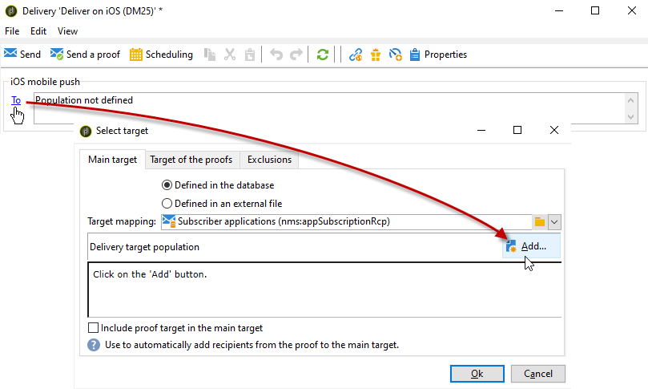
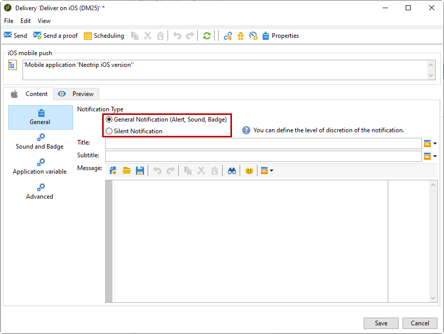

# 建立iOS通知{#create-notifications-ios}

本節詳細說明特定於iOS通知傳送的元素。 在[本節](steps-about-delivery-creation-steps.md)中介紹了傳遞建立的全域概念。

從建立新傳遞開始。

若要為iOS裝置建立推播通知，請遵循下列步驟：

1. 選取&#x200B;**[!UICONTROL Deliver on iOS]**&#x200B;傳遞範本。

   

1. 若要定義通知的目標，請按一下&#x200B;**[!UICONTROL To]**&#x200B;連結，然後按一下&#x200B;**[!UICONTROL Add]**。

   

   >[!NOTE]
   >
   >選取傳遞的目標母體時的詳細程式會顯示在[本節](steps-defining-the-target-population.md)中。
   >
   >如需使用個人化欄位的詳細資訊，請參閱[本區段](about-personalization.md)。
   >
   >如需包含種子清單的詳細資訊，請參閱[關於種子地址](about-seed-addresses.md)。

1. 選取&#x200B;**[!UICONTROL Subscribers of an iOS mobile application (iPhone, iPad)]**，選取與您的行動應用程式相關的服務（在此案例中為Neotrips），然後選取應用程式的iOS版本。

   

1. 在&#x200B;**[!UICONTROL General notification (Alert, Sound, Badge)]**&#x200B;或&#x200B;**[!UICONTROL Silent notification]**&#x200B;之間選擇您的&#x200B;**[!UICONTROL Notification type]**。

   

   >[!NOTE]
   >
   >**無訊息推播**&#x200B;模式允許將「無訊息」通知傳送至行動應用程式。 使用者不會發現有通知傳到。而是直接傳輸到應用程式。

1. 在&#x200B;**[!UICONTROL Title]**&#x200B;欄位中，輸入您要顯示在通知中心可用通知清單中的標題標籤。

   此欄位可讓您定義iOS通知承載的&#x200B;**title**&#x200B;引數值。

1. 您可以新增iOS通知承載之子標題引數的&#x200B;**[!UICONTROL Subtitle]**&#x200B;值。 請參閱[本節](configuring-the-mobile-application.md)。

1. 在助理員的&#x200B;**[!UICONTROL Message content]**&#x200B;區段中輸入訊息的內容。 個人化欄位的使用顯示在[關於個人化](about-personalization.md)區段。

   

1. 按一下&#x200B;**[!UICONTROL Insert emoticon]**&#x200B;圖示，將表情符號插入推播通知。 若要自訂表情符號清單，請參閱[本節](customizing-emoticon-list.md)

1. 您可以從&#x200B;**[!UICONTROL Sound and Badge]**&#x200B;標籤編輯下列選項：

   * **[!UICONTROL Clean Badge]**：啟用此選項以重新整理徽章值。

   * **[!UICONTROL Value]**：設定將用來直接在應用程式圖示上顯示新未讀取資訊的數字。

   * **[!UICONTROL Critical alert mode]**：啟用此選項，即使使用者的電話設定為焦點模式或iPhone已靜音，也可以將聲音加入您的通知。

   * **[!UICONTROL Name]**：選取在收到通知時，由行動終端機播放的音效。

   * **[!UICONTROL Volume]**：聲音的音量從0到100。

   >[!NOTE]
   >
   >聲音必須包含在應用程式中，並在建立服務時定義。 請參閱[本節](configuring-the-mobile-application.md#configuring-external-account-ios)。

   

1. 從&#x200B;**[!UICONTROL Application variables]**&#x200B;索引標籤，會自動新增您的&#x200B;**[!UICONTROL Application variables]**。 它們可讓您定義通知行為，例如，您可以設定當使用者啟動通知時顯示的特定應用程式畫面。

   如需詳細資訊，請參閱[本章節](configuring-the-mobile-application.md)。

1. 您可以從&#x200B;**[!UICONTROL Advanced]**&#x200B;標籤編輯下列一般選項：

   * **[!UICONTROL Mutable content]**：啟用此選項以允許行動應用程式下載媒體內容。

   * **[!UICONTROL Thread-id]**：用來將相關通知分組在一起的識別碼。

   * **[!UICONTROL Category]**：將顯示動作按鈕的類別ID名稱。 這些通知可讓使用者以更快的方式回應通知，執行不同的工作，而不需在應用程式中開啟或導覽。

   

1. 對於時效性通知，您可以指定下列選項：

   * **[!UICONTROL Target content ID]**：識別碼，用於鎖定在開啟通知時要轉送的應用程式視窗。

   * **[!UICONTROL Launch image]**：要顯示的啟動影像檔名稱。 如果使用者選擇啟動您的應用程式，則會顯示選取的影像，而非您應用程式的啟動畫面。

   * **[!UICONTROL Interruption level]**：

      * **[!UICONTROL Active]**：依預設設定，系統會立即顯示通知、開啟熒幕，並可播放音效。 通知不會突破焦點模式。

      * **[!UICONTROL Passive]**：系統會將通知新增至通知清單，而不需開啟熒幕或播放音效。 通知不會突破焦點模式。

      * **[!UICONTROL Time sensitive]**：系統會立即顯示通知、讓熒幕亮起、播放聲音並突破焦點模式。 此層級不需要Apple的特殊許可權。

      * **[!UICONTROL Critical]**：系統會立即顯示通知、讓熒幕亮起，並略過靜音切換或焦點模式。 請注意，此層級需要Apple的特殊許可權。

   * **[!UICONTROL Relevance score]**：將關聯性分數設定為0到100。 系統會使用此選項來排序通知摘要中的通知。

   

1. 設定通知後，按一下&#x200B;**[!UICONTROL Preview]**&#x200B;標籤以預覽通知。

   

   >[!NOTE]
   >
   >Adobe Campaign中未定義通知樣式（橫幅或警報）。 這取決於使用者在其iOS設定中選取的設定。 不過，Adobe Campaign可讓您預覽每種型別的通知樣式。 按一下右下方的箭頭，從一種樣式切換為另一種樣式。
   >
   >預覽使用iOS 10外觀。

若要傳送證明並傳送最終傳遞，請使用與電子郵件傳遞相同的程式。 [了解更多](steps-validating-the-delivery.md)

傳送訊息後，您可以監視和追蹤您的傳遞。 如需詳細資訊，請參閱下列區段。

* [推播通知隔離](understanding-quarantine-management.md#push-notification-quarantines)
* [監視傳遞](about-delivery-monitoring.md)
* [瞭解傳遞故障](understanding-delivery-failures.md)

## 建立iOS豐富型通知 {#creating-ios-delivery}

使用iOS 10或更新版本，即可產生豐富的通知。 Adobe Campaign可使用可讓裝置顯示豐富通知的變數來傳送通知。

您現在需要建立新的傳送，並將其連結至您建立的行動應用程式。

1. 前往&#x200B;**[!UICONTROL Campaign management]** > **[!UICONTROL Deliveries]**。

1. 按一下&#x200B;**[!UICONTROL New]**。

   

1. 在&#x200B;**[!UICONTROL Delivery template]**&#x200B;下拉式清單中選取&#x200B;**[!UICONTROL Deliver on iOS (ios)]**。 新增&#x200B;**[!UICONTROL Label]**&#x200B;至您的傳遞。

1. 按一下&#x200B;**[!UICONTROL To]**&#x200B;以定義目標母體。 依預設，會套用&#x200B;**[!UICONTROL Subscriber application]**&#x200B;目標對應。 按一下&#x200B;**[!UICONTROL Add]**&#x200B;以選取先前建立的服務。

   

1. 在&#x200B;**[!UICONTROL Target type]**&#x200B;視窗中，選取&#x200B;**[!UICONTROL Subscribers of an iOS mobile application (iPhone, iPad)]**&#x200B;並按一下&#x200B;**[!UICONTROL Next]**。

1. 在&#x200B;**[!UICONTROL Service]**&#x200B;下拉式清單中，選取您先前建立的服務，然後選取您要鎖定的應用程式，再按一下&#x200B;**[!UICONTROL Finish]**。

   

1. 編輯您的豐富型通知。

   

1. 從&#x200B;**[!UICONTROL Application variables]**&#x200B;索引標籤，您的&#x200B;**[!UICONTROL Application variables]**&#x200B;會根據組態步驟中新增的內容自動新增。

   >[!NOTE]
   >
   >應用程式變數必須在行動應用程式的程式碼中定義，並在服務建立期間輸入。 如需詳細資訊，請參閱[本章節](configuring-the-mobile-application.md)。

   

1. 從&#x200B;**[!UICONTROL Advanced]**&#x200B;索引標籤中，核取&#x200B;**[!UICONTROL Mutable content]**&#x200B;方塊以允許行動應用程式下載媒體內容。

1. 按一下&#x200B;**[!UICONTROL Save]**&#x200B;並傳送您的傳遞。

在訂閱者的iOS行動裝置上接收時，影像和網頁應顯示在推播通知中。

