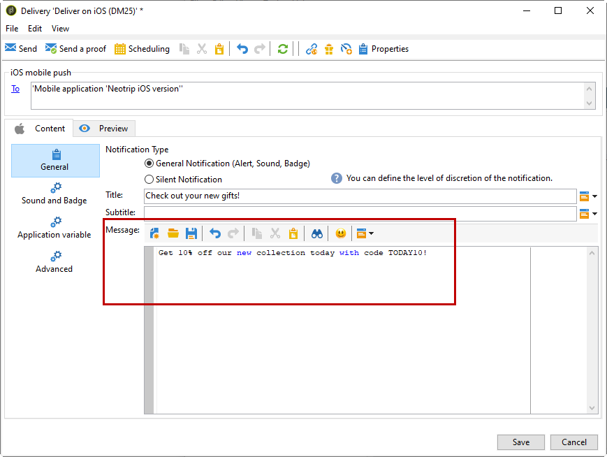

# 建立iOS通知{#create-notifications-ios}

本節詳細說明傳送iOS通知的特定元素。 傳遞建立的全域概念，在 [本節](steps-about-delivery-creation-steps.md).

首先，建立新的傳送。

若要建立iOS裝置的推播通知，請遵循下列步驟：

1. 選取 **[!UICONTROL Deliver on iOS]** 傳遞範本。

   

1. 若要定義通知的目標，請按一下 **[!UICONTROL To]** 連結，然後按一下 **[!UICONTROL Add]**.

   

   >[!NOTE]
   >
   >選取傳送的目標母體時的詳細程式會顯示在 [本節](steps-defining-the-target-population.md).
   >
   >有關個人化欄位使用的詳細資訊，請參閱 [本節](about-personalization.md).
   >
   >有關包含種子清單的詳細資訊，請參閱 [關於種子地址](about-seed-addresses.md).

1. 選擇 **[!UICONTROL Subscribers of an iOS mobile application (iPhone, iPad)]**，請選取與行動應用程式相關的服務（在此例中為Neotrips），然後選取應用程式的iOS版本。

   

1. 選擇通知類型： **[!UICONTROL Alert]**, **[!UICONTROL Badge]**，或 **[!UICONTROL Alert and badge]** 或 **[!UICONTROL Silent Push]**.

   

   >[!NOTE]
   >
   >此 **靜默推** 模式可將「靜默」通知傳送至行動應用程式。 使用者未得知通知的到達。 會直接轉送至應用程式。

1. 在 **[!UICONTROL Title]** 欄位中，輸入要在通知上顯示的標題標籤。 它只會出現在通知中心提供的通知清單中。 此欄位可讓您定義 **標題** iOS通知裝載的參數。

1. 如果您使用HTTP/2連接器，則可以新增字幕( **字幕** iOS通知裝載的參數)。 請參閱 [本節](configuring-the-mobile-application.md).

1. 然後輸入 **[!UICONTROL Message]** 和 **[!UICONTROL Value of the badge]** 根據所選通知類型。

   

   >[!NOTE]
   >
   >**[!UICONTROL Badge]** 和 **[!UICONTROL Alert and badge]** 類型通知可讓您修改徽章的值（行動應用程式標誌上方的數字）。 若要重新整理徽章，您只需輸入0作為值即可。 如果欄位空白，徽章值將不會變更。

1. 按一下 **[!UICONTROL Insert emoticon]** 圖示將表情符號插入推播通知。 若要自訂表情符號清單，請參閱 [本節](customizing-emoticon-list.md)

1. 此 **[!UICONTROL Action button]** 可讓您為出現在警報通知上的動作按鈕定義標籤(**action_loc_key** 有效負載的欄位)。 如果您的iOS應用程式管理可本地化的字串(**Localized.strings**)，請在此欄位中輸入對應的金鑰。 如果您的應用程式不管理可本地化的文字，請輸入要顯示在動作按鈕上的標籤。 如需可本地化字串的詳細資訊，請參閱 [Apple檔案](https://developer.apple.com/library/archive/documentation/NetworkingInternet/Conceptual/RemoteNotificationsPG/CreatingtheNotificationPayload.html#//apple_ref/doc/uid/TP40008194-CH10-SW1) .
1. 在 **[!UICONTROL Play a sound]** 欄位中，選取接收通知時由行動終端播放的音效。

   >[!NOTE]
   >
   >應用程式中必須包含聲音，並在建立服務時定義聲音。 請參閱[本節](configuring-the-mobile-application.md#configuring-external-account-ios)。

1. 在 **[!UICONTROL Application variables]** 欄位，輸入每個變數的值。 應用程式變數可讓您定義通知行為：例如，您可以設定特定應用程式畫面，以在使用者啟動通知時顯示。

   >[!NOTE]
   >
   >應用程式變數必須在行動應用程式的程式碼中定義，並在服務建立期間輸入。 如需詳細資訊，請參閱[本章節](configuring-the-mobile-application.md)。

1. 設定通知後，按一下 **[!UICONTROL Preview]** 標籤來預覽通知。

   

   >[!NOTE]
   >
   >通知樣式（橫幅或警報）未在Adobe Campaign中定義。 這取決於使用者在其iOS設定中選取的設定。 不過，Adobe Campaign可讓您預覽每種通知樣式。 按一下右下方的箭頭，以從一個樣式切換為另一個樣式。
   >
   >預覽使用iOS 10的外觀和風格。

若要傳送校樣並傳送最終傳送，請使用與電子郵件傳送相同的程式。

傳送訊息後，您可以監控及追蹤您的傳送。 如需詳細資訊，請參閱下列區段。

* [推播通知隔離](understanding-quarantine-management.md#push-notification-quarantines)
* [監視傳遞](about-delivery-monitoring.md)
* [瞭解傳遞故障](understanding-delivery-failures.md)

## 建立iOS豐富通知 {#creating-ios-delivery}

有了iOS 10或更新版本，便可產生豐富通知。 Adobe Campaign可使用變數傳送通知，讓裝置顯示豐富通知。

您現在需要建立新的傳送，並將其連結至您建立的行動應用程式。

1. 前往 **[!UICONTROL Campaign management]** > **[!UICONTROL Deliveries]**.

1. 按一下&#x200B;**[!UICONTROL New]**。

   

1. 選擇 **[!UICONTROL Deliver on iOS (ios)]** 在 **[!UICONTROL Delivery template]** 下拉式清單。 新增 **[!UICONTROL Label]** 傳送給您。

1. 按一下 **[!UICONTROL To]** 定義要定位的母體。 依預設， **[!UICONTROL Subscriber application]** 已套用目標對應。 按一下 **[!UICONTROL Add]** 來選取先前建立的服務。

   

1. 在 **[!UICONTROL Target type]** 窗口，選擇 **[!UICONTROL Subscribers of an iOS mobile application (iPhone, iPad)]** 按一下 **[!UICONTROL Next]**.

1. 在 **[!UICONTROL Service]** 下拉式清單，依序選取您先前建立的服務，然後選取您要定位的應用程式，然後按一下 **[!UICONTROL Finish]**.
此 **[!UICONTROL Application variables]** 會根據設定步驟中新增的內容自動新增。

   

1. 編輯豐富通知。

   

1. 檢查 **[!UICONTROL Mutable content]** 方塊，以允許行動應用程式下載媒體內容。

1. 按一下 **[!UICONTROL Save]** 並傳送您的傳遞。

在訂閱者的行動iOS裝置上收到影像和網頁時，應顯示在推播通知中。

