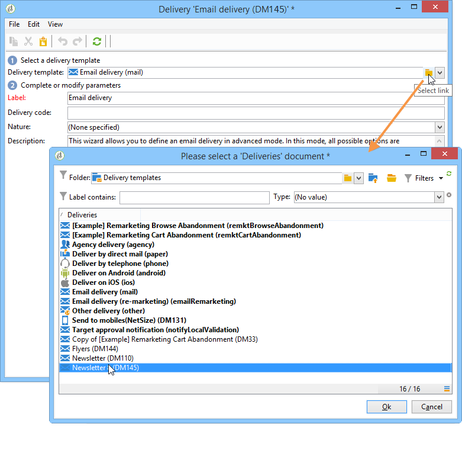

# 使用範本建立傳遞{#creating-a-delivery-from-a-template}

## 將範本連結至傳遞 {#linking-the-template-to-a-delivery}

若要根據現有範本建立傳遞，請從可用傳遞範本清單中選取範本。

否則，請按一下欄位右側的&#x200B;**[!UICONTROL Select link]**&#x200B;資料夾以瀏覽樹狀結構。

從&#x200B;**[!UICONTROL Folder]**&#x200B;欄位選取所要的目錄，或按一下&#x200B;**[!UICONTROL Display sub-levels]**&#x200B;圖示以顯示目前目錄子樹狀結構中的目錄內容。

選取要使用的傳遞範本，然後按一下&#x200B;**[!UICONTROL Ok]**。

## 執行範本 {#executing-the-template}

您可以直接從範本清單中啟動範本執行，而不需要先建立傳遞。 若要這麼做，請選取要執行的範本，然後按一下滑鼠右鍵。 選取 **[!UICONTROL Actions>Execute the delivery template...]**。

您也可以使用&#x200B;**[!UICONTROL File>Actions>Execute the delivery template...]**。

輸入傳遞引數並按一下&#x200B;**[!UICONTROL Send]**。

此動作會在附加至範本的資料夾中產生傳遞。 此傳遞的名稱是從中建立其傳遞範本的名稱。

>[!NOTE]
>
>如需設定傳遞的詳細資訊，請參閱[定義電子郵件內容](defining-the-email-content.md)。
