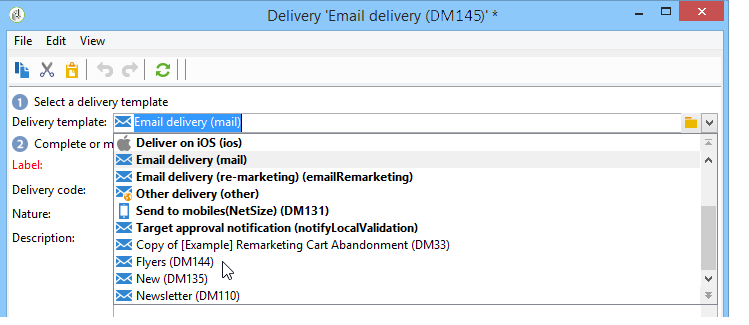

# 使用範本建立傳遞{#creating-a-delivery-from-a-template}

## 將模板連結到交貨 {#linking-the-template-to-a-delivery}

要基於現有模板建立交貨，請從可用交貨模板清單中選擇該模板。

否則，按一下 **[!UICONTROL Select link]** 的子菜單。

從 **[!UICONTROL Folder]** ，或按一下 **[!UICONTROL Display sub-levels]** 表徵圖，顯示當前目錄子樹中目錄的內容。

選擇要使用的交貨模板，然後按一下 **[!UICONTROL Ok]**。

## 執行模板 {#executing-the-template}

您可以直接從模板清單啟動模板的執行，而無需先建立傳遞。 為此，請選擇要執行的模板，然後按一下右鍵。 選取 **[!UICONTROL Actions>Execute the delivery template...]**。

您還可以使用 **[!UICONTROL File>Actions>Execute the delivery template...]**。

輸入交貨參數，然後按一下 **[!UICONTROL Send]**。

此操作將在附加到模板的資料夾中生成交貨。 此傳遞的名稱是從中建立它的傳遞模板的名稱。

>[!NOTE]
>
>有關配置交付的詳細資訊，請參見 [定義電子郵件內容](defining-the-email-content.md)。
