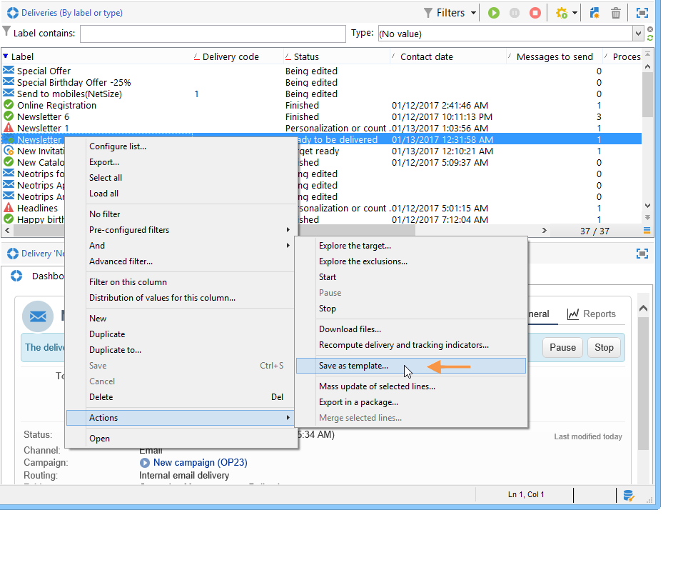

# 建立傳遞範本{#creating-a-delivery-template}

 [在影片中探索此功能](#delivery-template-video)

## 將現有傳遞轉換為範本 {#converting-an-existing-delivery-to-a-template}

傳送可轉換為範本，以執行新的重複傳送動作。 若要將傳遞轉換為範本，請從傳遞清單中選取，可透過 **[!UICONTROL Campaign management]** 樹的節點。

按一下滑鼠右鍵並選取 **[!UICONTROL Actions > Save as template...]**.

此動作會從選取的傳送建立傳送範本。 您必須輸入儲存資料夾的位置(在 **[!UICONTROL Folder]** 欄位)，以及建立根據此範本建立的傳送的資料夾(位於 **[!UICONTROL Execution folder]** 欄位)。

有關配置模式的詳細資訊，請參閱 [將範本連結至傳遞](creating-a-delivery-from-a-template.md#linking-the-template-to-a-delivery).

## 建立新範本 {#creating-a-new-template}

>[!NOTE]
>
>為避免設定錯誤，Adobe建議您複製原生範本並自訂其設定，而非建立新範本。

若要設定傳送範本，請執行下列步驟：

1. 開啟「促銷活動總管」。
1. 在 **資源** 資料夾，選取 **範本** then **傳遞範本**.

   

1. 按一下 **新增** ，建立新的傳遞範本，或 **複製** 現有範本。

   

1. 修改 **標籤** 和 **內部名稱** 的下限。
1. 儲存範本並重新開啟。
1. 按一下 **屬性** 按鈕，然後根據您的需求修改值。

   

1. 在 **一般** ，確認或變更 **執行資料夾**, **資料夾**，和 **路由** 下拉式功能表。

   

1. 完成 **電子郵件參數** 類別，以及您的電子郵件主旨和目標母體。
1. 新增 **HTML內容** 若要個人化您的範本，您可以顯示鏡像頁面連結和取消訂閱連結。
1. 選取 **預覽** 標籤。 在 **測試個人化** 下拉式功能表，選取 **收件者** 將範本預覽為選取的設定檔。

   

1. 按一下 **儲存**. 您的範本現在已可用於傳送。

## 教學課程影片 {#delivery-template-video}

### 如何設定傳遞範本

下列影片示範如何設定隨選傳遞的範本。

>[!VIDEO](https://video.tv.adobe.com/v/24066?quality=12)

### 如何設定傳遞範本屬性

以下影片說明如何設定傳送範本屬性，並詳細說明每個屬性。

>[!VIDEO](https://video.tv.adobe.com/v/24067?quality=12)

### 如何部署臨機傳遞範本

此影片說明如何部署隨選電子郵件傳送範本，並說明電子郵件傳送與傳送工作流程之間的差異。

>[!VIDEO](https://video.tv.adobe.com/v/24065?quality=12)

提供其他Campaign Classic作法影片 [此處](https://experienceleague.adobe.com/docs/campaign-classic-learn/tutorials/overview.html?lang=zh-Hant).
