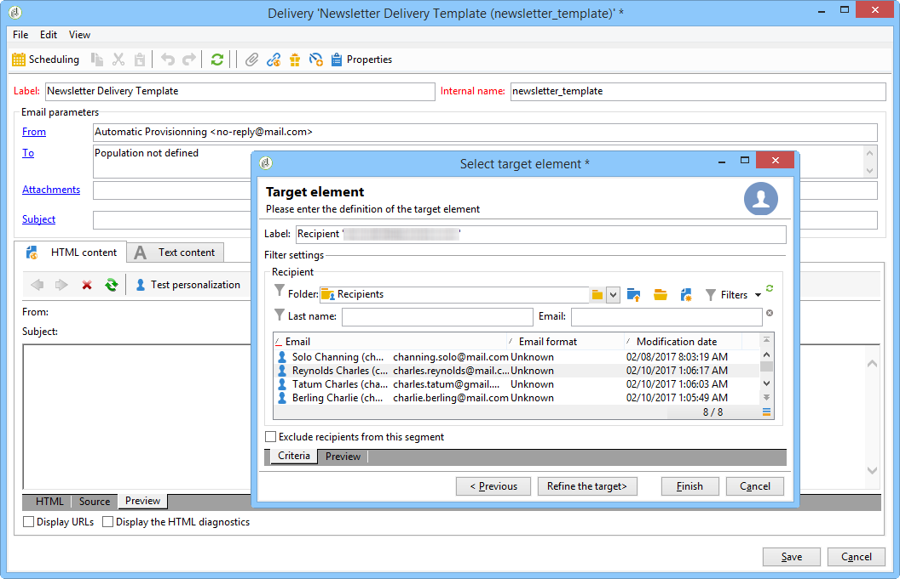

# 建立傳遞範本{#creating-a-delivery-template}

 [在影片中探索此功能](#delivery-template-video)

## 將現有傳送轉換為{#converting-an-existing-delivery-to-a-template}範本

傳送可轉換為範本，以執行新的重複傳送動作。 若要將傳送轉換為範本，請從傳送清單中選取它，此傳送清單可透過樹狀結構的&#x200B;**[!UICONTROL Campaign management]**&#x200B;節點存取。

按一下右鍵並選擇&#x200B;**[!UICONTROL Actions > Save as template...]**。

此動作會從選取的傳送建立傳送範本。 您必須輸入儲存資料夾（在&#x200B;**[!UICONTROL Folder]**&#x200B;欄位中），以及建立依據此範本建立之傳送的資料夾（在&#x200B;**[!UICONTROL Execution folder]**&#x200B;欄位中）。

有關配置模式的詳細資訊，請參閱[將模板連結到交付](../../delivery/using/creating-a-delivery-from-a-template.md#linking-the-template-to-a-delivery)。

## 建立新範本 {#creating-a-new-template}

若要設定傳送範本，請執行下列步驟：

1. 開啟促銷活動總管。
1. 在&#x200B;**資源**&#x200B;資料夾中，選擇&#x200B;**模板**，然後選擇&#x200B;**交付模板**。

   

1. 按一下工具列中的&#x200B;**New**，以建立新的傳送範本。

   

1. 修改資料夾的&#x200B;**Label**&#x200B;和&#x200B;**Internal name**。
1. 儲存範本並重新開啟。
1. 按一下「**屬性**」按鈕，然後根據您的需求修改值。

   

1. 在&#x200B;**一般**&#x200B;標籤中，確認或更改在&#x200B;**執行資料夾**、**資料夾**&#x200B;和&#x200B;**路由**&#x200B;下拉菜單中選擇的位置。

   

1. 請填妥&#x200B;**電子郵件參數**&#x200B;類別，以及您的電子郵件主旨和目標人口。
1. 新增&#x200B;**HTML內容**&#x200B;以個人化範本，您可以顯示鏡像頁面連結和取消訂閱連結。
1. 選擇&#x200B;**預覽**&#x200B;標籤。 在&#x200B;**測試個人化**&#x200B;下拉式選單中，選擇&#x200B;**收件者**&#x200B;以預覽範本做為選擇的描述檔。

   

1. 按一下&#x200B;**保存**。 您的範本現在已可供傳送使用。

>[!NOTE]
>
>為避免設定錯誤，建議您複製原生範本並變更其屬性，而不要建立新範本。

## 教學課程影片 {#delivery-template-video}

### 如何設定傳送範本

以下影片示範如何設定臨機傳送的範本。

>[!VIDEO](https://video.tv.adobe.com/v/24066?quality=12)

### 如何設定傳送範本屬性

下面的影片說明如何設定傳送範本屬性，並詳細說明每個屬性。

>[!VIDEO](https://video.tv.adobe.com/v/24067?quality=12)

### 如何部署臨機傳送範本

此影片說明如何部署臨機電子郵件傳送範本，並說明電子郵件傳送與傳送工作流程之間的差異。

>[!VIDEO](https://video.tv.adobe.com/v/24065?quality=12)

其他Campaign Classic操作視訊可在[這裡](https://experienceleague.adobe.com/docs/campaign-classic-learn/tutorials/overview.html?lang=zh-Hant)取得。