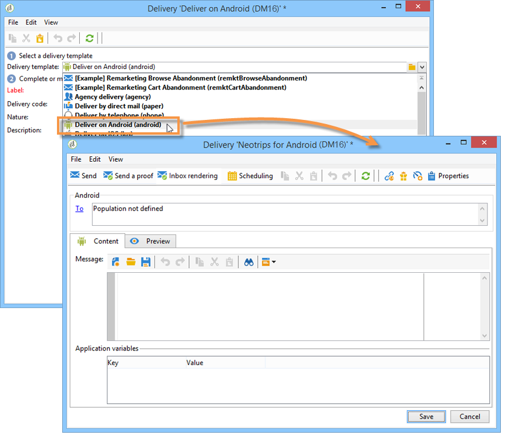
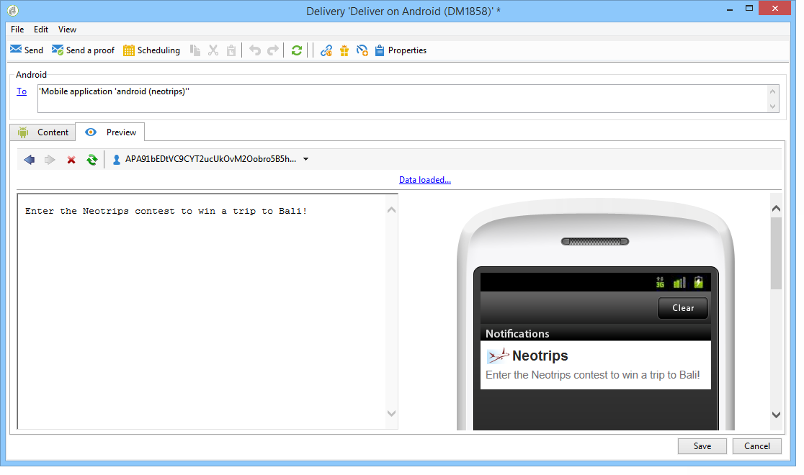

# 建立通知{#creating-notifications}

本節詳細說明iOS和Android通知傳送的特定元素。 傳遞建立的全域概念在[此小節](../../delivery/using/steps-about-delivery-creation-steps.md)中介紹。

首先，建立新的傳送。

## 在iOS {#sending-notifications-on-ios}上傳送通知

1. 選取&#x200B;**[!UICONTROL Deliver on iOS]**&#x200B;傳遞範本。

   

1. 若要定義通知的目標，請按一下&#x200B;**[!UICONTROL To]**&#x200B;連結，然後按一下&#x200B;**[!UICONTROL Add]**。

   

   >[!NOTE]
   >
   >選取傳送的目標母體時的詳細程式會顯示在[此區段](../../delivery/using/steps-defining-the-target-population.md)中。
   >
   >有關個人化欄位使用的詳細資訊，請參閱[關於個人化](../../delivery/using/about-personalization.md)。
   >
   >有關包含種子清單的詳細資訊，請參閱[關於種子地址](../../delivery/using/about-seed-addresses.md)。

1. 選取&#x200B;**[!UICONTROL Subscribers of an iOS mobile application (iPhone, iPad)]**，選取與行動應用程式相關的服務（在此例中為Neotrips），然後選取應用程式的iOS版本。

   

1. 選擇通知類型：**[!UICONTROL Alert]**、**[!UICONTROL Badge]**&#x200B;或&#x200B;**[!UICONTROL Alert and badge]**&#x200B;或&#x200B;**[!UICONTROL Silent Push]**。

   

   >[!NOTE]
   >
   >從iOS 7提供&#x200B;**靜默推播**&#x200B;模式。 這可讓「靜默」通知傳送至行動應用程式。 使用者未得知通知的到達。 會直接轉送至應用程式。

1. 在&#x200B;**[!UICONTROL Title]**&#x200B;欄位中，輸入要在通知上顯示的標題標籤。 它只會出現在通知中心提供的通知清單中。 此欄位可讓您定義iOS通知裝載的&#x200B;**title**&#x200B;參數的值。

1. 如果您使用HTTP/2連接器，則可以添加字幕（iOS通知有效負載的&#x200B;**subtile**&#x200B;參數的值）。 請參閱在Adobe Campaign](../../delivery/using/configuring-the-mobile-application.md)中設定行動應用程式區段。[

1. 然後根據所選通知類型輸入&#x200B;**[!UICONTROL Message]**&#x200B;和&#x200B;**[!UICONTROL Value of the badge]**。

   

   >[!NOTE]
   >
   >**[!UICONTROL Badge]** 和類 **[!UICONTROL Alert and badge]** 型通知可讓您修改徽章的值（行動應用程式標誌上方的數字）。若要重新整理徽章，您只需輸入0作為值即可。 如果欄位空白，徽章值將不會變更。

1. 按一下&#x200B;**[!UICONTROL Insert emoticon]**&#x200B;圖示，將表情符號插入推播通知。 若要自訂表情符號清單，請參閱[自訂表情符號清單](../../delivery/using/customizing-emoticon-list.md)

1. **[!UICONTROL Action button]**&#x200B;可讓您為出現在警報通知（**action_loc_key**&#x200B;有效負載欄位）上的動作按鈕定義標籤。 如果您的iOS應用程式管理可本地化的字串(**Localable.strings**)，請在此欄位中輸入相應的鍵。 如果您的應用程式不管理可本地化的文字，請輸入要顯示在動作按鈕上的標籤。 如需可本地化字串的詳細資訊，請參閱[Apple檔案](https://developer.apple.com/library/archive/documentation/NetworkingInternet/Conceptual/RemoteNotificationsPG/CreatingtheNotificationPayload.html#//apple_ref/doc/uid/TP40008194-CH10-SW1) 。
1. 在&#x200B;**[!UICONTROL Play a sound]**&#x200B;欄位中，選取接收通知時由行動終端播放的音效。

   >[!NOTE]
   >
   >應用程式中必須包含聲音，並在建立服務時定義聲音。 請參閱[設定iOS外部帳戶](../../delivery/using/configuring-the-mobile-application.md#configuring-external-account-ios)。

1. 在&#x200B;**[!UICONTROL Application variables]**&#x200B;欄位中，輸入每個變數的值。 應用程式變數可讓您定義通知行為：例如，您可以設定特定應用程式畫面，以在使用者啟動通知時顯示。

   >[!NOTE]
   >
   >應用程式變數必須在行動應用程式的程式碼中定義，並在服務建立期間輸入。 有關詳細資訊，請參閱：[在Adobe Campaign中設定行動應用程式](../../delivery/using/configuring-the-mobile-application.md)。

1. 設定通知後，按一下&#x200B;**[!UICONTROL Preview]**&#x200B;標籤以預覽通知。

   

   >[!NOTE]
   >
   >通知樣式（橫幅或警報）未在Adobe Campaign中定義。 這取決於使用者在其iOS設定中選取的設定。 不過，Adobe Campaign可讓您預覽每種通知樣式。 按一下右下方的箭頭，以從一個樣式切換為另一個樣式。
   >
   >預覽使用iOS 10的外觀和風格。

若要傳送校樣並傳送最終傳送，請使用與電子郵件傳送相同的程式。

傳送訊息後，您可以監控及追蹤您的傳送。 如需詳細資訊，請參閱下列區段。

* [推播通知隔離](../../delivery/using/understanding-quarantine-management.md#push-notification-quarantines)
* [監視](../../delivery/using/about-delivery-monitoring.md)
* [瞭解傳送故障](../../delivery/using/understanding-delivery-failures.md)

## 在Android {#sending-notifications-on-android}上傳送通知

1. 首先，選取&#x200B;**[!UICONTROL Deliver on Android (android)]**&#x200B;傳遞範本。

   

1. 若要定義通知的目標，請按一下&#x200B;**[!UICONTROL To]**&#x200B;連結，然後按一下&#x200B;**[!UICONTROL Add]**。

   

1. 選取&#x200B;**[!UICONTROL Subscribers of an Android mobile application]**，選擇與行動應用程式相關的服務（在此例中為Neotrips），然後選取應用程式的Android版本。

   

1. 然後輸入通知的內容。

   

1. 按一下&#x200B;**[!UICONTROL Insert emoticon]**&#x200B;圖示，將表情符號插入推播通知。 若要自訂表情符號清單，請參閱[自訂表情符號清單](../../delivery/using/defining-interactive-content.md)

1. 在&#x200B;**[!UICONTROL Application variables]**&#x200B;欄位中，輸入每個變數的值。 應用程式變數可讓您定義通知行為：例如，您可以設定特定應用程式畫面，以在使用者啟動通知時顯示。

   >[!NOTE]
   >
   >應用程式變數必須在行動應用程式的程式碼中定義，並在服務建立期間輸入。 有關詳細資訊，請參閱：[在Adobe Campaign中設定行動應用程式](../../delivery/using/configuring-the-mobile-application.md)。

1. 設定通知後，按一下&#x200B;**[!UICONTROL Preview]**&#x200B;標籤以預覽通知。

   

若要傳送校樣並傳送最終傳送，請使用與電子郵件傳送相同的程式。

驗證和傳送傳遞的詳細程式會顯示在以下章節：

* [驗證傳遞](../../delivery/using/steps-validating-the-delivery.md)
* [傳送傳遞](../../delivery/using/steps-sending-the-delivery.md)

傳送訊息後，您可以監控及追蹤您的傳送。 如需詳細資訊，請參閱下列區段。

* [推播通知隔離](../../delivery/using/understanding-quarantine-management.md#push-notification-quarantines)
* [監視](../../delivery/using/about-delivery-monitoring.md)
* [瞭解傳送故障](../../delivery/using/understanding-delivery-failures.md)
