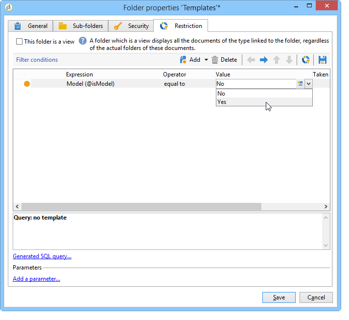

# 建立種子地址{#creating-seed-addresses}

種子地址不是透過標準設定檔和目標來管理，而是在Adobe Campaign階層&#x200B;**[!UICONTROL Resources > Campaign management > Seed addresses]**&#x200B;的專用節點中。

您可以建立子資料夾以組織種子地址。 要執行此操作，請按一下右鍵&#x200B;**[!UICONTROL Seed addresses]**&#x200B;節點並選擇&#x200B;**[!UICONTROL Create a new 'Seed addresses' folder]**。 為子資料夾命名，然後按&#x200B;**[!UICONTROL Enter]**&#x200B;進行驗證。 您現在可以建立種子地址或將種子地址複製到此子資料夾。 有關詳細資訊，請參閱[定義地址](#defining-addresses)。

Adobe Campaign也可讓您建立種子地址範本，這些範本會匯入至傳遞或促銷活動中，並根據相關傳遞和促銷活動的特定需求加以調整。 請參閱[建立種子地址模板](#creating-seed-address-templates)。

## 定義地址 {#defining-addresses}

要建立種子地址，請執行以下步驟：

1. 按一下種子地址清單上方的&#x200B;**[!UICONTROL New]**&#x200B;按鈕。
1. 在&#x200B;**[!UICONTROL Recipient]**&#x200B;頁簽的匹配欄位中輸入連結到地址的資料。 可用欄位對應於傳送收件者設定檔中的標準欄位（nms:recipient表格）:姓名、名字、電子郵件等

   >[!NOTE]
   >
   >地址的標籤會自動填入您定義的姓氏和名字。
   >
   >建立種子地址時，不需要輸入每個頁簽的所有欄位。 任何遺失的個人化元素會在傳送期間隨機輸入。

   

1. 在&#x200B;**[!UICONTROL Seed fields]**&#x200B;索引標籤中，輸入要在分析階段（在&#x200B;**[!UICONTROL nms:broadLog]**&#x200B;表格中）插入傳遞日誌的值。

1. 在&#x200B;**[!UICONTROL Additional data]**&#x200B;標籤中，輸入在資料管理工作流程中建立，且您想要指派特定值給的傳送所使用的個人化資料。

   >[!NOTE]
   >
   >請確保已使用別名定義其他目標資料，該別名在&#x200B;**[!UICONTROL Enrichment]**&#x200B;活動中以「@」開頭。 否則，您將無法在傳遞活動中將種子地址正確使用它們。

## 建立種子地址模板 {#creating-seed-address-templates}

要建立將導入的地址模板，並且可以針對每次傳送進行修改，該過程與定義新種子地址時的過程相同。 唯一的區別是種子地址模板地址必須儲存在「模板」類型資料夾中。

要定義模板資料夾，請應用以下過程：

1. 建立新的&#x200B;**[!UICONTROL Seed addresses]**&#x200B;類型資料夾，按一下右鍵該資料夾，然後選擇&#x200B;**[!UICONTROL Properties...]**。

   

1. 按一下&#x200B;**[!UICONTROL Restriction]**&#x200B;標籤並新增下列篩選條件：**@isModel = true**。

   

   儲存在此資料夾中的地址現在可以用作地址模板。 您可以將它們匯入傳送或促銷活動，並根據相關傳送和促銷活動的特定需求加以調整（請參閱[新增種子地址](adding-seed-addresses.md)）。
