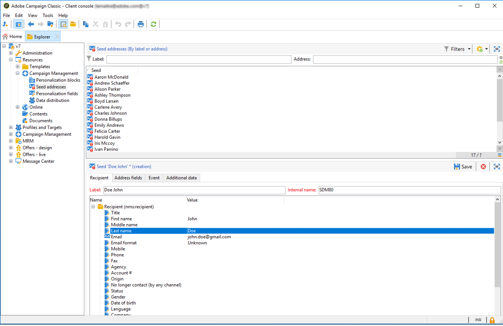

# 建立種子地址{#creating-seed-addresses}

種子位址不是透過標準設定檔和目標來管理，而是在Adobe Campaign階層&#x200B;**[!UICONTROL Resources > Campaign management > Seed addresses]**&#x200B;的專用節點中管理。

您可以建立子資料夾以組織種子地址。 若要這麼做，請用滑鼠右鍵按一下&#x200B;**[!UICONTROL Seed addresses]**&#x200B;節點並選取&#x200B;**[!UICONTROL Create a new 'Seed addresses' folder]**。 為子資料夾命名，然後按&#x200B;**[!UICONTROL Enter]**&#x200B;進行驗證。 您現在可以建立種子地址或將其複製到此子資料夾。 如需詳細資訊，請參閱[定義地址](#defining-addresses)。

Adobe Campaign也可讓您建立種子地址範本，這些範本會匯入至傳遞或行銷活動中，並根據相關傳遞和行銷活動的特定需求進行調整。 請參閱[建立種子地址範本](#creating-seed-address-templates)。

## 定義地址 {#defining-addresses}

若要建立種子地址，請遵循下列步驟：

1. 按一下種子地址清單上方的&#x200B;**[!UICONTROL New]**&#x200B;按鈕。
1. 從&#x200B;**[!UICONTROL Recipient]**&#x200B;索引標籤的相符欄位中，輸入連結到位址的資料。 可用欄位對應到傳遞收件者（nms:recipient表格）之設定檔中的標準欄位：名稱、名字、電子郵件等。

   >[!NOTE]
   >
   >地址的標籤會自動填入您定義的姓氏和名字。
   >
   >建立種子地址時，不需要輸入每個標籤的所有欄位。 在傳遞分析期間隨機輸入缺少的個人化元素。

   

1. 在&#x200B;**[!UICONTROL Address fields]**&#x200B;索引標籤中，輸入將在分析階段（在&#x200B;**[!UICONTROL nms:broadLog]**&#x200B;表格中）插入傳遞記錄中的值。

1. 在&#x200B;**[!UICONTROL Additional data]**&#x200B;索引標籤中，輸入用於資料管理工作流程中所建立傳遞的個人化資料，以及您想要指派特定值的對象。

   >[!NOTE]
   >
   >請確定已在&#x200B;**[!UICONTROL Enrichment]**&#x200B;活動中定義其他目標資料，且別名開頭為&#39;@&#39;。 否則，您將無法在傳送活動中正確搭配種子地址使用。

## 建立種子地址範本 {#creating-seed-address-templates}

若要建立將匯入且可能針對每次傳遞修改的位址範本，程式與定義新種子位址時相同。 唯一的區別是種子地址範本地址必須儲存在「範本」型別資料夾中。

若要定義範本資料夾，請套用下列程式：

1. 建立新的&#x200B;**[!UICONTROL Seed addresses]**&#x200B;型別資料夾，在資料夾上按一下滑鼠右鍵，然後選取&#x200B;**[!UICONTROL Properties...]**。

   

1. 按一下&#x200B;**[!UICONTROL Restriction]**&#x200B;索引標籤並新增下列篩選條件： **@isModel = true**。

   

   儲存在此資料夾中的地址現在可以用作地址範本。 您可以將它們匯入傳遞或行銷活動，並根據相關傳遞和行銷活動的特定需求進行調整（請參閱[新增種子地址](adding-seed-addresses.md)）。
