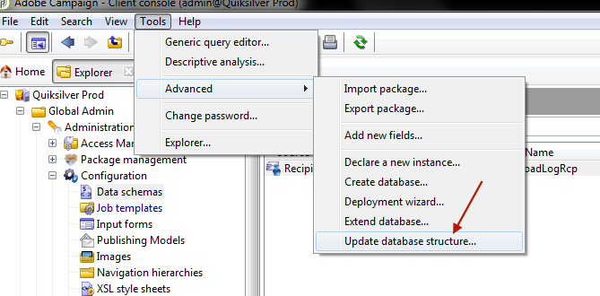

# 進階：自訂傳遞記錄 {#customize-delivery-logs}

>[!NOTE]
>
>[Campaign v8檔案](https://experienceleague.adobe.com/zh-hant/docs/campaign/campaign-v8/send/monitor/delivery-dashboard)已記錄存取傳遞清單及使用傳遞儀表板的完整指引。 此內容適用於Campaign Classic v7和Campaign v8使用者。
>
>此頁面記錄混合式部署和內部部署的&#x200B;**Campaign Classic v7專屬進階自訂**。

若要在Campaign UI中監視傳遞，請參閱Campaign UI檔案[中的](https://experienceleague.adobe.com/zh-hant/docs/campaign/campaign-v8/send/monitor/delivery-dashboard){target="_blank"}Campaign v8監視傳遞。

## 自訂傳遞記錄 {#use-case}

對於&#x200B;**Campaign Classic v7混合/內部部署**，您可以擴充結構以自訂傳遞記錄。 本節說明如何將寄件者的IP位址新增至傳送記錄檔。

>[!NOTE]
>
>此自訂需要內部部署中可用的結構描述擴充功能。 Campaign v8受管理的Cloud Services使用者應聯絡Adobe客戶服務，瞭解自訂傳遞記錄欄位。
>
>如果您使用單一執行個體或中間來源執行個體，則此修改會不同。 進行修改之前，請確定您已連線至電子郵件傳送執行個體。

### 步驟1：擴充結構

若要在傳遞記錄中新增&#x200B;**publicID**，您必須先擴充結構描述。 您可以依照以下步驟繼續操作。

1. 在&#x200B;**[!UICONTROL Administration]** > **[!UICONTROL Configuration]** > **[!UICONTROL Data Schemas]** > **[!UICONTROL New]**&#x200B;下建立結構描述延伸。

   如需結構描述擴充功能的詳細資訊，請參閱[此頁面](../../configuration/using/extending-a-schema.md)。

1. 選取&#x200B;**[!UICONTROL broadLogRcp]**&#x200B;以擴充收件者傳遞記錄(nms)並定義自訂名稱空間。 在此案例中會是「cus」：

   

   >[!NOTE]
   >
   >如果您的執行個體位於中間來源，則需使用broadLogMid結構描述。

1. 在擴充功能中新增欄位。 在此範例中，您需要取代：

   ```
   <element img="nms:broadLog.png" label="Recipient delivery logs" labelSingular="Recipient delivery log" name="broadLogRcp"/>
   ```

   作者：

   ```
   <element img="nms:broadLog.png" label="Recipient delivery logs" labelSingular="Recipient delivery log" name="broadLogRcp">
   <attribute desc="Outbound IP identifier" label="IP identifier"
   name="publicId" type="long"/>
   </element>
   ```

   

### 步驟2：更新資料庫結構

完成修改後，您需要更新資料庫結構，使其與其邏輯說明一致。

要執行此操作，請遵循下列步驟：

1. 按一下&#x200B;**[!UICONTROL Tools]** > **[!UICONTROL Advanced]** > **[!UICONTROL Update database structure...]**&#x200B;功能表。

   

1. 在&#x200B;**[!UICONTROL Edit tables]**&#x200B;視窗中，已檢查&#x200B;**[!UICONTROL NmsBroadLogRcp]**&#x200B;表格(或者&#x200B;**[!UICONTROL broadLogMid]**&#x200B;表格（如果您在中間來源環境中），如下所示：

   

   >[!IMPORTANT]
   >
   >請一律確認沒有其他修改，除了&#x200B;**[!UICONTROL NmsBroadLoGRcp]**&#x200B;資料表（或如果您在中間來源環境中，則為&#x200B;**[!UICONTROL broadLogMid]**&#x200B;資料表）。 如果是，請取消核取其他表格。

1. 按一下&#x200B;**[!UICONTROL Next]**&#x200B;進行驗證。 接著會顯示下列畫面：

   

1. 按一下&#x200B;**[!UICONTROL Next]**，然後按&#x200B;**[!UICONTROL Start]**&#x200B;開始更新資料庫結構。 正在開始建立索引。 此步驟可能很長，取決於&#x200B;**[!UICONTROL NmsBroadLogRcp]**&#x200B;表格中的列數。

   

>[!NOTE]
>
>成功更新資料庫的實體結構後，您需要中斷連線並重新連線，以便考慮您的修改。

### 步驟3：驗證修改

若要確認一切都正常運作，您需要更新傳送記錄畫面。

若要這麼做，請存取傳遞記錄並新增「IP識別碼」欄。


>[!NOTE]
>
>若要瞭解如何在Campaign Classic介面中設定清單，請參閱[此頁面](../../platform/using/adobe-campaign-workspace.md)。

以下是修改後您在&#x200B;**[!UICONTROL Delivery]**&#x200B;標籤中應該看到的內容：


## 相關主題

* [在Campaign UI中監視傳遞](https://experienceleague.adobe.com/zh-hant/docs/campaign/campaign-v8/send/monitor/delivery-dashboard){target="_blank"} （Campaign v8檔案）
* [傳遞狀態](https://experienceleague.adobe.com/zh-hant/docs/campaign/campaign-v8/send/monitor/delivery-statuses){target="_blank"} （Campaign v8檔案）
* [瞭解傳遞失敗](https://experienceleague.adobe.com/zh-hant/docs/campaign/campaign-v8/send/monitor/delivery-failures){target="_blank"} （Campaign v8檔案）
* [隔離管理](https://experienceleague.adobe.com/zh-hant/docs/campaign/campaign-v8/send/monitor/quarantines){target="_blank"} （Campaign v8檔案）
* [擴充結構描述](../../configuration/using/extending-a-schema.md) （v7混合式/內部部署）

