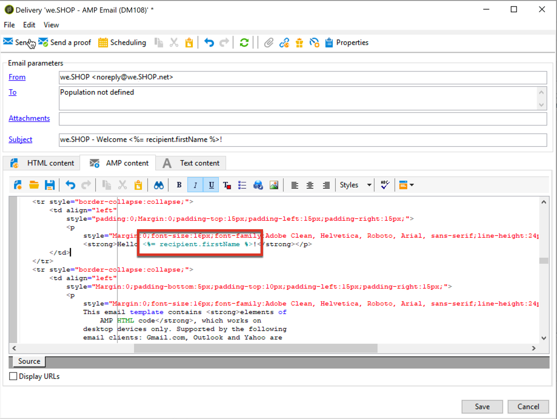

# 定義互動式內容{#defining-interactive-content}

Adobe Campaign可讓您使用互動式 [電子郵件的AMP](https://amp.dev/about/email/) 格式，可在特定條件下傳送動態電子郵件。

使用AMP for Email，您可以：
* 測試傳送AMP電子郵件至適當設定的特定地址。
* 向對應的服務供應商註冊後，將AMP電子郵件傳送至Gmail或Mail.ru地址。

如需測試和傳送AMP電子郵件的詳細資訊，請參閱 [本節](#targeting-amp-email).

此功能透過Adobe Campaign中的專用套件提供。 根據您的許可權和部署模式，您可以安裝此套件或聯絡Adobe為您安裝。

>[!NOTE]
>
> 對於混合式與託管式架構，套件必須安裝在所有伺服器上，包括 [中間來源伺服器](../../installation/using/mid-sourcing-server.md) 和 [執行例項](../../message-center/using/configuring-instances.md#execution-instance).

## 關於電子郵件的AMP {#about-amp-for-email}

使用 **電子郵件的AMP** 新格式，可在訊息中加入AMP元件，並透過豐富可行的內容改善電子郵件體驗。 透過直接在電子郵件中提供的現代化應用程式功能，收件者可以與訊息本身內容進行動態互動。

例如：
* 以AMP撰寫的電子郵件可以包含互動式元素，例如影像輪播。
* 內容會保持訊息中的最新狀態。
* 收件者無需離開收件匣即可回應表單。

AMP for Email與現有電子郵件相容。 除了HTML和/或純文字外，AMP版本的訊息還作為新的MIME部分嵌入電子郵件中，以確保所有電子郵件使用者端的相容性。

如需電子郵件格式、規格和需求的AMP詳細資訊，請參閱 [AMP開發人員檔案](https://amp.dev/documentation/guides-and-tutorials/learn/email-spec/amp-email-format/?format=email).

 [在影片中探索此功能](#amp-email-video)

## 透過Adobe Campaign使用AMP for Email的關鍵步驟 {#key-steps-to-use-amp}

若要使用Adobe Campaign成功測試和傳送AMP電子郵件，請遵循下列步驟：
1. 安裝 **[!UICONTROL AMP support]** 封裝。 另請參閱 [安裝Campaign內建套件](../../installation/using/installing-campaign-standard-packages.md).
1. 在Adobe Campaign中建立電子郵件並建置AMP內容。 另請參閱 [使用Adobe Campaign建立AMP電子郵件內容](#build-amp-email-content).
1. 請務必遵循支援AMP格式的電子郵件提供者所定的所有傳送要求。 另請參閱 [電子郵件傳遞需求的AMP](#amp-for-email-delivery-requirements).
1. 定義目標時，請務必選取可顯示AMP格式的收件者。 另請參閱 [AMP電子郵件目標定位](#targeting-amp-email).

   >[!NOTE]
   >
   >目前您只能將AMP電子郵件傳送至 [特定電子郵件地址](#testing-amp-delivery-for-selected-addresses) （用於測試目的）或之後 [註冊](#delivering-amp-emails-by-registering) 支援的電子郵件使用者端。

1. 像往常一樣傳送電子郵件。 另請參閱 [傳送AMP電子郵件](#sending-amp-email).

## 在Adobe Campaign中建立AMP電子郵件內容 {#build-amp-email-content}

若要使用AMP格式建置電子郵件，請遵循下列步驟。

>[!IMPORTANT]
>
>請務必遵循AMP的電子郵件需求和規格，詳見 [AMP開發人員檔案](https://amp.dev/documentation/guides-and-tutorials/learn/email_fundamentals/?format=email). 您也可以參閱 [AMP for Email最佳作法](https://amp.dev/documentation/guides-and-tutorials/develop/amp_email_best_practices/?format=email).

1. 建立電子郵件傳遞時，請選取任何範本。

   >[!NOTE]
   >
   >特定AMP範本包含您可以使用的主要功能範例：產品清單、輪播、雙重選擇加入、調查和進階伺服器請求。

1. 按一下 **[!UICONTROL AMP content]** 標籤。

   

1. 編輯AMP內容以符合您的需求。

   >[!NOTE]
   >
   >如需建立第一個AMP電子郵件的詳細資訊，請參閱 [AMP開發人員檔案](https://amp.dev/documentation/guides-and-tutorials/start/create_email/?format=email).

   例如，您可以使用AMP範本中的產品清單元件，並維護來自協力廠商系統或甚至是Adobe Campaign內部的產品清單。 每當您調整價格或其他元素時，當收件者從信箱開啟電子郵件時，就會自動反映價格。

1. 視需要個人化AMP內容，就像在Adobe Campaign中處理HTML格式時一樣，使用個人化欄位和個人化區塊。

   

1. 完成編輯後，請選取整個AMP內容，並複製貼到 [AMP網頁型驗證器](https://validator.ampproject.org) 或類似的網站。

   >[!NOTE]
   >
   >請務必選取 **AMP4電子郵件** 從熒幕上方的下拉式清單中選取。

   

   錯誤會以內嵌方式標幟。

   >[!NOTE]
   >
   >Adobe Campaign AMP編輯器並非針對內容驗證而設計。 使用外部網站，例如 [AMP網頁型驗證器](https://validator.ampproject.org) 以檢查您的內容是否正確。

1. 在AMP內容通過驗證前，視需要進行修正。

   

1. 若要預覽您的內容，請複製並貼上已驗證的內容至 [AMP遊樂場](https://playground.amp.dev) 或類似的網站。

   >[!NOTE]
   >
   >請務必選取 **電子郵件的AMP** 從熒幕上方的下拉式清單中選取。

   

   >[!NOTE]
   >
   >您無法直接在Adobe Campaign中預覽AMP內容。 使用外部網站，例如 [AMP遊樂場](https://playground.amp.dev).

1. 返回Adobe Campaign，並將驗證的內容複製並貼到 **[!UICONTROL AMP content]** 標籤。

1. 切換至 **[!UICONTROL HTML content]** 或 **[!UICONTROL Text content]** 定位並定義這兩種格式中至少一個的內容。

   >[!IMPORTANT]
   >
   >如果除了AMP內容外，您的電子郵件未包含HTML或純文字版本，則無法傳送。

## 電子郵件傳遞需求的AMP {#amp-for-email-delivery-requirements}

在Adobe Campaign中建立AMP內容時，您必須符合傳送動態電子郵件的條件，這些條件特定於收件者的電子郵件提供者。

目前有兩個電子郵件提供者支援測試此格式：Gmail和Mail.ru。

在Gmail帳戶上以AMP格式測試傳送所需的所有步驟和規格，均會在相應的檔案中詳細說明 [Gmail](https://developers.google.com/gmail/ampemail?)、和 [Mail.ru](https://postmaster.mail.ru/amp) 開發人員檔案。

特別是，必須符合下列要求：
* 遵循以下專用的AMP安全性要求： [Gmail](https://developers.google.com/gmail/ampemail/security-requirements)、和 [Mail.ru](https://postmaster.mail.ru/amp/#howto).
* AMP MIME部分必須包含 [有效的AMP檔案](https://amp.dev/documentation/guides-and-tutorials/learn/validation-workflow/validate_emails/?format=email).
* AMP MIME部分必須小於100KB。

您也可以參閱 [Gmail的提示和已知限制](https://developers.google.com/gmail/ampemail/tips) 檔案。

## AMP電子郵件定位 {#targeting-amp-email}

目前，您可以透過兩個步驟來實驗傳送AMP電子郵件：

1. Adobe Campaign可讓您測試傳送AMP支援的動態電子郵件至已適當設定的選定電子郵件地址，以驗證其內容和行為。 另請參閱 [測試所選地址的AMP電子郵件傳遞](#testing-amp-delivery-for-selected-addresses).

1. 測試後，您可以向相關電子郵件提供者註冊，將您的寄件者網域新增至允許清單，藉此傳送傳遞或促銷活動作為AMP for Email方案的一部分。 另請參閱 [透過向電子郵件提供者註冊來傳遞AMP電子郵件](#delivering-amp-emails-by-registering).

### 測試所選地址的AMP電子郵件傳遞 {#testing-amp-delivery-for-selected-addresses}

您可以測試從Adobe Campaign傳送動態訊息至所選電子郵件地址。

>[!NOTE]
>
>只有Gmail和Mail.ru支援測試AMP格式。

針對Gmail，您必須先將您使用的寄件者地址新增至允許清單，以從Adobe Campaign傳送您鎖定目標的Gmail帳戶。

操作步驟：
1. 請確定已在相關電子郵件提供者中勾選啟用動態電子郵件的選項。
1. 複製傳遞中顯示的寄件者地址 **[!UICONTROL From]** 欄位，並將其貼到電子郵件提供者帳戶設定的適當區段中。

如需詳細資訊，請參閱 [Gmail](https://developers.google.com/gmail/ampemail/testing-dynamic-email) 開發人員檔案。

若要測試傳送AMP電子郵件至Mail.ru位址，請依照 [Mail.ru開發人員檔案](https://postmaster.mail.ru/amp/#howto) (**如果您是使用者** 區段)。

### 透過向電子郵件提供者註冊來傳遞AMP電子郵件 {#delivering-amp-emails-by-registering}

您可以透過向支援的電子郵件提供者註冊來實驗傳送動態電子郵件，以將您的寄件者網域新增到允許清單。

>[!NOTE]
>
>只有Gmail和Mail.ru支援AMP格式。

使用幾個地址測試後，您可以將AMP電子郵件傳送至任何Gmail地址。 為此，您必須向Google註冊，並等待其解答。 請依照以下說明中的步驟操作： [Gmail](https://developers.google.com/gmail/ampemail/register) 開發人員檔案。 註冊成功後，您就會成為授權寄件者。

若要將AMP電子郵件傳送至Mail.ru地址，請遵循 [Mail.ru開發人員檔案](https://postmaster.mail.ru/amp/#howto) (**如果您是電子郵件寄件者** 區段)。

## 傳送AMP電子郵件 {#sending-amp-email}

一旦AMP內容和遞補內容準備就緒，且定義相容的目標後，您就可以像平常一樣傳送電子郵件。

目前只有Gmail和Mail.ru在某些情況下支援AMP格式。 您可以鎖定其他電子郵件提供者的地址，但他們將收到您電子郵件的HTML或純文字版本。

>[!IMPORTANT]
>
>如果除了AMP內容外，您的電子郵件未包含HTML或純文字版本，則無法傳送。

相符的收件者會在信箱中顯示電子郵件的AMP版本。

例如，如果您在電子郵件中包含產品清單，則在協力廠商系統中編輯價格時，每當收件者再次在其信箱中開啟電子郵件時，價格就會自動調整。

>[!NOTE]
>
>您可以建立郵件處理規則，以防止特定網域收到AMP電子郵件。 另請參閱 [管理電子郵件格式](../../installation/using/email-deliverability.md#managing-email-formats).
>
>根據預設 **[!UICONTROL AMP inclusion]** 選項已設為 **[!UICONTROL No]**.

## 教學課程影片 {#amp-email-video}

以下影片說明如何在 Adobe Campaign 啟動 AMP，並展示其使用情形。

>[!VIDEO](https://video.tv.adobe.com/v/29940?quality=12&learn=on)

提供其他Campaign操作說明影片 [此處](https://experienceleague.adobe.com/docs/campaign-classic-learn/tutorials/overview.html?lang=zh-Hant).
