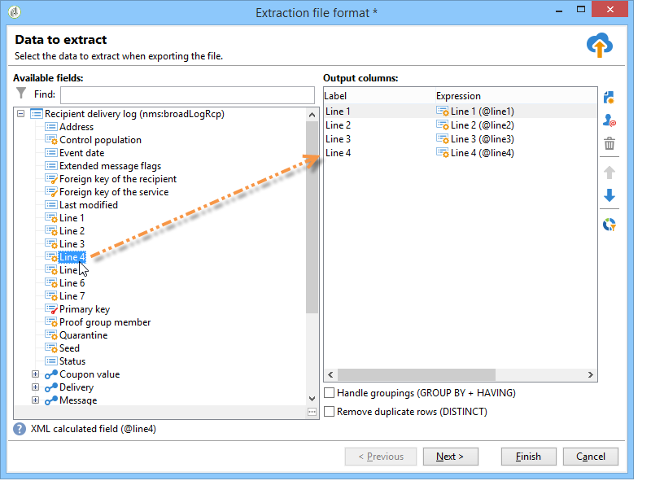

# 定義直接郵件內容{#defining-the-direct-mail-content}

## 擷取檔案 {#extraction-file}

包含提取資料的檔案的名稱在欄位中定 **[!UICONTROL File]** 義。 欄位右側的按鈕可讓您使用個人化欄位來建立檔案名稱。

預設情況下，抽取檔案將建立並儲存在伺服器上。 您可將它儲存在電腦上。 若要這麼做，請檢查 **[!UICONTROL Download the generated file after the analysis of the delivery]**。 在這種情況下，您需要指示本地儲存目錄的訪問路徑以及檔案名。

對於直接郵件發送，提取內容在連結中定 **[!UICONTROL Edit the extraction file format...]** 義。

此連結可讓您訪問抽取嚮導並定義要導出到輸出檔案中的資訊（列）。

可以將個人化URL插入提取檔案。 For more on this, refer to [Web functionality](../../web/using/publishing-a-web-form.md).

>[!NOTE]
>
>此嚮導包含導出嚮導的步驟，如「快速入門」部 [分中詳細](../../platform/using/exporting-data.md#export-wizard) 。
