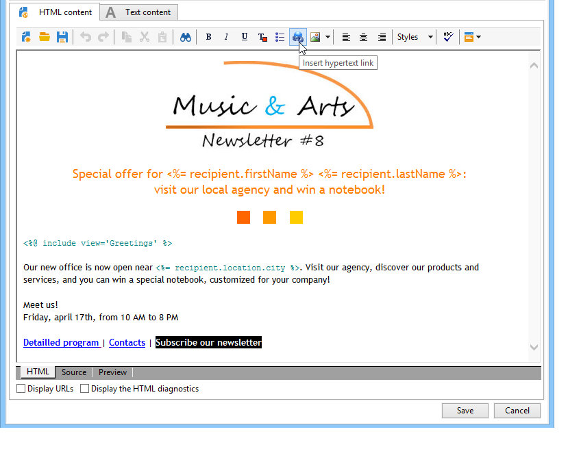
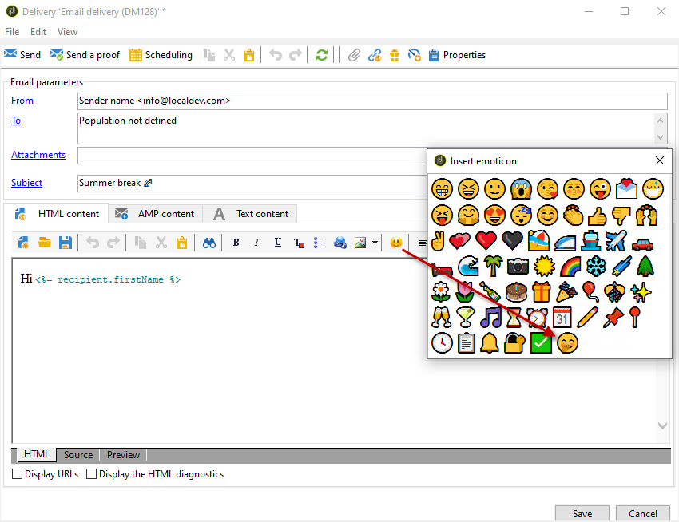
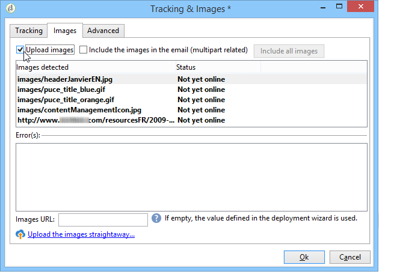
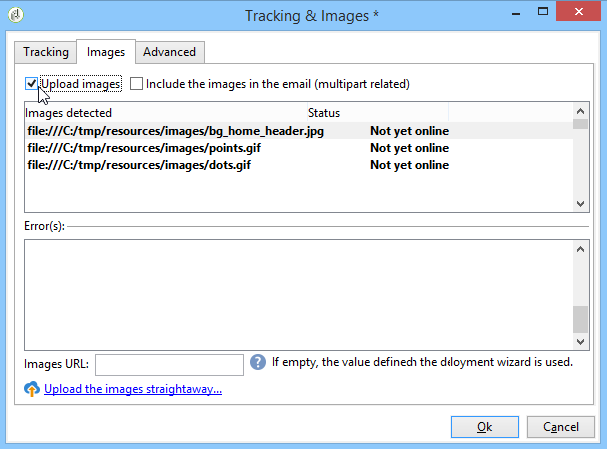
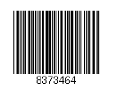
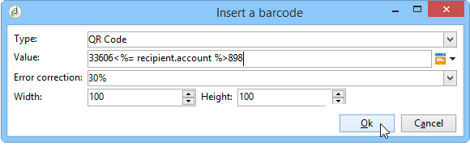

# 定義電子郵件內容 {#defining-the-email-content}

## 發件人 {#sender}

要定義將出現在發送郵件標題中的發件人的名稱和地址，請按一下 **[!UICONTROL From]** 的子菜單。

此窗口允許您輸入建立電子郵件標題所需的所有資訊。 可將此資訊加以個人化。為此，請使用輸入欄位右側的按鈕插入個性化欄位。

要瞭解如何插入和使用個性化欄位，請參閱 [關於個性化](about-personalization.md) 的子菜單。

>[!NOTE]
>
>* 預設情況下，發件人地址將用於回復。
>* 標頭參數不能為空。 預設情況下，它們包含配置部署嚮導時輸入的值。 有關詳細資訊，請參閱 [安裝指南](../../installation/using/deploying-an-instance.md)。
>* 發送者地址是允許發送電子郵件（RFC標準）的必需地址。
>* Adobe Campaign檢查輸入的電子郵件地址的語法。

>[!IMPORTANT]
>
>在網際網路接入提供商(ISP)為打擊未經請求的電子郵件（垃圾郵件）而實施的檢查的上下文中，Adobe建議建立與指定用於遞送和回復的地址對應的電子郵件帳戶。 請咨詢消息系統管理員。

## 消息主題 {#message-subject}

消息的主題在相應欄位中配置。 您可以直接在欄位中輸入，或按一下 **[!UICONTROL Subject]** 連結以輸入指令碼。 個性化連結允許您在主題中插入資料庫欄位。

>[!IMPORTANT]
>
>消息主題是強制的。

在發送消息時，欄位內容將替換為收件人配置檔案中的值。

例如，在上面的消息中，消息的主題針對每個接收者使用其配置檔案中的資料進行個性化。

>[!NOTE]
>
>中介紹了個性化欄位的使用 [關於個性化](about-personalization.md)。

您還可以使用 **[!UICONTROL Insert emoticon]** 彈出窗口。

## 消息內容 {#message-content}

>[!IMPORTANT]
>
>出於隱私原因，我們建議對所有外部資源使用HTTPS。

消息的內容在傳遞配置窗口的下部定義。

預設情況下，根據收件人偏好，以HTML或文本格式發送消息。 我們建議以兩種格式建立內容，以確保郵件能夠在任何郵件系統中正確顯示。 有關此內容的詳細資訊，請參閱 [選擇消息格式](email-parameters.md#selecting-message-formats)。

* 要導入HTML內容，請使用 **[!UICONTROL Open]** 按鈕 也可以將原始碼直接貼上到 **[!UICONTROL Source]** 的子菜單。

   如果使用 [數字內容編輯器](../../web/using/about-campaign-html-editor.md) (DCE)，請參閱 [選擇內容模板](../../web/using/use-case--creating-an-email-delivery.md#step-3---selecting-a-content)。

   >[!IMPORTANT]
   >
   >HTML內容必須事先製作，然後導入Adobe Campaign。 HTML編輯器不是為內容建立而設計的。

   的 **[!UICONTROL Preview]** 子頁籤用於查看收件人的每個內容的呈現。 將個性化欄位和內容的條件元素替換為所選簡檔的相應資訊。

   工具欄按鈕提供對HTML頁的標準操作和格式參數的訪問。

   

   您可以在來自本地檔案或來自Adobe Campaign影像庫的消息中插入影像。 要執行此操作，請按一下 **[!UICONTROL Image]** 表徵圖，然後選擇相應的選項。

   

   庫影像可通過 **[!UICONTROL Resources>Online>Public resources]** 資料夾樹中的。 另請參閱 [添加影像](#adding-images)。

   工具欄中的最後一個按鈕允許您插入個性化欄位。

   >[!NOTE]
   >
   >中介紹了個性化欄位的使用 [關於個性化](about-personalization.md)。

   頁面底部的頁籤允許您顯示所建立頁面的HTML代碼，並查看消息的個性化呈現。 要啟動此顯示，請按一下 **[!UICONTROL Preview]** 並使用 **[!UICONTROL Test personalization]** 按鈕 您可以從定義的目標中選擇一個收件人或選擇另一個收件人。

   

   您可以驗證HTML消息。 您還可以查看電子郵件標題的內容。

   

* 要導入文本內容，請使用 **[!UICONTROL Open]** 或 **[!UICONTROL Text Content]** 按鈕，將選定控制項在Tab鍵次序中下移一個位置。 使用工具欄按鈕訪問內容上的操作。 最後一個按鈕允許您插入個性化欄位。

   

   對於HTML格式，按一下 **[!UICONTROL Preview]** 頁籤，查看消息的個性化呈現。

   

## 定義互動式內容 {#amp-for-email-format}

Adobe Campaign讓你嘗試新的互動式 [電子郵件的AMP](https://amp.dev/about/email/) 格式，它允許在特定條件下發送動態電子郵件。

如需詳細資訊，請參閱[本節](defining-interactive-content.md)。

## 使用內容管理 {#using-content-management}

您可以使用內容管理表單直接在交付嚮導中定義交付的內容。 為此，必須引用要使用的內容管理的發佈模板， **[!UICONTROL Advanced]** 的子菜單。

另外一個頁籤允許您輸入將根據內容管理規則自動整合和格式化的內容。

>[!NOTE]
>
>有關Adobe Campaign內容管理的詳細資訊，請參閱 [此部分](about-content-management.md)。

## 插入表情符 {#inserting-emoticons}

您可以將表情符號插入電子郵件內容。

1. 按一下 **[!UICONTROL Insert emoticon]** 表徵圖
1. 從彈出窗口中選擇一個表情。

   

1. 按一下 **[!UICONTROL Close]** 按鈕。

要自定義表情清單，請參閱 [頁](customizing-emoticon-list.md)。

## 添加影像 {#adding-images}

HTML格式電子郵件遞送可包含影像。 從傳遞嚮導中，您可以導入包含影像的HTML頁，或直接使用HTML編輯器通過 **[!UICONTROL Image]** 表徵圖

映像可以是：

* 本地映像或從伺服器調用的映像
* Adobe Campaign公共資源圖書館中的一幅影像

   公共資源可通過 **[!UICONTROL Resources > Online]** 的子節點。 它們被分組到庫中，並可以包含在電子郵件中，但也可用於市場活動或任務或內容管理。

* 與Adobe Experience Cloud共用的資產。 請參閱[本節](../../integrations/using/sharing-assets-with-adobe-experience-cloud.md)。

>[!IMPORTANT]
>
>要使用傳遞嚮導在電子郵件中包含映像，必須配置Adobe Campaign實例以啟用公共資源管理。 此過程可以從部署嚮導中執行。 請參閱 [此部分](../../installation/using/deploying-an-instance.md) 的上界。

傳遞嚮導允許您將本地映像或儲存在庫中的映像添加到消息內容。 要執行此操作，請按一下 **[!UICONTROL Image]** 按鈕。

>[!IMPORTANT]
>
>為了讓收件人能夠查看其接收郵件中包含的影像，這些郵件必須在可從外部訪問的伺服器上可用。

要通過交付嚮導管理映像，請執行以下操作：

1. 按一下 **[!UICONTROL Tracking & Images]** 的子菜單。
   

1. 選擇 **[!UICONTROL Upload images]** 的 **[!UICONTROL Images]** 頁籤。
1. 然後，您可以選擇是否要在電子郵件中包含這些影像。
   

* 您可以手動上載影像，而無需等待交付分析階段。 要執行此操作，請按一下 **[!UICONTROL Upload the images straightaway...]** 的子菜單。
* 可以指定另一個路徑以訪問跟蹤伺服器上的映像。 要執行此操作，請在 **[!UICONTROL Images URL]** 的子菜單。 此值將覆蓋在安裝嚮導的參數中定義的值。

當您在傳遞嚮導中開啟包含影像的HTML內容時，一條消息將根據傳遞參數提供立即上載影像的選項。

>[!IMPORTANT]
>
>* 在手動上載期間或在發送消息時修改影像訪問路徑。
> 
>* 為避免效能問題，如果您將從個性化URL中動態下載的影像作為 [附件](attaching-files.md)，預設情況下每個影像大小不應超過100,000位元組。 此建議的閾值可從 [Campaign Classic選項清單](../../installation/using/configuring-campaign-options.md#delivery)。

**用例：用影像發送消息**

下面是一個包含四個影像的交貨示例：

這些映像來自本地目錄或網站，您可以從 **[!UICONTROL Source]** 頁籤。

按一下 **[!UICONTROL Tracking & Images]** 表徵圖 **[!UICONTROL Images]** 頁籤，以開始檢測消息中的影像。

對於檢測到的每個影像，可以查看其狀態：

* 如果映像儲存在本地或位於另一台伺服器上，即使此伺服器從外部（例如在Internet站點上）可見，也會檢測到它為 **[!UICONTROL Not yet online]**。
* 影像被檢測為 **[!UICONTROL Already online]** 如果在建立其他交貨時較早上載了它們。
* 在部署嚮導中，可以定義未啟用影像檢測的URL:上傳這些影像 **[!UICONTROL Skipped]**。

>[!NOTE]
>
>影像由其內容而不是由其訪問路徑來標識。 這意味著先前以不同名稱或不同目錄上載的映像將檢測為 **[!UICONTROL Already online]**。

在分析階段，影像自動上傳到伺服器，以便從外部可訪問這些影像，但必須事先上載的本地影像除外。

您可以提前處理並上傳影像，以便其他Adobe Campaign操作員可以查看這些影像。 如果您協同工作，您可能會發現這一點很有用。 要執行此操作，請按一下 **[!UICONTROL Upload the images straightaway...]** 將映像上載到伺服器。

>[!NOTE]
>
>然後修改電子郵件中影像的URL，特別是其名稱。

在影像聯機後，您可以從 **[!UICONTROL Source]** 的子菜單。

如果選擇 **[!UICONTROL Include the images in the email]**，可以選擇要包含在相應列中的影像。

>[!NOTE]
>
>如果消息中包含本地映像，則必須確認對消息原始碼所做的更改。

## 插入個性化條形碼{#insert-a-barcode}

條形碼生成模組允許您建立符合許多常見標準的幾種條形碼，包括2D條形碼。

可以使用使用客戶標準定義的值動態地將條形碼生成為點陣圖。 個性化條形碼可以包含在電子郵件活動中。 收件人可以打印郵件並將其顯示給發卡公司進行掃描（例如，簽出時）。

要將條形碼插入電子郵件，請將游標置於要顯示它的內容中，然後按一下個性化按鈕。 選取 **[!UICONTROL Include > Barcode...]**。

然後配置以下元素以滿足您的需要：

1. 選擇條形碼類型。

   * 對於1D格式，以下類型在Adobe Campaign提供：代碼128、GS1-128（前稱EAN-128）、UPC-A、UPC-E、ISBN、EAN-8、Code39、5的交錯2、POSTNET和皇家郵件(RM4SCC)。

      1D條形碼示例：

      

   * DataMatrix和PDF417類型涉及2D格式。

      2D條形碼示例：

      

   * 要插入QR碼，請選擇此類型並輸入要應用的糾錯率。 此速率定義重複資訊的數量和對劣化的容忍度。

      

      QR代碼示例：

      

1. 輸入要插入電子郵件的條形碼的大小：通過配置比例，可以將條形碼的大小從x1增加或減小到x10。
1. 的 **[!UICONTROL Value]** 欄位中，您可以定義條形碼的值。 值可以與特別優惠相匹配，也可以是標準的函式，也可以是連結到客戶的資料庫欄位的值。

   此示例顯示EAN-8類型條形碼，該條形碼已添加收件人的帳號。 要添加此帳號，請按一下「 **[!UICONTROL Value]** 選擇 **[!UICONTROL Recipient > Account number]**。

   

1. 的 **[!UICONTROL Height]** 欄位中，您可以通過更改每個條形之間的間距來配置條形碼的高度，而不更改其寬度。

   根據條形碼的類型，沒有限制性輸入控制。 如果條形碼值不正確，則只能在 **預覽** 將條形碼以紅色划出的模式。

   >[!NOTE]
   >
   >分配給條形碼的值取決於其類型。 例如，EAN-8類型的數字應恰好為8。
   >
   >「Personalization（個性化）」按鈕 **[!UICONTROL Value]** 欄位中，除了值本身之外，還可添加資料。 這豐富了條形碼，前提是條形碼標準接受它。
   >
   >例如，如果您使用的是GS1-128類型條形碼，並且除了輸入值外，還要輸入收件人的帳號，請按一下個性化按鈕並選擇 **[!UICONTROL Recipient > Account number]**。 如果正確輸入了所選收件人的帳號，則條形碼將其考慮在內。

配置完這些元素後，您就可以完成電子郵件併發送。 要避免錯誤，請始終通過按一下 **[!UICONTROL Preview]** 頁籤。

>[!NOTE]
>
>如果條形碼的值不正確，則其點陣圖將以紅色划出。

