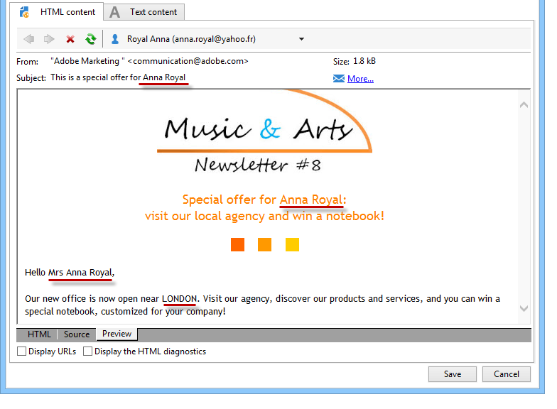
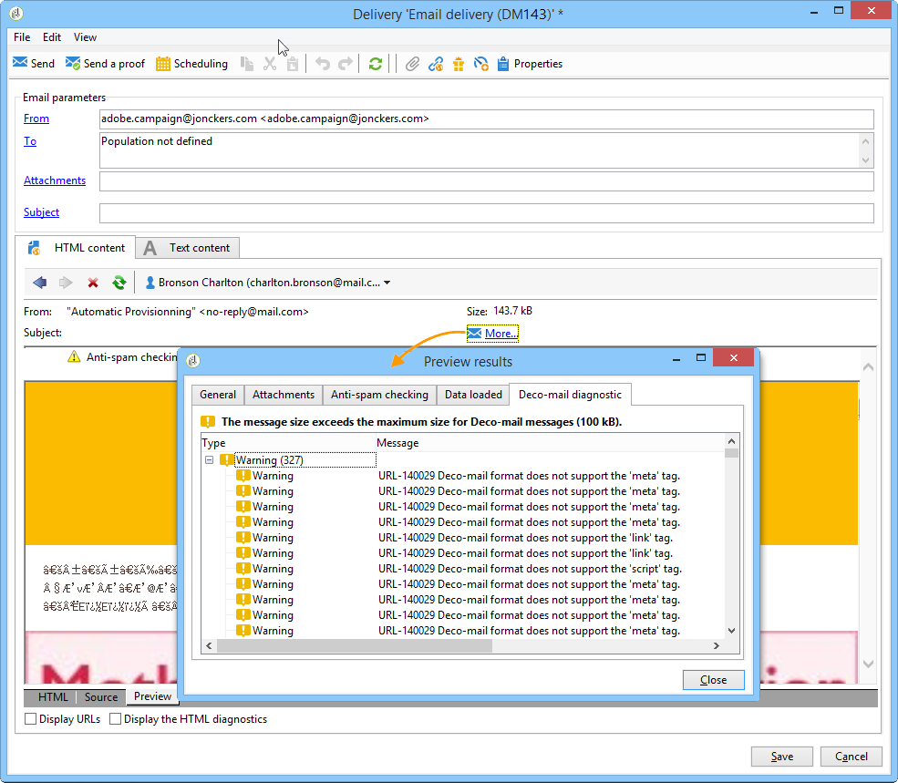

# 定義電子郵件內容 {#defining-the-email-content}

## 寄件者 {#sender}

要定義將顯示在已發送郵件標題中的發件人的名稱和地址，請按一下&#x200B;**[!UICONTROL From]**&#x200B;連結。

此視窗可讓您輸入建立電子郵件標題所需的所有資訊。 可將此資訊加以個人化。若要這麼做，請使用輸入欄位右側的按鈕來插入個人化欄位。

若要了解如何插入和使用個人化欄位，請參閱[關於個人化](about-personalization.md)區段。

>[!NOTE]
>
>* 預設會使用寄件者的地址進行回覆。
>* 標題參數不得為空。 預設情況下，它們包含配置部署嚮導時輸入的值。 有關詳細資訊，請參閱[安裝指南](../../installation/using/deploying-an-instance.md)。
>* 發送者的地址是強制性的，以允許發送電子郵件（RFC標準）。
>* Adobe Campaign會檢查輸入之電子郵件地址的語法。

>[!IMPORTANT]
>
>在由網際網路存取提供者(ISP)實作的檢查以打擊未經請求的電子郵件（垃圾郵件）的內容中，Adobe建議建立與指定用於傳送和回覆的地址相對應的電子郵件帳戶。 請咨詢您的消息系統管理員。

## 訊息主體 {#message-subject}

消息的主題在相應欄位中配置。 您可以直接在欄位中輸入，或按一下&#x200B;**[!UICONTROL Subject]**&#x200B;連結以輸入指令碼。 個人化連結可讓您在主題中插入資料庫欄位。

>[!IMPORTANT]
>
>訊息主體是必填的。

傳送訊息時，欄位內容將由收件者設定檔中的值取代。

例如，在上述訊息中，訊息的主旨會針對每位收件者以其設定檔的資料進行個人化。

>[!NOTE]
>
>個人化欄位的使用會顯示在[關於個人化](about-personalization.md)中。

您也可以透過&#x200B;**[!UICONTROL Insert emoticon]**&#x200B;快顯視窗，將表情符號插入主旨行。

## 訊息內容 {#message-content}

>[!IMPORTANT]
>
>基於隱私權考量，我們建議對所有外部資源使用HTTPS。

訊息的內容會在傳送設定視窗的下方區段中定義。

根據收件者偏好設定，預設會以HTML或文字格式傳送訊息。 建議您以兩種格式建立內容，以確保郵件可以正確顯示在任何郵件系統中。 有關詳細資訊，請參閱[選擇消息格式](#selecting-message-formats)。

* 要導入HTML內容，請使用&#x200B;**[!UICONTROL Open]**&#x200B;按鈕。 您也可以將原始碼直接貼到&#x200B;**[!UICONTROL Source]**&#x200B;子標籤中。

   如果您使用[數字內容編輯器](../../web/using/about-campaign-html-editor.md)(DCE)，請參閱[選擇內容模板](../../web/using/use-case--creating-an-email-delivery.md#step-3---selecting-a-content)。

   >[!IMPORTANT]
   >
   >HTML內容必須預先建立，然後匯入至Adobe Campaign。 HTML編輯器並非專為內容建立而設計。

   **[!UICONTROL Preview]**&#x200B;子標籤可讓您檢視收件者之每個內容的呈現。 個人化欄位和內容的條件元素會取代為所選設定檔的對應資訊。

   工具欄按鈕提供對HTML頁面標準操作和格式參數的訪問。

   

   您可以從本機檔案或Adobe Campaign的影像程式庫，在訊息中插入影像。 要執行此操作，請按一下&#x200B;**[!UICONTROL Image]**&#x200B;圖示並選取適當的選項。

   

   可以通過資料夾樹中的&#x200B;**[!UICONTROL Resources>Online>Public resources]**&#x200B;資料夾訪問庫映像。 另請參閱[新增影像](#adding-images)。

   工具列中的最後一個按鈕可讓您插入個人化欄位。

   >[!NOTE]
   >
   >個人化欄位的使用會顯示在[關於個人化](about-personalization.md)中。

   頁面底部的索引標籤可讓您顯示所建立頁面的HTML程式碼，並檢視以其個人化呈現訊息的情形。 若要啟動此顯示，請按一下&#x200B;**[!UICONTROL Preview]**&#x200B;並使用工具列中的&#x200B;**[!UICONTROL Test personalization]**&#x200B;按鈕選取收件者。 您可以從定義的目標中選取收件者，或選擇其他收件者。

   

   您可以驗證HTML訊息。 您也可以檢視電子郵件標題的內容。

   

* 要導入文本內容，請使用&#x200B;**[!UICONTROL Open]**&#x200B;按鈕或&#x200B;**[!UICONTROL Text Content]**&#x200B;頁簽輸入以文本格式顯示的消息內容。 使用工具欄按鈕訪問內容上的操作。 最後一個按鈕可讓您插入個人化欄位。

   

   至於HTML格式，請按一下頁面底部的&#x200B;**[!UICONTROL Preview]**&#x200B;標籤，以檢視呈現訊息及其個人化內容。

   

<!--## Selecting message formats {#selecting-message-formats}

You can change the format of email messages sent. To do this, edit the delivery properties and click the **[!UICONTROL Delivery]** tab.

Select the format of the email in the lower section of the window:

* **[!UICONTROL Use recipient preferences]** (default mode)

  The message format is defined according to the data stored in the recipient profile and stored by default in the **[!UICONTROL email format]** field (@emailFormat). If a recipient wishes to receive messages in a certain format, this is the format sent. If the field is not filled in, a multipart-alternative message is sent (see below).

* **[!UICONTROL Let recipient mail client choose the most appropriate format]**

  The message contains both formats: text and HTML. The format displayed on reception depends on the configuration of the recipient's mail software (multipart-alternative).

  >[!IMPORTANT]
  >
  >This option includes both versions of the document. It therefore impacts the delivery rate, because the message size is greater.

* **[!UICONTROL Send all messages in text format]**

  The message is sent in text format. HTML format will not be sent, but used for the mirror page only when the recipient clicks on the message.-->

## 定義互動式內容 {#amp-for-email-format}

Adobe Campaign可讓您嘗試新的互動式[電子郵件適用的AMP](https://amp.dev/about/email/)格式，這可讓您在特定條件下傳送動態電子郵件。

如需詳細資訊，請參閱[本節](defining-interactive-content.md)。

## 使用內容管理 {#using-content-management}

您可以直接在傳遞精靈中使用內容管理表單來定義傳遞內容。 要執行此操作，您必須在傳送屬性的&#x200B;**[!UICONTROL Advanced]**&#x200B;標籤中參考要使用的內容管理的發佈範本。

另一個索引標籤可讓您輸入內容，內容將根據內容管理規則自動整合和格式化。

>[!NOTE]
>
>如需Adobe Campaign中內容管理的詳細資訊，請參閱[此區段](about-content-management.md)。

## 插入表情符號 {#inserting-emoticons}

您可以將表情符號插入電子郵件內容。

1. 按一下&#x200B;**[!UICONTROL Insert emoticon]**&#x200B;圖示。
1. 從快顯視窗中選取表情符號。

   

1. 完成後，按一下&#x200B;**[!UICONTROL Close]**&#x200B;按鈕。

若要自訂表情符號清單，請參閱此[page](customizing-emoticon-list.md)。

## 新增影像 {#adding-images}

HTML格式的電子郵件傳遞可包含影像。 從傳送精靈，您可以透過&#x200B;**[!UICONTROL Image]**&#x200B;圖示，使用HTML編輯器匯入包含影像的HTML頁面或直接插入影像。

影像可以是：

* 本機影像或從伺服器呼叫的影像
* 儲存在Adobe Campaign公共資源庫中的影像

   可透過Adobe Campaign階層的&#x200B;**[!UICONTROL Resources > Online]**&#x200B;節點存取公用資源。 它們會分組在資料庫中，並可包含在電子郵件訊息中，但也可用於行銷活動或工作，或用於內容管理。

* 與Adobe Experience Cloud共用的資產。 請參閱[本節](../../integrations/using/sharing-assets-with-adobe-experience-cloud.md)。

>[!IMPORTANT]
>
>若要使用傳送精靈在電子郵件訊息中加入影像，必須將Adobe Campaign例項設定為啟用公用資源管理。 此過程可從部署嚮導中執行。 有關配置的詳細資訊，請參閱[此部分](../../installation/using/deploying-an-instance.md)。

傳遞精靈可讓您將本機影像或儲存在程式庫中的影像新增至訊息內容。 要執行此操作，請按一下HTML內容工具欄中的&#x200B;**[!UICONTROL Image]**&#x200B;按鈕。

>[!IMPORTANT]
>
>為了讓收件者能夠檢視其收到訊息中包含的影像，這些訊息必須可在可從外部存取的伺服器上使用。

若要透過傳送精靈管理影像：

1. 按一下工具列中的&#x200B;**[!UICONTROL Tracking & Images]**圖示。
   

1. 在&#x200B;**[!UICONTROL Images]**&#x200B;頁簽中選擇&#x200B;**[!UICONTROL Upload images]**。
1. 然後，您可以選擇是否要將影像包含在電子郵件訊息中。
   

* 您可以手動上傳影像，而不需等待傳遞分析階段。 要執行此操作，請按一下&#x200B;**[!UICONTROL Upload the images straightaway...]**&#x200B;連結。
* 您可以指定其他路徑以存取追蹤伺服器上的影像。 要執行此操作，請在&#x200B;**[!UICONTROL Images URL]**&#x200B;欄位中輸入它。 此值會覆寫安裝精靈參數中定義的值。

當您在傳遞精靈中開啟含有影像的HTML內容時，系統會傳送訊息，讓您可以選擇根據傳遞參數立即上傳影像。

>[!IMPORTANT]
>
>在手動上傳或傳送訊息時修改影像存取路徑。

### 傳送包含影像的訊息 {#sending-a-message-with-images}

>[!NOTE]
>
>為避免效能問題，如果您包含從個人化URL即時下載的影像，如[attachment](attaching-files.md)，則每個影像大小預設不應超過100,000位元組。 可從[Campaign Classic選項清單](../../installation/using/configuring-campaign-options.md#delivery)配置此建議閾值。

以下是含有四個影像的傳送範例：

這些影像來自本地目錄或網站，如您可從&#x200B;**[!UICONTROL Source]**&#x200B;頁簽驗證的。

按一下&#x200B;**[!UICONTROL Tracking & Images]**&#x200B;圖示，然後按一下&#x200B;**[!UICONTROL Images]**&#x200B;標籤以開始偵測訊息中的影像。

對於檢測到的每個影像，您可以查看其狀態：

* 如果映像儲存在本地或位於另一台伺服器上，即使此伺服器從外部（例如在網際網路站點上）可見，它將被檢測為&#x200B;**[!UICONTROL Not yet online]**。
* 如果影像是在建立其他傳送時先前上傳的，則會偵測為&#x200B;**[!UICONTROL Already online]**。
* 在部署精靈中，您可以定義未啟用影像偵測的URL:上傳這些影像將會是&#x200B;**[!UICONTROL Skipped]**。

>[!NOTE]
>
>影像的識別方式為其內容，而非其存取路徑。 這表示先前以不同名稱或不同目錄上傳的影像，將偵測為&#x200B;**[!UICONTROL Already online]**。

在分析階段，影像會自動上傳至伺服器，以便從外部存取，但必須預先上傳的本機影像除外。

您可以繼續操作並上傳影像，以便其他Adobe Campaign運算子檢視。 如果您能與他人合作，這項功能將會非常實用。 要執行此操作，請按一下&#x200B;**[!UICONTROL Upload the images straightaway...]**&#x200B;將影像上傳至伺服器。

>[!NOTE]
>
>接著會修改電子郵件中影像的URL，尤其是其名稱。

影像上線後，您就可以從訊息的&#x200B;**[!UICONTROL Source]**&#x200B;標籤檢視其名稱和路徑的變更。

如果選擇&#x200B;**[!UICONTROL Include the images in the email]**，則可以選擇要包含在相應列中的影像。

>[!NOTE]
>
>如果郵件中包含本地映像，則必須確認對郵件原始碼的更改。

## 在電子郵件中插入條形碼{#inserting-a-barcode-in-an-email}

條碼產生模組可讓您建立符合許多常見標準的數種條碼，包括2D條碼。

可以使用使用客戶條件定義的值以點陣圖形式動態生成條形碼。 電子郵件行銷活動中可包含個人化條碼。 收件者可以列印訊息，並將其顯示給發行公司以進行掃描（例如當結帳時）。

若要將條碼插入電子郵件中，請將游標置於您要顯示該條碼的內容中，然後按一下個人化按鈕。 選取 **[!UICONTROL Include > Barcode...]**。

然後設定下列元素以符合您的需求：

1. 選擇條形碼的類型。

   * 若為1D格式，可在Adobe Campaign中使用下列類型：Codabar，代碼128, GS1-128（前身為EAN-128）, UPC-A, UPC-E, ISBN, EAN-8，代碼39，交錯2 of 5, POSTNET和Royal Mail(RM4SCC)。

      1D條形碼的示例：

      

   * DataMatrix和PDF417類型與2D格式有關。

      2D條形碼的示例：

      

   * 若要插入QR碼，請選取此類型並輸入要套用的糾錯率。 該速率定義了重複資訊的數量和退化的容限。

      

      QR碼範例：

      

1. 輸入要插入電子郵件的條形碼的大小：配置刻度可以從x1增加或縮小條形碼的大小，從x1增加到x10。
1. **[!UICONTROL Value]**&#x200B;欄位允許您定義條形碼的值。 值可以符合特殊選件，也可以是條件的函式，也可以是連結至客戶之資料庫欄位的值。

   此示例顯示了EAN-8類型的條形碼，該條形碼已添加到收件者的帳號。 要添加此帳號，請按一下&#x200B;**[!UICONTROL Value]**&#x200B;欄位右側的個性化按鈕，然後選擇&#x200B;**[!UICONTROL Recipient > Account number]**。

   

1. **[!UICONTROL Height]**&#x200B;欄位可讓您通過改變每條之間的空間量來配置條形碼的高度，而不更改其寬度。

   根據條碼類型，沒有限制的輸入控制項。 如果條碼值不正確，則只會在&#x200B;**預覽**&#x200B;模式中顯示，在該模式中，條碼將以紅色交叉。

   >[!NOTE]
   >
   >分配給條形碼的值取決於其類型。 例如，EAN-8類型應正好有8個數字。
   >
   >**[!UICONTROL Value]**&#x200B;欄位右側的個人化按鈕可讓您除了值本身之外新增資料。 這豐富了條碼，前提是條碼標準接受它。
   >
   >例如，如果您使用GS1-128類型條形碼，並且除了要輸入值之外還要輸入收件人的帳號，請按一下個性化按鈕並選擇&#x200B;**[!UICONTROL Recipient > Account number]**。 如果正確輸入了所選收件人的帳號，則條形碼會將其考慮在內。

設定這些元素後，您就可以完成電子郵件並傳送。 若要避免錯誤，請在按一下&#x200B;**[!UICONTROL Preview]**&#x200B;標籤執行傳送前，一律確認內容正確顯示。

>[!NOTE]
>
>如果條形碼的值不正確，則其點陣圖會以紅色交叉顯示。

<!--## Sending emails on Japanese mobiles {#sending-emails-on-japanese-mobiles}

### Email formats for Japanese mobiles {#email-formats-for-japanese-mobiles}

Adobe Campaign manages three specific Japanese formats for email on mobiles: **Deco-mail** (DoCoMo mobiles), **Decore Mail** (Softbank mobiles) and **Decoration Mail** (KDDI AU mobiles). These formats impose particular coding, structure, and size constraints. Learn more about limitations and recommendations in [this section](#limitations-and-recommendations).

In order for the recipient to correctly receive messages in one of these formats, we recommend selecting **[!UICONTROL Deco-mail (DoCoMo)]**, **[!UICONTROL Decore Mail (Softbank)]** or **[!UICONTROL Decoration Mail (KDDI AU)]** in the corresponding profile:

However, if you leave the **[!UICONTROL Email format]** option as **[!UICONTROL Unknown]**, **[!UICONTROL HTML]** or **[!UICONTROL Text]**, Adobe Campaign will automatically detect (when sending the email) the Japanese format to use so that the message is correctly displayed.

This automatic detection system is based on the list of predefined domains defined in the **[!UICONTROL Management of Email Formats]** mail rule set. For more on managing email formats, refer to [this page](../../installation/using/email-deliverability.md#managing-email-formats).

### Limitations and recommendations {#limitations-and-recommendations}

A certain number of constraints apply for sending emails that will be read on a mobile operated by a Japanese provider (Softbank, DoCoMo, KDDI AU).

Therefore, you must:

* Only use images in JPEG or GIF format
* Create a delivery with text and HTML sections that are strictly lower than 10 000 bytes (for KDDI AU and DoCoMo)
* Use images with a total size (before encoding) that is lower than 100 KB
* Do not use more than 20 images per message
* Use a reduced size HTML format (a limited number of tags are available for each operator)

>[!NOTE]
>
>Limitations specific to each operator are to be taken into account when creating your message. Refer to:  
>
>* For DoCoMo, refer to [this page](https://www.nttdocomo.co.jp/service/developer/make/content/deco_mail/index.html)
>* For KDDI AU, refer to [this page](https://www.au.com/ezfactory/tec/spec/decorations/template.html)
>* For Softbank, refer to [this page](https://www.support.softbankmobile.co.jp/partner/home_tech3/index.cfm)

### Testing the email content {#testing-the-email-content}

#### Previewing the message {#previewing-the-message}

Adobe Campaign allows you to check that your message format is adapted to be sent to a Japanese mobile.

Once you have defined your content and entered the email subject, you can check the display and formatting when the message is created.

In the **[!UICONTROL Preview]** tab of the content editing window, clicking **[!UICONTROL More... > Deco-mail diagnostic]** allows you to:

* Check that the HTML content tags conform to the Japanese format restrictions
* Check that the number of images in the message does not exceed the limit imposed by the format (20 images)
* Check the total message size (less than 100kB)

  

#### Running typology rule {#running-typology-rule}

In addition to the previewing diagnosis, a second check is carried out when sending a proof or a delivery: a specific typology rule, **[!UICONTROL Deco-mail check]**, is started during the analysis.

>[!IMPORTANT]
>
>This typology rule is only executed if at least one of the recipients is configured to receive emails in **[!UICONTROL Deco-mail (DoCoMo)]**, **[!UICONTROL Decore Mail (Softbank)]** or **[!UICONTROL Decoration Mail (KDDI AU)]** format.

This typology rule allows you to make sure that the delivery respects the [format constraints](#limitations-and-recommendations) defined by the Japanese operators, particularly in relation to the total size of the email, the size of the HTML and text sections, the number of images in the messages, and the tags in the HTML content.

#### Sending proofs {#sending-proofs}

You can send proofs to test your delivery. When you send the proof, if you are using substitution addresses, please enter addresses that correspond to the email format of the profile used.

For example, you can replace a profile's address by test@softbank.ne.jp if the email format for this profile was defined beforehand on **[!UICONTROL Decore Mail (Softbank)]**.

### Sending messages {#sending-messages}

To send an email to recipients with Japanese email formats with Campaign, two options are possible:

* Create two deliveries: one only for Japanese recipients and another for other recipients - refer to [this section](#designing-a-specific-delivery-for-japanese-formats).
* Create a single delivery and Adobe Campaign will automatically detect the format to use - refer to [this section](#designing-a-delivery-for-all-formats).

#### Designing a specific delivery for Japanese formats {#designing-a-specific-delivery-for-japanese-formats}

You can create a workflow that contains two deliveries: one to be read on a Japanese mobile and another for recipients with a standard email format.

To do this, use the **[!UICONTROL Split]** activity in your workflow and define the Japanese email formats (Deco-mail, Decoration Mail and Decore Mail) as filtering conditions.

#### Designing a delivery for all formats {#designing-a-delivery-for-all-formats}

When Adobe Campaign dynamically manages the formats according to the domain (profiles with email formats defined as **[!UICONTROL Unknown]**, **[!UICONTROL HTML]** or **[!UICONTROL Text]** ), you can send the same delivery to all of your recipients.

The message contact will display correctly for the users on Japanese mobiles, just as for the standard recipients.

>[!IMPORTANT]
>
>Make sure to respect the special features associated with each Japanese email format (Deco-mail, Decoration Mail, and Decore Mail). For more information on limitations, refer to [this section](#limitations-and-recommendations).-->
