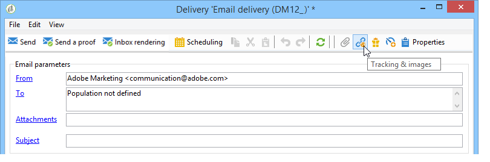

# 定義電子郵件內容{#defining-the-email-content}

## 發件人{#sender}

要定義將出現在所發送消息標題中的發件人名稱和地址，請按一下&#x200B;**[!UICONTROL From]**&#x200B;連結。

此視窗可讓您輸入建立電子郵件標題所需的所有資訊。 可將此資訊加以個人化。若要這麼做，請使用輸入欄位右側的按鈕來插入個人化欄位。

要瞭解如何插入和使用個性化欄位，請參閱[關於個性化](../../delivery/using/about-personalization.md)部分。

>[!NOTE]
>
>* 預設會使用傳送者的位址來回覆。
>* 標題參數不得為空。 預設情況下，它們包含配置部署嚮導時輸入的值。 有關詳細資訊，請參閱[《安裝指南》。](../../installation/using/deploying-an-instance.md)
>* 發件人地址是允許發送電子郵件的強制性地址（RFC標準）。
>* Adobe Campaign會檢查輸入的電子郵件地址語法。

>[!IMPORTANT]
>
>在網際網路存取提供者(ISP)為對抗垃圾郵件（垃圾訊息）而實施的檢查中，Adobe建議建立與傳送和回覆所指定位址對應的電子郵件帳戶。 請洽詢您的訊息系統管理員。

## 消息主題{#message-subject}

消息的主題在相應欄位中配置。 您可以直接在欄位中輸入，或按一下&#x200B;**[!UICONTROL Subject]**&#x200B;連結以輸入指令碼。 個人化連結可讓您在主題中插入資料庫欄位。

>[!IMPORTANT]
>
>訊息主體為強制性。

當傳送訊息時，欄位內容會由收件者描述檔中的值取代。

例如，在上述訊息中，訊息的主旨是使用每位收件者的個人資料來個人化。

>[!NOTE]
>
>個人化欄位的使用在[關於個人化](../../delivery/using/about-personalization.md)中。

您也可以透過&#x200B;**[!UICONTROL Insert emoticon]**&#x200B;快顯視窗，將表情符號插入主題行。

## 消息內容{#message-content}

>[!IMPORTANT]
>
>基於隱私權原因，我們建議對所有外部資源使用HTTPS。

消息內容在傳送配置窗口的下部部分中定義。

根據收件者偏好設定，訊息預設會以HTML或文字格式傳送。 我們建議您以兩種格式建立內容，以確保訊息能正確顯示在任何郵件系統中。 有關詳細資訊，請參閱[選擇消息格式](#selecting-message-formats)。

* 若要匯入HTML內容，請使用&#x200B;**[!UICONTROL Open]**&#x200B;按鈕。 您也可以將原始碼直接貼到&#x200B;**[!UICONTROL Source]**&#x200B;子標籤中。

   如果您使用[數字內容編輯器](../../web/using/about-campaign-html-editor.md)(DCE)，請參閱[選擇內容模板](../../web/using/use-case--creating-an-email-delivery.md#step-3---selecting-a-content)。

   >[!IMPORTANT]
   >
   >HTML內容必須事先建立，然後匯入Adobe Campaign。 HTML編輯器不是專為建立內容而設計。

   **[!UICONTROL Preview]**&#x200B;子標籤可讓您檢視收件者的每個內容的轉換。 個性化欄位和內容的條件元素被所選配置檔案的相應資訊替換。

   工具列按鈕可讓您存取HTML頁面的標準動作和格式參數。

   

   您可以在Adobe Campaign的本機檔案或影像庫訊息中插入影像。 若要這麼做，請按一下&#x200B;**[!UICONTROL Image]**&#x200B;圖示並選取適當的選項。

   

   可通過資料夾樹中的&#x200B;**[!UICONTROL Resources>Online>Public resources]**&#x200B;資料夾訪問庫映像。 另請參閱[添加影像](#adding-images)。

   工具列的最後一個按鈕可讓您插入個人化欄位。

   >[!NOTE]
   >
   >個人化欄位的使用在[關於個人化](../../delivery/using/about-personalization.md)中。

   頁面底部的標籤可讓您顯示所建立頁面的HTML程式碼，並檢視訊息的個人化呈現。 要啟動此顯示，請按一下&#x200B;**[!UICONTROL Preview]** ，然後使用工具欄中的&#x200B;**[!UICONTROL Test personalization]**&#x200B;按鈕選擇收件者。 您可以從定義的目標中選擇收件者，或選擇其他收件者。

   

   您可以驗證HTML訊息。 您也可以檢視電子郵件標題的內容。

   

* 要導入文本內容，請使用&#x200B;**[!UICONTROL Open]**&#x200B;按鈕或&#x200B;**[!UICONTROL Text Content]**&#x200B;頁籤輸入以文本格式顯示的消息內容。 使用工具列按鈕來存取內容上的動作。 最後一個按鈕可讓您插入個人化欄位。

   

   至於HTML格式，請按一下頁面底部的&#x200B;**[!UICONTROL Preview]**&#x200B;標籤，以檢視訊息的個人化呈現。

   

### 在電子郵件{#inserting-emoticons}中插入表情符號

您可以將表情符號插入您的電子郵件內容。

1. 按一下&#x200B;**[!UICONTROL Insert emoticon]**&#x200B;表徵圖。
1. 從彈出式視窗中選取表情符號。

   

1. 完成時按一下&#x200B;**[!UICONTROL Close]**&#x200B;按鈕。

若要自訂表情符號清單，請參閱此[page](../../delivery/using/customizing-emoticon-list.md)。

## 選擇消息格式{#selecting-message-formats}

您可以變更傳送的電子郵件格式。 若要這麼做，請編輯傳送屬性，然後按一下&#x200B;**[!UICONTROL Delivery]**&#x200B;標籤。

在窗口的下半部選擇電子郵件格式：

* **[!UICONTROL Use recipient preferences]** （預設模式）

   消息格式根據儲存在收件人配置檔案中的資料定義，並預設儲存在&#x200B;**[!UICONTROL email format]**&#x200B;欄位(@emailFormat)中。 如果收件者希望以特定格式接收郵件，則此格式為傳送的格式。如果未填入欄位，則會傳送多部分替代訊息（請參閱下文）。

* **[!UICONTROL Let recipient mail client choose the most appropriate format]**

   訊息包含兩種格式：文字和HTML。 接收上顯示的格式取決於收件人郵件軟體的配置（多部分替代）。

   >[!IMPORTANT]
   >
   >此選項包括文檔的兩個版本。 因此，它會影響傳送率，因為訊息大小較大。

* **[!UICONTROL Send all messages in text format]**

   訊息會以文字格式傳送。 HTML格式不會傳送，但只有在收件者點按訊息時，才會用於鏡像頁面。

## 定義互動式內容 {#amp-for-email-format}

Adobe Campaign可讓您嘗試新的互動式[AMP for Email](https://amp.dev/about/email/)格式，讓您在特定條件下傳送動態電子郵件。

如需詳細資訊，請參閱[本節](../../delivery/using/defining-interactive-content.md)。

## 使用內容管理{#using-content-management}

您可以直接在傳送精靈中，使用內容管理表單來定義傳送的內容。 若要這麼做，您必須參考要使用之內容管理的發佈範本，位於傳送屬性的&#x200B;**[!UICONTROL Advanced]**&#x200B;標籤中。

另外一個標籤可讓您輸入內容，這些內容會根據內容管理規則自動整合和格式化。

>[!NOTE]
>
>如需Adobe Campaign中內容管理的詳細資訊，請參閱[本節](../../delivery/using/about-content-management.md)。

## 添加影像{#adding-images}

HTML格式的電子郵件傳送可包含影像。 從傳送精靈中，您可以匯入包含影像的HTML頁面，或透過&#x200B;**[!UICONTROL Image]**&#x200B;圖示直接使用HTML編輯器插入影像。

影像可以是：

* 本機影像或從伺服器呼叫的影像
* 儲存在Adobe Campaign公共資源庫中的影像

   公共資源可透過Adobe Campaign階層的&#x200B;**[!UICONTROL Resources > Online]**&#x200B;節點存取。 它們會分組在資料庫中，並可包含在電子郵件訊息中，但也可用於促銷活動或工作，或用於內容管理。

* 與Adobe Experience Cloud共用的資產。 請參閱[本區段](../../integrations/using/sharing-assets-with-adobe-experience-cloud.md)。

>[!IMPORTANT]
>
>若要使用傳送精靈將影像加入電子郵件訊息中，必須設定Adobe Campaign例項，以啟用公共資源管理。 此過程可從部署嚮導中執行。 有關配置的詳細資訊，請參閱[本節](../../installation/using/deploying-an-instance.md)。

傳送精靈可讓您將儲存在資料庫中的本機影像或影像新增至訊息內容。 若要這麼做，請按一下HTML內容工具列中的&#x200B;**[!UICONTROL Image]**&#x200B;按鈕。

>[!IMPORTANT]
>
>為了讓收件者能夠檢視其所收到訊息中包含的影像，這些訊息必須可在可從外部存取的伺服器上使用。

若要透過傳送精靈管理影像：

1. 按一下工具欄中的&#x200B;**[!UICONTROL Tracking & Images]**表徵圖。
   

1. 在&#x200B;**[!UICONTROL Images]**&#x200B;頁籤中選擇&#x200B;**[!UICONTROL Upload images]**。
1. 然後，您可以選擇是否要將影像加入電子郵件訊息中。
   

* 您可以手動上傳影像，而不需等待傳送分析階段。 若要這麼做，請按一下&#x200B;**[!UICONTROL Upload the images straightaway...]**&#x200B;連結。
* 您可以指定另一個路徑，以存取追蹤伺服器上的影像。 若要這麼做，請在&#x200B;**[!UICONTROL Images URL]**&#x200B;欄位中輸入。 此值將覆蓋在安裝嚮導參數中定義的值。

當您在傳送精靈中開啟包含影像的HTML內容時，會顯示訊息，提供您根據傳送參數立即上傳影像的選項。

>[!IMPORTANT]
>
>在手動上傳或傳送訊息期間會修改影像存取路徑。

### 傳送包含影像{#sending-a-message-with-images}的訊息

>[!NOTE]
>
>為避免效能問題，如果您將即時從個人化URL下載的影像加入[attachment](../../delivery/using/attaching-files.md)，預設每個影像大小不得超過100,000位元組。 此建議的臨界值可從[促銷活動傳統選項清單中設定。](../../installation/using/configuring-campaign-options.md#delivery)

以下是包含4張影像的傳送範例：

這些影像來自本機目錄或網站，如您可從&#x200B;**[!UICONTROL Source]**&#x200B;標籤驗證。

按一下&#x200B;**[!UICONTROL Tracking & Images]**&#x200B;圖示，然後按一下&#x200B;**[!UICONTROL Images]**&#x200B;標籤，開始偵測訊息中的影像。

對於每個檢測到的映像，您可以查看其狀態：

* 如果映像儲存在本地或位於另一台伺服器上，即使該伺服器從外部（例如，在網際網路站點上）可見，也會被檢測為&#x200B;**[!UICONTROL Not yet online]**。
* 如果影像是在建立其他傳送時較早上傳，則會偵測為&#x200B;**[!UICONTROL Already online]**。
* 在部署精靈中，您可以定義未啟用影像偵測的URL:上傳這些影像將會是&#x200B;**[!UICONTROL Skipped]**。

>[!NOTE]
>
>影像是由其內容識別，而非由其存取路徑識別。 這表示先前以不同名稱或不同目錄上傳的影像會偵測為&#x200B;**[!UICONTROL Already online]**。

在分析階段，影像會自動上傳至伺服器，以便從外部存取，但必須事先上傳的本機影像除外。

您可以繼續工作並上傳影像，讓其他Adobe Campaign營運商可以檢視這些影像。 如果您合作，您可能會發現這項功能很有用。 若要這麼做，請按一下&#x200B;**[!UICONTROL Upload the images straightaway...]**&#x200B;將影像上傳至伺服器。

>[!NOTE]
>
>然後會修改電子郵件中影像的URL，尤其是其名稱。

在影像上線後，您就可以從訊息的&#x200B;**[!UICONTROL Source]**&#x200B;標籤中檢視其名稱和路徑的變更。

如果選擇&#x200B;**[!UICONTROL Include the images in the email]**，您可以選擇要包含在對應欄中的影像。

>[!NOTE]
>
>如果消息中包含本地映像，則必須確認對消息原始碼的更改。

## 在電子郵件中插入條形碼{#inserting-a-barcode-in-an-email}

條碼產生模組可讓您建立數種符合許多常見標準的條碼，包括2D條碼。

可以使用使用客戶標準定義的值動態生成條形碼作為點陣圖。 個人化條碼可以包含在電子郵件宣傳中。 收件者可列印訊息並將它顯示給發行公司以進行掃描（例如，當結帳時）。

若要將條形碼插入電子郵件中，請將游標置於要顯示該條形碼的內容中，然後按一下個人化按鈕。 選取 **[!UICONTROL Include > Barcode...]**。

然後設定下列元素以符合您的需求：

1. 選擇條形碼類型。

   * 對於1D格式，Adobe Campaign提供下列類型：Codabar, Code 128, GS1-128（之前稱為EAN-128）, UPC-A, UPC-E, ISBN, EAN-8, Code39, Interable 2 of 5, POSTNET和Royal Mail(RM4SCC)。

      1D條形碼示例：

      

   * DataMatrix和PDF417類型與2D格式有關。

      2D條碼範例：

      

   * 若要插入QR Code，請選取此類型並輸入要套用的糾錯率。 此比率定義了重複的資訊量和惡化容限。

      

      QR Code範例：

      

1. 輸入要插入到電子郵件中的條形碼的大小：配置比例可讓您將條形碼的大小從x1增加或減小到x10。
1. 使用&#x200B;**[!UICONTROL Value]**&#x200B;欄位可以定義條形碼的值。 值可以與特殊選件相符，也可以是標準的函式，也可以是連結至客戶的資料庫欄位的值。

   此示例顯示了EAN-8類型條形碼，該條形碼已添加到收件者的帳戶號。 若要新增此帳戶號碼，請按一下&#x200B;**[!UICONTROL Value]**&#x200B;欄位右側的個人化按鈕，然後選取&#x200B;**[!UICONTROL Recipient > Account number]**。

   

1. **[!UICONTROL Height]**&#x200B;欄位可讓您設定條碼的高度，而不需變更其寬度，方法是變更每個條條之間的間距。

   根據條形碼類型，沒有限制條目控制。 如果條形碼值不正確，則只能在&#x200B;**預覽**&#x200B;模式中顯示，在該模式中，條形碼將以紅色划出。

   >[!NOTE]
   >
   >分配給條形碼的值取決於其類型。 例如，EAN-8類型的數字恰好為8。
   >
   >**[!UICONTROL Value]**&#x200B;欄位右側的個人化按鈕可讓您除了新增值本身之外，還新增資料。 這豐富了條形碼，前提是條形碼標準接受它。
   >
   >例如，如果您使用GS1-128類型條形碼，並且除了要輸入值之外還要輸入收件人的帳戶號，請按一下個性化按鈕並選擇&#x200B;**[!UICONTROL Recipient > Account number]**。 如果正確輸入了所選收件人的帳戶號碼，條形碼會將其納入考慮範圍。

在設定好這些元素後，您就可以完成電子郵件並傳送。 若要避免錯誤，請務必在執行傳送前，按一下&#x200B;**[!UICONTROL Preview]**&#x200B;標籤，確定您的內容已正確顯示。

>[!NOTE]
>
>如果條形碼的值不正確，其點陣圖將以紅色交叉顯示。

## 在日文手機上傳送電子郵件{#sending-emails-on-japanese-mobiles}

### 日文行動裝置的電子郵件格式{#email-formats-for-japanese-mobiles}

Adobe Campaign管理三種特定的日文格式，以用於行動電子郵件：**Deco-mail**(DoCoMo mo mobiles)、**Decore Mail**(Softbank mobiles)和&#x200B;**Decoring Mail**(KDDI AU mobiles)。 這些格式會加上特定的編碼、結構和大小限制。 進一步瞭解[本節](#limitations-and-recommendations)中的限制和建議。

為了讓收件者能夠正確接收以下格式的訊息，建議在對應的設定檔中選取&#x200B;**[!UICONTROL Deco-mail (DoCoMo)]**、**[!UICONTROL Decore Mail (Softbank)]**&#x200B;或&#x200B;**[!UICONTROL Decoration Mail (KDDI AU)]**:

不過，如果您將&#x200B;**[!UICONTROL Email format]**&#x200B;選項保留為&#x200B;**[!UICONTROL Unknown]**、**[!UICONTROL HTML]**&#x200B;或&#x200B;**[!UICONTROL Text]**,Adobe Campaign會自動偵測（傳送電子郵件時）要使用的日文格式，以正確顯示訊息。

此自動檢測系統基於&#x200B;**[!UICONTROL Management of Email Formats]**&#x200B;郵件規則集中定義的預定義域清單。 有關管理電子郵件格式的詳細資訊，請參閱[本頁](../../installation/using/email-deliverability.md#managing-email-formats)。

### 限制與建議{#limitations-and-recommendations}

傳送電子郵件時，會受到若干限制，這些電子郵件會在日本供應商(Softbank、DoCoMo、KDDI AU)所營運的行動裝置上讀取。

因此，您必須：

* 僅使用JPEG或GIF格式的影像
* 建立文字和HTML區段的傳送，其欄位嚴格低於10 000位元組（適用於KDDI AU和DoCoMo）
* 使用總大小（編碼前）低於100 KB的影像
* 每則訊息不要使用超過20個影像
* 使用精簡的HTML格式（每個運算子可使用有限數目的標籤）

>[!NOTE]
>
>建立訊息時，應考量到每個運算子的特定限制。 請參閱:
>
>* 如需DoCoMo，請參閱[本頁](https://www.nttdocomo.co.jp/service/developer/make/content/deco_mail/index.html)
>* 對於KDDI AU，請參閱[此頁](https://www.au.com/ezfactory/tec/spec/decorations/template.html)
>* 如需Softbank，請參閱[本頁](https://www.support.softbankmobile.co.jp/partner/home_tech3/index.cfm)

### 測試電子郵件內容{#testing-the-email-content}

#### 預覽訊息{#previewing-the-message}

Adobe Campaign可讓您檢查訊息格式是否適合傳送至日文行動裝置。

定義內容並輸入電子郵件主旨後，您就可以在建立訊息時檢查顯示和格式。

在內容編輯窗口的&#x200B;**[!UICONTROL Preview]**&#x200B;頁籤中，按一下&#x200B;**[!UICONTROL More... > Deco-mail diagnostic]**&#x200B;可以：

* 檢查HTML內容標籤是否符合日文格式限制
* 檢查訊息中的影像數量是否未超過格式（20張影像）所設定的限制
* 檢查消息大小總計（小於100kB）

   

#### 運行類型學規則{#running-typology-rule}

除了預覽診斷外，在傳送校樣或傳送時進行第二檢查：分析期間會啟動特定的排版規則&#x200B;**[!UICONTROL Deco-mail check]**。

>[!IMPORTANT]
>
>只有當至少一個收件者被配置為接收&#x200B;**[!UICONTROL Deco-mail (DoCoMo)]**、**[!UICONTROL Decore Mail (Softbank)]**&#x200B;或&#x200B;**[!UICONTROL Decoration Mail (KDDI AU)]**&#x200B;格式的電子郵件時，才執行此排版規則。

此排版規則可讓您確定傳送符合日文運算子所定義的[格式限制](#limitations-and-recommendations)，尤其是與電子郵件的總大小、HTML和文字區段的大小、訊息中的影像數量，以及HTML內容中的標籤有關。

#### 傳送校樣 {#sending-proofs}

您可以傳送校樣來測試傳送。 當您傳送證明時，如果您使用替代地址，請輸入與所用描述檔電子郵件格式對應的地址。

例如，如果此描述檔的電子郵件格式是預先在&#x200B;**[!UICONTROL Decore Mail (Softbank)]**&#x200B;中定義的，您可以將描述檔的位址取代為test@softbank.ne.jp。

### 傳送訊息 {#sending-messages}

若要使用Campaign以日文電子郵件格式傳送電子郵件給收件者，有兩種選項可能：

* 建立兩個傳送：一個僅供日文收件人使用，另一個為其他收件人使用——請參閱[本節](#designing-a-specific-delivery-for-japanese-formats)。
* 建立單一傳送，Adobe Campaign會自動偵測要使用的格式——請參閱[本節](#designing-a-delivery-for-all-formats)。

#### 針對日文格式設計特定的傳送內容{#designing-a-specific-delivery-for-japanese-formats}

您可以建立包含兩個傳送的工作流程：一個要在日文行動裝置上閱讀，另一個要在標準電子郵件格式的收件者閱讀。

若要這麼做，請使用工作流程中的&#x200B;**[!UICONTROL Split]**&#x200B;活動，並將日文電子郵件格式（Deco-mail、Decoring Mail和Decore Mail）定義為篩選條件。

#### 設計所有格式的傳送{#designing-a-delivery-for-all-formats}

當Adobe Campaign根據網域動態管理格式（電子郵件格式定義為&#x200B;**[!UICONTROL Unknown]**、**[!UICONTROL HTML]**&#x200B;或&#x200B;**[!UICONTROL Text]**&#x200B;的描述檔）時，您可以傳送相同的傳送給所有收件者。

訊息連絡人會正確顯示給日文行動裝置上的使用者，就像標準收件者一樣。

>[!IMPORTANT]
>
>請務必遵守與每種日文電子郵件格式（裝飾郵件、裝飾郵件和廣告郵件）相關的特殊功能。 有關限制的詳細資訊，請參閱[本節](#limitations-and-recommendations)。
